## SQL - Funkcje okna (Window functions) <br> Lab 1

---

**Imiona i nazwiska:** Natalia Bratek, Jakub Karczewski

---

Celem ćwiczenia jest przygotowanie środowiska pracy, wstępne zapoznanie się z działaniem funkcji okna (window functions) w SQL, analiza wydajności zapytań i porównanie z rozwiązaniami przy wykorzystaniu "tradycyjnych" konstrukcji SQL

Swoje odpowiedzi wpisuj w miejsca oznaczone jako:

---

> Wyniki:

```sql
--  ...
```

---

Ważne/wymagane są komentarze.

Zamieść kod rozwiązania oraz zrzuty ekranu pokazujące wyniki, (dołącz kod rozwiązania w formie tekstowej/źródłowej)

Zwróć uwagę na formatowanie kodu

---

## Oprogramowanie - co jest potrzebne?

Do wykonania ćwiczenia potrzebne jest następujące oprogramowanie:

- MS SQL Server - wersja 2019, 2022, 2025
- PostgreSQL - wersja 15/16/17/18
- SQLite
- Narzędzia do komunikacji z bazą danych
  - SSMS - Microsoft SQL Managment Studio
  - DtataGrip lub DBeaver
- Przykładowa baza Northwind
  - W wersji dla każdego z wymienionych serwerów

Oprogramowanie dostępne jest na przygotowanej maszynie wirtualnej

## Dokumentacja/Literatura

- Kathi Kellenberger,  Clayton Groom, Ed Pollack, Expert T-SQL Window Functions in SQL Server 2019, Apres 2019
- Itzik Ben-Gan, T-SQL Window Functions: For Data Analysis and Beyond, Microsoft 2020

- Kilka linków do materiałów które mogą być pomocne
   - [https://learn.microsoft.com/en-us/sql/t-sql/queries/select-over-clause-transact-sql?view=sql-server-ver16](https://learn.microsoft.com/en-us/sql/t-sql/queries/select-over-clause-transact-sql?view=sql-server-ver16)
  - [https://www.sqlservertutorial.net/sql-server-window-functions/](https://www.sqlservertutorial.net/sql-server-window-functions/)
  - [https://www.sqlshack.com/use-window-functions-sql-server/](https://www.sqlshack.com/use-window-functions-sql-server/)
  - [https://www.postgresql.org/docs/current/tutorial-window.html](https://www.postgresql.org/docs/current/tutorial-window.html)
  - [https://www.postgresqltutorial.com/postgresql-window-function/](https://www.postgresqltutorial.com/postgresql-window-function/)
  - [https://www.sqlite.org/windowfunctions.html](https://www.sqlite.org/windowfunctions.html)
  - [https://www.sqlitetutorial.net/sqlite-window-functions/](https://www.sqlitetutorial.net/sqlite-window-functions/)

- W razie potrzeby - opis Ikonek używanych w graficznej prezentacji planu zapytania w SSMS jest tutaj:
  - [https://docs.microsoft.com/en-us/sql/relational-databases/showplan-logical-and-physical-operators-reference](https://docs.microsoft.com/en-us/sql/relational-databases/showplan-logical-and-physical-operators-reference)

## Przygotowanie

Uruchom SSMS
- Skonfiguruj połączenie z bazą Northwind na lokalnym serwerze MS SQL 

Uruchom DataGrip (lub Dbeaver)

- Skonfiguruj połączenia z bazą Northwind3
  - na lokalnym serwerze MS SQL
  - na lokalnym serwerze PostgreSQL
  - z lokalną bazą SQLite

---

# Zadanie 1 - obserwacja

Wykonaj i porównaj wyniki następujących poleceń.

```sql
select avg(unitprice) avgprice
from products p;

select avg(unitprice) over () as avgprice
from products p;

select categoryid, avg(unitprice) avgprice
from products p
group by categoryid

select avg(unitprice) over (partition by categoryid) as avgprice
from products p;
```

Jaka jest są podobieństwa, jakie różnice pomiędzy grupowaniem danych a działaniem funkcji okna?

---

> Wyniki:

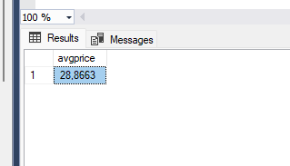

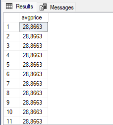

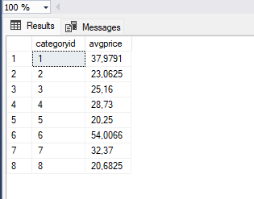

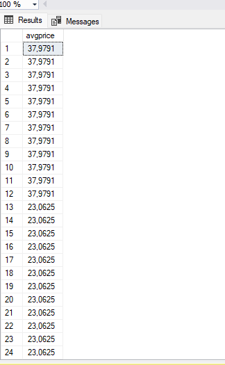


- podobieństwa: funkcja okna i grupowanie dają takie same wyniki dla średniej ceny kategorii i produktów
- różnice: grupowanie zwraca jeden wynik dla każdej grupy, a funkcja okna zwraca wszytskie rekordy razem z obliczonym wynikiem

---

# Zadanie 2 - obserwacja

Wykonaj i porównaj wyniki następujących poleceń.

```sql
--1)

select p.productid, p.ProductName, p.unitprice,
       (select avg(unitprice) from products) as avgprice
from products p
where productid < 10

--2)
select p.productid, p.ProductName, p.unitprice,
       avg(unitprice) over () as avgprice
from products p
where productid < 10
```

Jaka jest różnica? Czego dotyczy warunek w każdym z przypadków? Napisz polecenie równoważne

- 1. z wykorzystaniem funkcji okna. Napisz polecenie równoważne
- 2. z wykorzystaniem podzapytania

> Wyniki: 

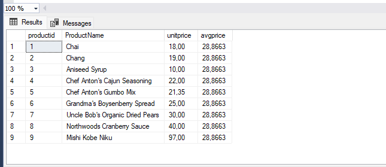


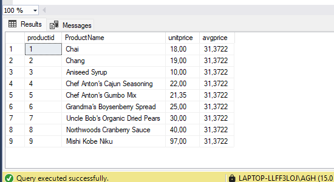

Różnica: w pierwszym zapytaniu jest średnia wszystkich produktów, a w drugim zapytaniu średnia cena produktów o productid < 10

- funkcja okna 

```sql
select p.productid, p.ProductName, p.unitprice, 
       avg(p.unitprice) over () as avgprice
from products p
where productid < 10;
```
- podzapytanie

```sql
select p.productid, p.ProductName, p.unitprice, 
       (select avg(unitprice) from products) as avgprice
from products p
where productid < 10;
```
W funkcji okna średnia liczona jest tylko dla przefiltrowanych danych, w podzapytaniu średnia jest liczona dla całej tabeli.

---

# Zadanie 3

Baza: Northwind, tabela: products

Napisz polecenie, które zwraca: id produktu, nazwę produktu, cenę produktu, średnią cenę wszystkich produktów.

Napisz polecenie z wykorzystaniem z wykorzystaniem podzapytania, join'a oraz funkcji okna. Porównaj czasy oraz plany wykonania zapytań.

Przetestuj działanie w różnych SZBD (MS SQL Server, PostgreSql, SQLite)

W SSMS włącz dwie opcje: Include Actual Execution Plan oraz Include Live Query Statistics


W DataGrip użyj opcji Explain Plan/Explain Analyze


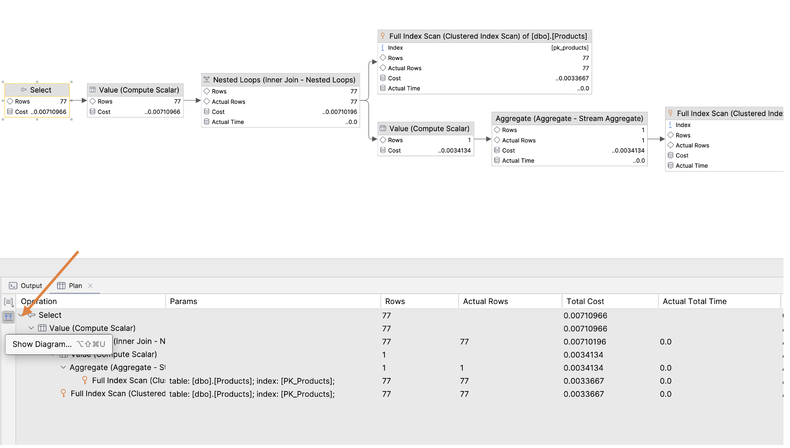

---

> Wyniki:

```sql
select productid, productname, unitprice, 
(select avg(unitprice) from products) as avgprice
from products p;

```


```sql

select productid, productname, unitprice,
avg(unitprice) over () as avgprice
from products;
```

```sql
select p.productid, p.productname, p.unitprice, avg(a.unitprice) as avgprice
from products p
cross join products a
group by p.productid, p.productname, p.unitprice;

```


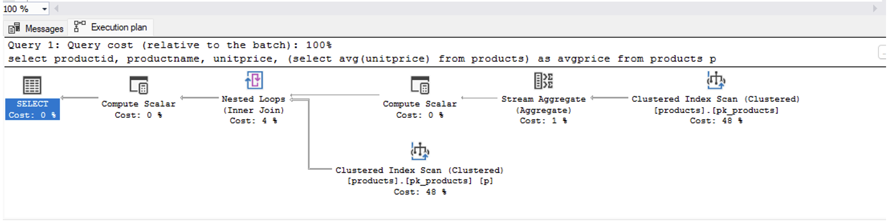

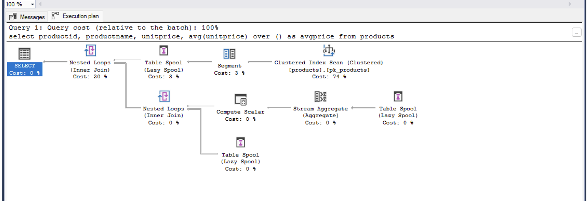

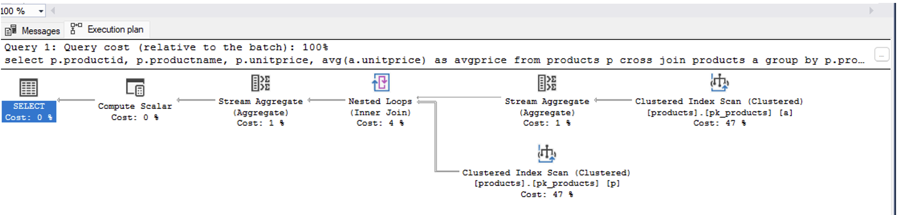

- MS SQL Server:
  - główny koszt we wszystkich zapytaniach to Clustered Index Scan 
  - podzapytanie i cross join wykonują dwa Index Scan, a funkcja okna tylko jeden 
  - Subquery:
    -  dwa skany(dla AVG i dla głównych danych)
    - Wynik AVG przechodzi przez Compute Scalar do każdego wiersza.

  - Window func: 
    - jeden skan: AVG i dane główne liczone razem.

  - Cross Join 
    - dwa skany: połączone są przez Nested Loop
    - dwie agregacje
  
- POSTGRES:

  - główny koszt to Seq Scan (pełny skan tabeli products)
  - subquery i cross join wykonują dwa Seq Scan, a window function tylko jeden

  - Subquery:
    - są dwa skany (dla AVG i dla głównego SELECT)
    - jest osobny Aggregate dla obliczenia średniej


  - Window func:
    - jest jeden skan

  - Cross Join:
    - Nested Loop łączy dwa skany
    - jest agregacja na dużym zbiorze danych

- SQLITE:

  - główną operacją w każdym zapytaniu jest Full Scan 

  - Subquery:
    - jest blok Subquery
    - wykorzystuje Full Scan

  - Window func:
    - występuje operacja CO-ROUTINE 
    - wykorzystuje Full Scan 

  - Cross Join:
    - dwa Full Scan


 We wszystkich analizowanych systemach najbardziej efektywne jest użycie funkcji okna. Najmniej efektywne jest wykorzystanie CROSS JOIN. Powoduje on łączenie każdego wiersza z każdym (Nested Loop), czyli zwiększa się liczby operacji i kosztu. 


---


# Zadanie 4

Baza: Northwind, tabela products

Napisz polecenie, które zwraca: id produktu, nazwę produktu, cenę produktu, średnią cenę produktów w kategorii, do której należy dany produkt. Wyświetl tylko pozycje (produkty) których cena jest większa niż średnia cena.

Napisz polecenie z wykorzystaniem podzapytania, join'a oraz funkcji okna. Porównaj zapytania. Porównaj czasy oraz plany wykonania zapytań.

Przetestuj działanie w różnych SZBD (MS SQL Server, PostgreSql, SQLite)

---

> Wyniki:

```sql
select p.productid, p.productname, p.unitprice,
       (
           select avg(x.unitprice)
           from products x
           where x.categoryid = p.categoryid
       ) as avg_category_price
from products p
where p.unitprice > (
    select avg(x.unitprice)
    from products x
    where x.categoryid = p.categoryid
);
```

```sql
select *
from (
    select p.productid, p.productname, p.unitprice,
           avg(p.unitprice) over (partition by p.categoryid) as avg_category_price
    from products p
) t
where t.unitprice > t.avg_category_price;
```

```sql
select p.productid, p.productname, p.unitprice, avg(x.unitprice) as avg_category_price
from products p
left join products x
  on x.categoryid = p.categoryid
group by p.productid, p.productname, p.unitprice
having p.unitprice > avg(x.unitprice);

```


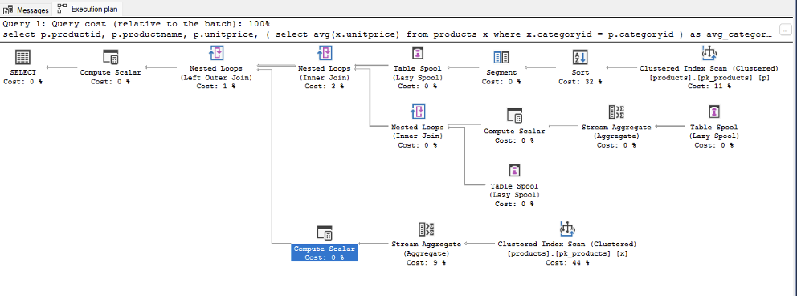

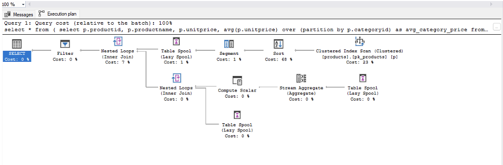

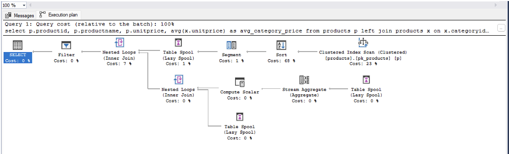


 Najlepszym rozwiązaniem jest funkcja okna, bo pozwala policzyć średnią bez robienia osobnego zapytania i dodatkowego skanowania tabeli. Mimo że pojawiają się jakieś dodatkowe operacje jak sort czy spool, to i tak jest to bardziej opłacalne niż ponowne czytanie danych.

Podzapytanie jest mniej wydajne, bo widać, że tabela jest skanowana więcej niż raz: raz do głównego zapytania i drugi raz do policzenia średniej. Do tego dochodzi jeszcze osobna agregacja, więc robi się więcej operacji.

Najgorzej wypada rozwiązanie z join, bo łączy dane przez Nested Loop i potem robi agregację na większym zbiorze. To powoduje więcej pracy dla silnika i bardziej rozbudowany plan wykonania.


---

# Zadanie 5 

Oryginalna baza Northwind jest bardzo mała. Warto zaobserwować działanie na nieco większym zbiorze danych.

Baza Northwind3 zawiera dodatkową tabelę product_history

- 2,2 mln wierszy

Bazę Northwind3 można pobrać z moodle (zakładka - Backupy baz danych)

Można też wygenerować tabelę product_history przy pomocy skryptu

Skrypt dla SQL Srerver

Stwórz tabelę o następującej strukturze:

```sql
create table product_history(
   id int identity(1,1) not null,
   productid int,
   productname varchar(40) not null,
   supplierid int null,
   categoryid int null,
   quantityperunit varchar(20) null,
   unitprice decimal(10,2) null,
   quantity int,
   value decimal(10,2),
   date date,
 constraint pk_product_history primary key clustered
    (id asc )
)
```

Wygeneruj przykładowe dane:

Dla 30000 iteracji, tabela będzie zawierała nieco ponad 2mln wierszy (dostostu ograniczenie do możliwości swojego komputera)

Skrypt dla SQL Srerver

```sql
declare @i int
set @i = 1
while @i <= 30000
begin
    insert product_history
    select productid, ProductName, SupplierID, CategoryID,
         QuantityPerUnit,round(RAND()*unitprice + 10,2),
         cast(RAND() * productid + 10 as int), 0,
         dateadd(day, @i, '1940-01-01')
    from products
    set @i = @i + 1;
end;

update product_history
set value = unitprice * quantity
where 1=1;
```

Skrypt dla Postgresql

```sql
create table product_history(
   id int generated always as identity not null
       constraint pkproduct_history
            primary key,
   productid int,
   productname varchar(40) not null,
   supplierid int null,
   categoryid int null,
   quantityperunit varchar(20) null,
   unitprice decimal(10,2) null,
   quantity int,
   value decimal(10,2),
   date date
);
```

Wygeneruj przykładowe dane:

Skrypt dla Postgresql

```sql
do $$
begin
  for cnt in 1..30000 loop
    insert into product_history(productid, productname, supplierid,
           categoryid, quantityperunit,
           unitprice, quantity, value, date)
    select productid, productname, supplierid, categoryid,
           quantityperunit,
           round((random()*unitprice + 10)::numeric,2),
           cast(random() * productid + 10 as int), 0,
           cast('1940-01-01' as date) + cnt
    from products;
  end loop;
end; $$;

update product_history
set value = unitprice * quantity
where 1=1;
```

Wykonaj polecenia: `select count(*) from product_history`, potwierdzające wykonanie zadania

---

> Wyniki:


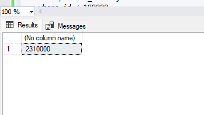


# Zadanie 6

Baza: Northwind, tabela product_history

Napisz polecenie, które zwraca: id pozycji, id produktu, nazwę produktu, id_kategorii, cenę produktu, średnią cenę produktów w kategorii do której należy dany produkt. Wyświetl tylko pozycje (produkty) których cena jest większa niż średnia cena.

W przypadku długiego czasu wykonania ogranicz zbiór wynikowy do kilkuset/kilku tysięcy wierszy

pomocna może być konstrukcja `with`

```sql
with t as (

....
)
select * from t
where id between ....
```

Napisz polecenie z wykorzystaniem podzapytania, join'a oraz funkcji okna. Porównaj zapytania. Porównaj czasy oraz plany wykonania zapytań.

Przetestuj działanie w różnych SZBD (MS SQL Server, PostgreSql, SQLite)

---

> Wyniki:

```sql
select *
from (
    select
    id,
    productid,
    productname,
    categoryid,
    unitprice,
    avg(unitprice) over (partition by categoryid) as avg_price_in_category
    from product_history
    where id < 100000
) t
where unitprice > avg_price_in_category;
```

```sql
with t as (
    select *
    from product_history
    where id < 20000
)
select
    p.id,
    p.productid,
    p.productname,
    p.categoryid,
    p.unitprice,
    avg(pp.unitprice) as avg_price_in_category
from t p
join t pp on p.categoryid = pp.categoryid
group by
    p.id, p.productid, p.productname, p.categoryid, p.unitprice
having p.unitprice > avg(pp.unitprice)
order by p.id;
```

```sql
with t as (
	select *
	from product_history
	where id < 100000
)
select *
from (
	select
		id,
		productid,
		productname,
		categoryid,
		unitprice,
		avg(unitprice) over (partition by categoryid) as avg_price_in_category
	from t
) x
where unitprice > avg_price_in_category
order by id;
```

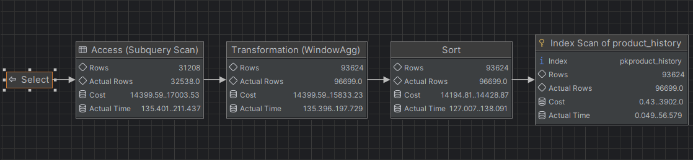

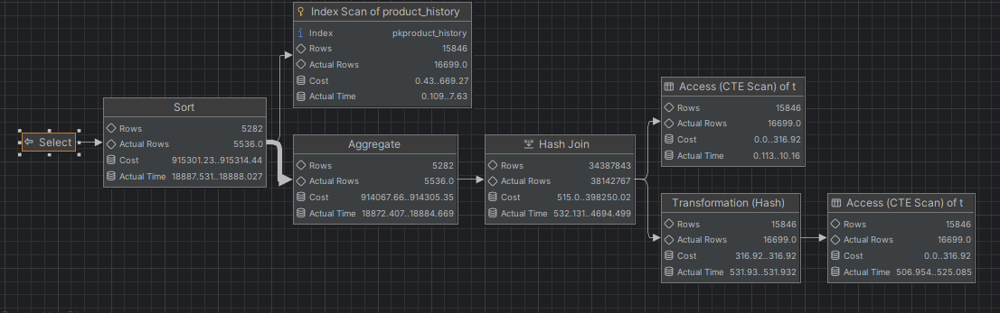

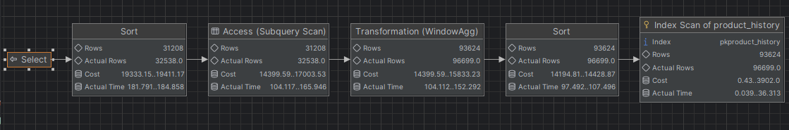

Ze względu na długi czas wykonania zapytań ograniczyliśmy liczbę wierszy.

Podzapytanie i funkcja okna dawały podobne wyniki czasowe. 
Największa różnica była widoczna w przypadku zapytania z join. W PostgreSQL czas wykonania był znacznie dłuższy, ponieważ wykorzystywany był Hash Join oraz agregacja na dużym zbiorze danych. W SQL Server to samo zapytanie wykonywało się szybciej. Wynika to z zastosowania innych mechanizmów.


---

|         |     |
| ------- | --- |
| zadanie | pkt |
| 1       | 1   |
| 2       | 1   |
| 3       | 1   |
| 4       | 1   |
| 5       | 1   |
| 6       | 2   |
| razem:  | 7   |


