## SQL - Funkcje okna (Window functions) <br> Lab 1

---

**Imiona i nazwiska:** Natalia Bratek, Jakub Karczewski

---

Celem ćwiczenia jest przygotowanie środowiska pracy, wstępne zapoznanie się z działaniem funkcji okna (window functions) w SQL, analiza wydajności zapytań i porównanie z rozwiązaniami przy wykorzystaniu "tradycyjnych" konstrukcji SQL

Swoje odpowiedzi wpisuj w miejsca oznaczone jako:

---

> Wyniki:

```sql
--  ...
```

---

Ważne/wymagane są komentarze.

Zamieść kod rozwiązania oraz zrzuty ekranu pokazujące wyniki, (dołącz kod rozwiązania w formie tekstowej/źródłowej)

Zwróć uwagę na formatowanie kodu

---

## Oprogramowanie - co jest potrzebne?

Do wykonania ćwiczenia potrzebne jest następujące oprogramowanie:

- MS SQL Server - wersja 2019, 2022, 2025
- PostgreSQL - wersja 15/16/17/18
- SQLite
- Narzędzia do komunikacji z bazą danych
  - SSMS - Microsoft SQL Managment Studio
  - DtataGrip lub DBeaver
- Przykładowa baza Northwind
  - W wersji dla każdego z wymienionych serwerów

Oprogramowanie dostępne jest na przygotowanej maszynie wirtualnej

## Dokumentacja/Literatura

- Kathi Kellenberger,  Clayton Groom, Ed Pollack, Expert T-SQL Window Functions in SQL Server 2019, Apres 2019
- Itzik Ben-Gan, T-SQL Window Functions: For Data Analysis and Beyond, Microsoft 2020

- Kilka linków do materiałów które mogą być pomocne
   - [https://learn.microsoft.com/en-us/sql/t-sql/queries/select-over-clause-transact-sql?view=sql-server-ver16](https://learn.microsoft.com/en-us/sql/t-sql/queries/select-over-clause-transact-sql?view=sql-server-ver16)
  - [https://www.sqlservertutorial.net/sql-server-window-functions/](https://www.sqlservertutorial.net/sql-server-window-functions/)
  - [https://www.sqlshack.com/use-window-functions-sql-server/](https://www.sqlshack.com/use-window-functions-sql-server/)
  - [https://www.postgresql.org/docs/current/tutorial-window.html](https://www.postgresql.org/docs/current/tutorial-window.html)
  - [https://www.postgresqltutorial.com/postgresql-window-function/](https://www.postgresqltutorial.com/postgresql-window-function/)
  - [https://www.sqlite.org/windowfunctions.html](https://www.sqlite.org/windowfunctions.html)
  - [https://www.sqlitetutorial.net/sqlite-window-functions/](https://www.sqlitetutorial.net/sqlite-window-functions/)

- W razie potrzeby - opis Ikonek używanych w graficznej prezentacji planu zapytania w SSMS jest tutaj:
  - [https://docs.microsoft.com/en-us/sql/relational-databases/showplan-logical-and-physical-operators-reference](https://docs.microsoft.com/en-us/sql/relational-databases/showplan-logical-and-physical-operators-reference)

## Przygotowanie

Uruchom SSMS
- Skonfiguruj połączenie z bazą Northwind na lokalnym serwerze MS SQL 

Uruchom DataGrip (lub Dbeaver)

- Skonfiguruj połączenia z bazą Northwind3
  - na lokalnym serwerze MS SQL
  - na lokalnym serwerze PostgreSQL
  - z lokalną bazą SQLite

---

# Zadanie 1 - obserwacja

Wykonaj i porównaj wyniki następujących poleceń.

```sql
select avg(unitprice) avgprice
from products p;

select avg(unitprice) over () as avgprice
from products p;

select categoryid, avg(unitprice) avgprice
from products p
group by categoryid

select avg(unitprice) over (partition by categoryid) as avgprice
from products p;
```

Jaka jest są podobieństwa, jakie różnice pomiędzy grupowaniem danych a działaniem funkcji okna?

---

> Wyniki:


- podobieństwa: funkcja okna i grupowanie dają takie same wyniki dla średniej ceny kategorii i produktów
- różnice: grupowanie zwraca jeden wynik dla każdej grupy, a funkcja okna zwraca wszytskie rekordy razem z obliczonym wynikiem

---

# Zadanie 2 - obserwacja

Wykonaj i porównaj wyniki następujących poleceń.

```sql
--1)

select p.productid, p.ProductName, p.unitprice,
       (select avg(unitprice) from products) as avgprice
from products p
where productid < 10

--2)
select p.productid, p.ProductName, p.unitprice,
       avg(unitprice) over () as avgprice
from products p
where productid < 10
```

Jaka jest różnica? Czego dotyczy warunek w każdym z przypadków? Napisz polecenie równoważne

- 1. z wykorzystaniem funkcji okna. Napisz polecenie równoważne
- 2. z wykorzystaniem podzapytania

> Wyniki: 


Różnica: w pierwszym zapytaniu jest średnia wszystkich produktów, ponieważ subquery jest wywoływane niezależnie od klauzuli where i taki sam wynik średniej(dla całości)jest potem doklejany do każdego produktu z id mniejszym od 10.
W drugim zapytaniu, dzięki użyciu funkcji okna filtr z where jest uwzględniany, przez co liczymy średnią dla produktów o id mniejszym od 10 uwzględniając w oknie tylko produkty o id mniejszym od 10.


### Podzapytanie równoważne 2

```sql
SELECT
    p.productid,
    p.ProductName,
    p.unitprice,
    (SELECT AVG(unitprice)
     FROM products
     WHERE productid < 10) AS avgprice
FROM products p
WHERE productid < 10;
```

### funkcja okna równoważna 1

```sql
WITH all_products AS (
    SELECT *
    FROM products
),
calc AS (
    SELECT
        *,
        AVG(unitprice) OVER () AS avgprice
    FROM all_products
)
SELECT
    productid,
    ProductName,
    unitprice,
    avgprice
FROM calc
WHERE productid < 10;
```


---

# Zadanie 3

Baza: Northwind, tabela: products

Napisz polecenie, które zwraca: id produktu, nazwę produktu, cenę produktu, średnią cenę wszystkich produktów.

Napisz polecenie z wykorzystaniem z wykorzystaniem podzapytania, join'a oraz funkcji okna. Porównaj czasy oraz plany wykonania zapytań.

Przetestuj działanie w różnych SZBD (MS SQL Server, PostgreSql, SQLite)

W SSMS włącz dwie opcje: Include Actual Execution Plan oraz Include Live Query Statistics


W DataGrip użyj opcji Explain Plan/Explain Analyze


---

> Wyniki:

```sql
select productid, productname, unitprice, 
(select avg(unitprice) from products) as avgprice
from products p;

```


```sql

select productid, productname, unitprice,
avg(unitprice) over () as avgprice
from products;
```

```sql
select p.productid, p.productname, p.unitprice, avg(a.unitprice) as avgprice
from products p
cross join products a
group by p.productid, p.productname, p.unitprice;

```

### Plany zapytań dla MS SQL Server


### Plany zapytań dla PostgreSQL
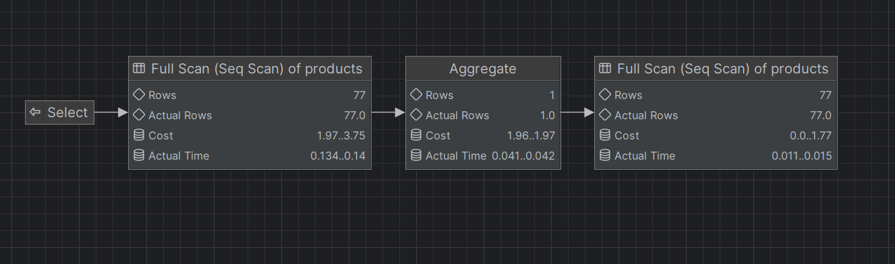

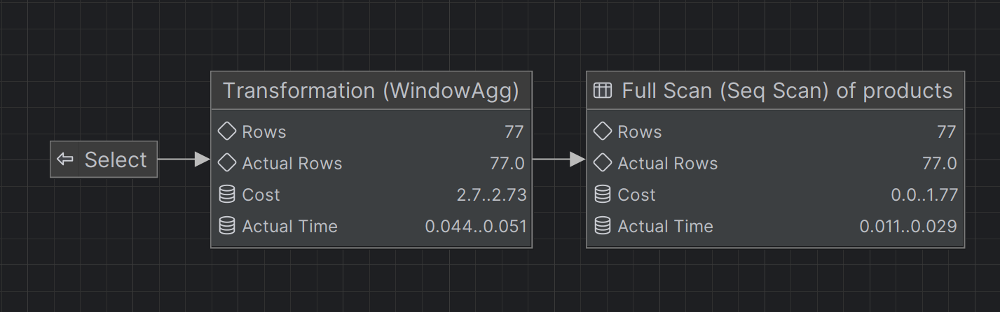

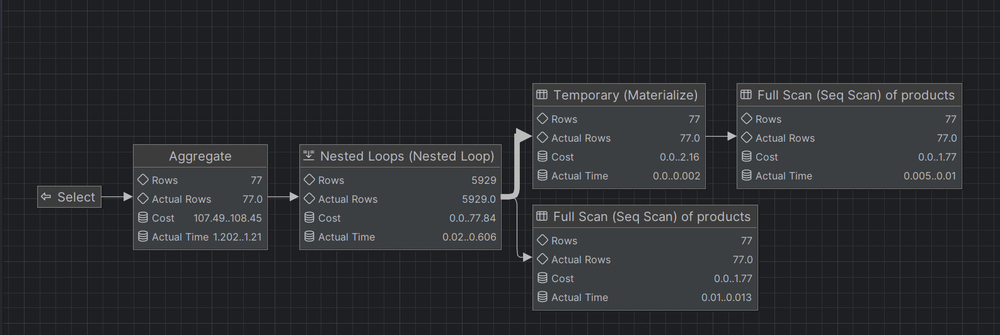


### Plany zapytań dla SQLite
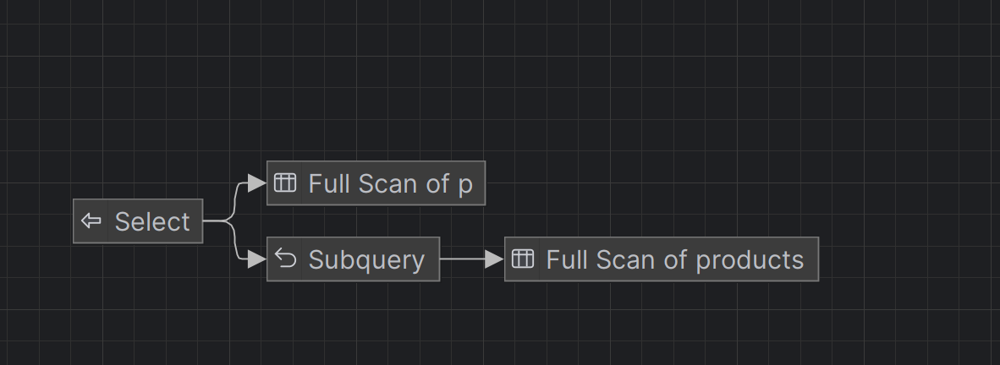

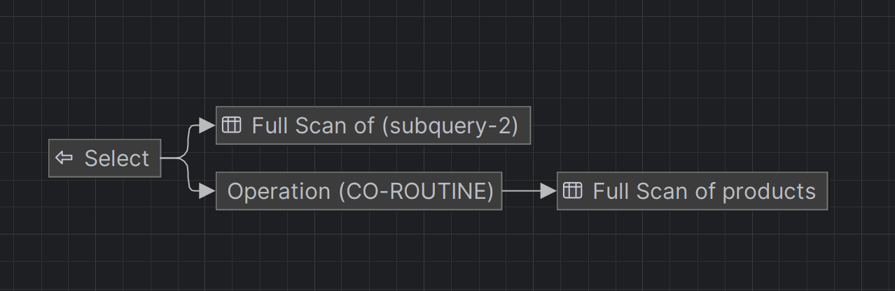

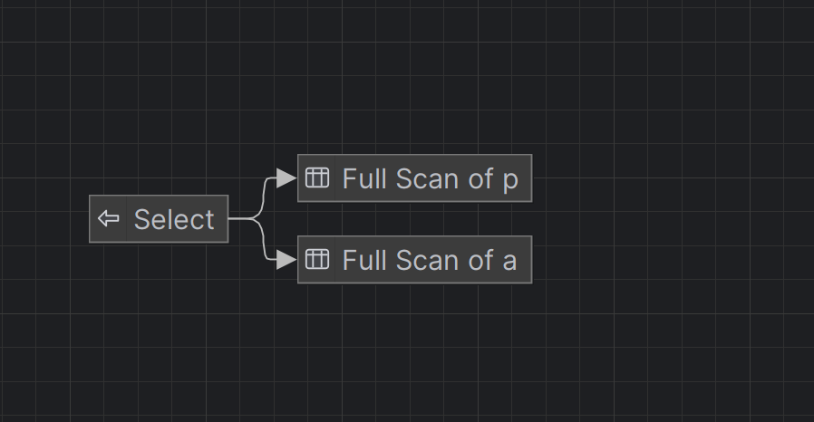


# Wnioski
## MS SQL SERVER
- W MS SQL Server najważniejszym operatorem w zapytaniach jest Clustered Index Scan dla tabeli products. 
Różnica sprowadza się głównie do liczby wykonań Full Index Scan: zapytanie z funkcją okna wykonuje go tylko raz (74% kosztu zapytania): średnia i dane główne liczone są w jednym przebiegu. Natomiast podzapytanie i cross join wykonują Index Scan dwa razy (po ~47-48% każdy, łącznie ~95% kosztu zapytania): jeden dla obliczenia AVG, drugi dla głównych danych.

- W podzapytaniu dwa skany łączone są przez Nested Loops. Wartość średniej przechodzi przez Compute Scalar do każdego wiersza. Cross Join łączy dwa skany przez Nested Loops i dodatkowo stosuje dwie agregacje.

## PostgreSQL
- W PostgreSQL funkcja okna wykonuje jeden Seq Scan, po którym WindowAgg liczy średnią: total cost wynosi 2.73, a Actual Time 0.051 ms. Podzapytanie ma dwa Seq Scan i Aggregate dla obliczenia średniej: total cost 3.75, Actual Time 0.14 ms. 
Problem pojawia się przy joinie, żeby policzyć średnią ze wszystkich produktów trzeba użyć cross join, a cross join powoduje, że dla n wierszy mamy n² par do przetworzenia (w Nested Loop widać 5929 wierszy = 77 × 77). Dlatego jest wyższy koszt agregacji niż w pozostałych zapytaniach: total cost 108.45, Actual Time 1.21 ms. 

## SQLite
- SQLite nie pokazuje kosztów ani liczby wierszy przetworzonych. W SQLite w każdym z zapytań pojawiają się dwa bloki Full Scan. W podzapytaniu pojawia się osobny blok Subquery, a funkcja okna realizowana jest przez CO-ROUTINE.
- We wszystkich trzech systemach najbardziej efektywna jest funkcja okna, ponieważ wymaga tylko jednego skanu tabeli. Największe różnice widać w PostgreSQL: cross join tworzy n² wierszy (5929 zamiast 77), więc agregacja robi się droższa.

---


# Zadanie 4

Baza: Northwind, tabela products

Napisz polecenie, które zwraca: id produktu, nazwę produktu, cenę produktu, średnią cenę produktów w kategorii, do której należy dany produkt. Wyświetl tylko pozycje (produkty) których cena jest większa niż średnia cena.

Napisz polecenie z wykorzystaniem podzapytania, join'a oraz funkcji okna. Porównaj zapytania. Porównaj czasy oraz plany wykonania zapytań.

Przetestuj działanie w różnych SZBD (MS SQL Server, PostgreSql, SQLite)

---

> Wyniki:

```sql
select p.productid, p.productname, p.unitprice,
(
    select avg(x.unitprice)
    from products x
    where x.categoryid = p.categoryid
) as avg_category_price
from products p
where p.unitprice > avg_category_price
```

```sql
select *
from (
    select p.productid, p.productname, p.unitprice,
           avg(p.unitprice) over (partition by p.categoryid) as avg_category_price
    from products p
) t
where t.unitprice > t.avg_category_price;
```

```sql
select p.productid, p.productname, p.unitprice, avg(x.unitprice) as avg_category_price
from products p
left join products x
  on x.categoryid = p.categoryid
group by p.productid, p.productname, p.unitprice
having p.unitprice > avg(x.unitprice);

```

### Plany zapytań dla MS SQL Server


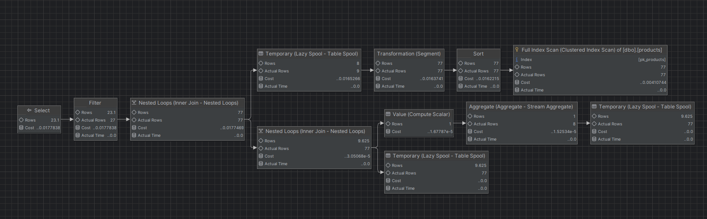

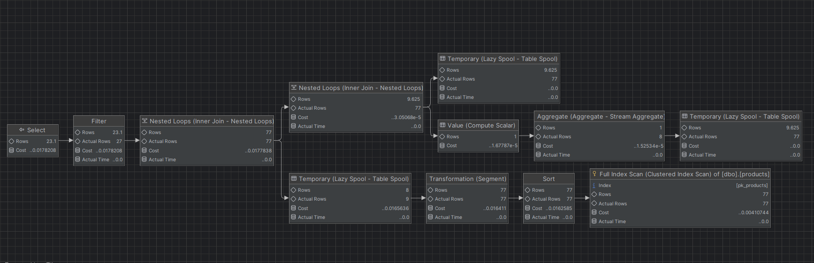

### Plany zapytań dla PostgreSQL
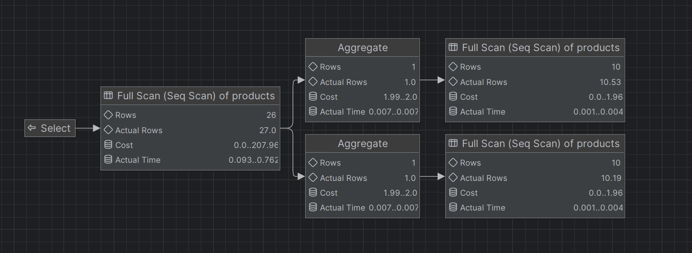

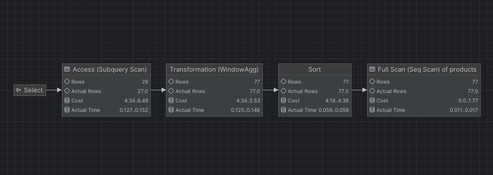

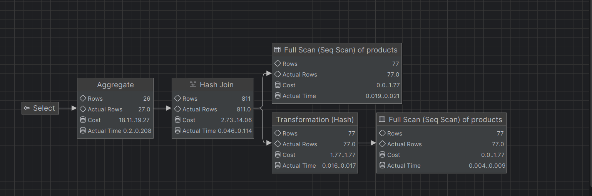

### Plany zapytań dla SQLite

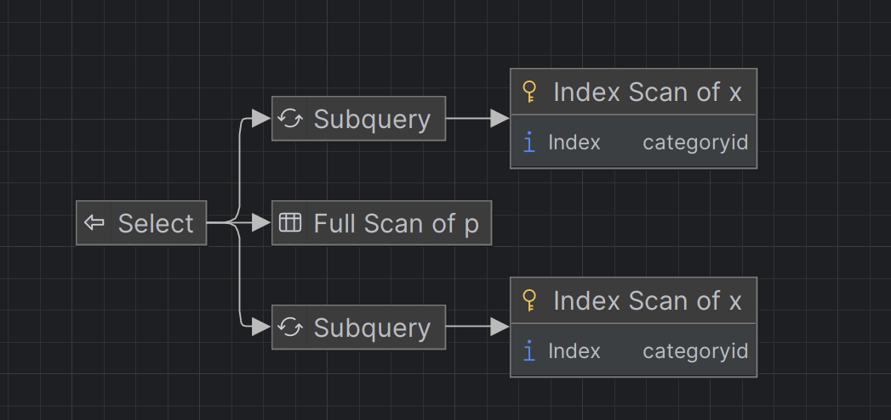

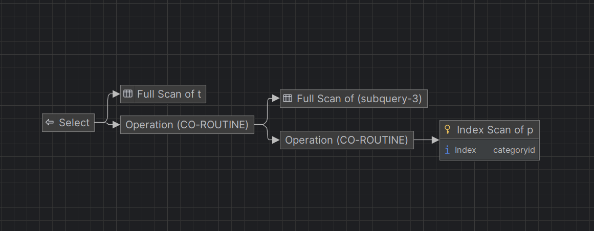

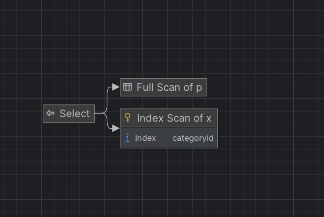


W MS SQL Server najważniejszym operatorem jest Clustered Index Scan dla tabeli products. Funkcja okna wykonuje jeden Index Scan, po którym następuje Sort po categoryid (32% kosztu, dominująca operacja w planie), Segment i Stream Aggregate liczące średnią dla kategorii, a na końcu Filter odrzuca wiersze poniżej średniej. Podzapytanie wykonuje dwa skany tabeli (11% i 44% kosztu, razem 55%). Zapytanie z left join łączy produkty z tej samej kategorii przez Nested Loops, oblicza średnią na połączonym zbiorze i dopiero na końcu filtruje wiersze klauzulą HAVING.
W PostgreSQL funkcja okna wykonuje jeden Seq Scan, po którym WindowAgg liczy średnią dla okna: total cost 6.49, Actual Time 0.152 ms. Podzapytanie wymaga osobnego Aggregate dla każdej kategorii i drugiego skanu tabeli : total cost 207.96, Actual Time 0.762 ms, czyli drożej niż funkcja okna. Left join używa Hash Join po categoryid, który wewnątrz każdej kategorii łączy każdy wiersz z każdym (Hash Join zwraca 811 wierszy zamiast 77), dlatego agregacja wykonywana jest na większym zbiorze niż w pozostałych zapytaniach: total cost 19.27, Actual Time 0.208 ms.
W SQLite funkcja okna ma pojedynczy Full Scan z CO-ROUTINE. Podzapytanie i join wymagają dwóch skanów tabeli products.
We wszystkich trzech systemach najlepsza jest funkcja okna, bo liczy średnią raz bez ponownego skanowania tabeli. Podzapytanie jest mniej wydajne, bo tabela skanowana jest co najmniej dwa razy i jeszcze jest osobna agregacja. Najgorzej wypada join, który łączy dane przez Nested Loops lub Hash Join, przez co agregat liczony jest na większym zbiorze.


---

# Zadanie 5 

Oryginalna baza Northwind jest bardzo mała. Warto zaobserwować działanie na nieco większym zbiorze danych.

Baza Northwind3 zawiera dodatkową tabelę product_history

- 2,2 mln wierszy

Bazę Northwind3 można pobrać z moodle (zakładka - Backupy baz danych)

Można też wygenerować tabelę product_history przy pomocy skryptu

Skrypt dla SQL Srerver

Stwórz tabelę o następującej strukturze:

```sql
create table product_history(
   id int identity(1,1) not null,
   productid int,
   productname varchar(40) not null,
   supplierid int null,
   categoryid int null,
   quantityperunit varchar(20) null,
   unitprice decimal(10,2) null,
   quantity int,
   value decimal(10,2),
   date date,
 constraint pk_product_history primary key clustered
    (id asc )
)
```

Wygeneruj przykładowe dane:

Dla 30000 iteracji, tabela będzie zawierała nieco ponad 2mln wierszy (dostostu ograniczenie do możliwości swojego komputera)

Skrypt dla SQL Srerver

```sql
declare @i int
set @i = 1
while @i <= 30000
begin
    insert product_history
    select productid, ProductName, SupplierID, CategoryID,
         QuantityPerUnit,round(RAND()*unitprice + 10,2),
         cast(RAND() * productid + 10 as int), 0,
         dateadd(day, @i, '1940-01-01')
    from products
    set @i = @i + 1;
end;

update product_history
set value = unitprice * quantity
where 1=1;
```

Skrypt dla Postgresql

```sql
create table product_history(
   id int generated always as identity not null
       constraint pkproduct_history
            primary key,
   productid int,
   productname varchar(40) not null,
   supplierid int null,
   categoryid int null,
   quantityperunit varchar(20) null,
   unitprice decimal(10,2) null,
   quantity int,
   value decimal(10,2),
   date date
);
```

Wygeneruj przykładowe dane:

Skrypt dla Postgresql

```sql
do $$
begin
  for cnt in 1..30000 loop
    insert into product_history(productid, productname, supplierid,
           categoryid, quantityperunit,
           unitprice, quantity, value, date)
    select productid, productname, supplierid, categoryid,
           quantityperunit,
           round((random()*unitprice + 10)::numeric,2),
           cast(random() * productid + 10 as int), 0,
           cast('1940-01-01' as date) + cnt
    from products;
  end loop;
end; $$;

update product_history
set value = unitprice * quantity
where 1=1;
```

Wykonaj polecenia: `select count(*) from product_history`, potwierdzające wykonanie zadania

---

> Wyniki:


# Zadanie 6

Baza: Northwind, tabela product_history

Napisz polecenie, które zwraca: id pozycji, id produktu, nazwę produktu, id_kategorii, cenę produktu, średnią cenę produktów w kategorii do której należy dany produkt. Wyświetl tylko pozycje (produkty) których cena jest większa niż średnia cena.

W przypadku długiego czasu wykonania ogranicz zbiór wynikowy do kilkuset/kilku tysięcy wierszy

pomocna może być konstrukcja `with`

```sql
with t as (

....
)
select * from t
where id between ....
```

Napisz polecenie z wykorzystaniem podzapytania, join'a oraz funkcji okna. Porównaj zapytania. Porównaj czasy oraz plany wykonania zapytań.

Przetestuj działanie w różnych SZBD (MS SQL Server, PostgreSql, SQLite)

---

> Wyniki:

```sql
WITH t AS (
    SELECT 
        ph.id,
        ph.productid,
        ph.productname,
        ph.categoryid,
        ph.unitprice,
        (
            SELECT AVG(ph2.unitprice)
            FROM product_history ph2
            WHERE ph2.categoryid = ph.categoryid
        ) AS avg_category_price
    FROM product_history ph
)
SELECT *
FROM t
WHERE id BETWEEN 1 AND 2000
  AND unitprice > avg_category_price;
```

```sql
with t as (
    select *
    from product_history
    where id < 20000
)
select
    p.id,
    p.productid,
    p.productname,
    p.categoryid,
    p.unitprice,
    avg(pp.unitprice) as avg_price_in_category
from t p
join t pp on p.categoryid = pp.categoryid
group by
    p.id, p.productid, p.productname, p.categoryid, p.unitprice
having p.unitprice > avg(pp.unitprice)
order by p.id;
```

```sql
with t as (
	select *
	from product_history
	where id < 100000
)
select *
from (
	select
		id,
		productid,
		productname,
		categoryid,
		unitprice,
		avg(unitprice) over (partition by categoryid) as avg_price_in_category
	from t
) x
where unitprice > avg_price_in_category
order by id;
```


### Wyniki zapytań dla MS SQL Server
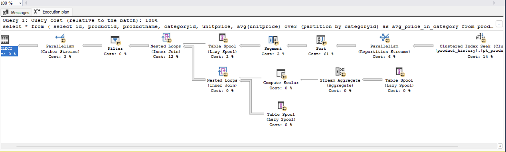

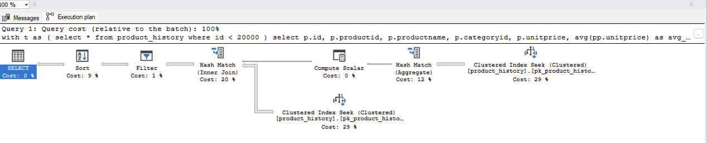

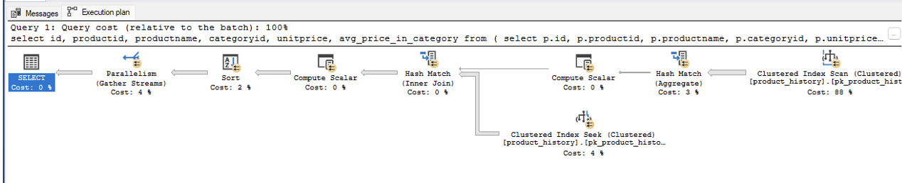


### Wyniki zapytań dla PostgreSQL:
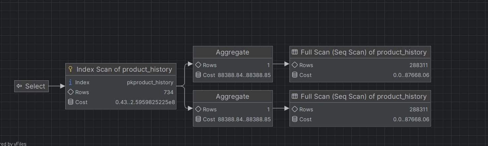

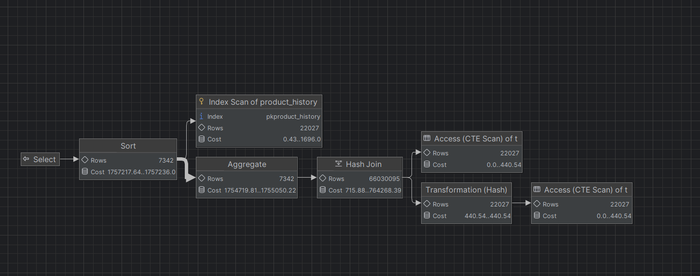

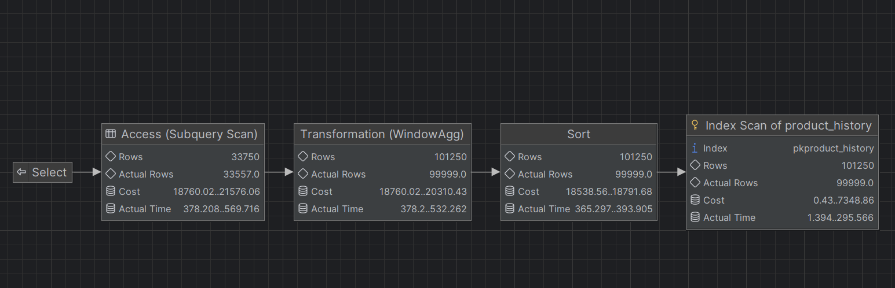

### Wyniki zapytań dla SQLite:
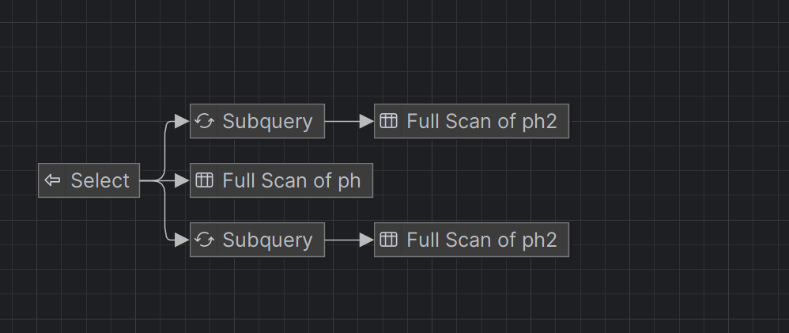

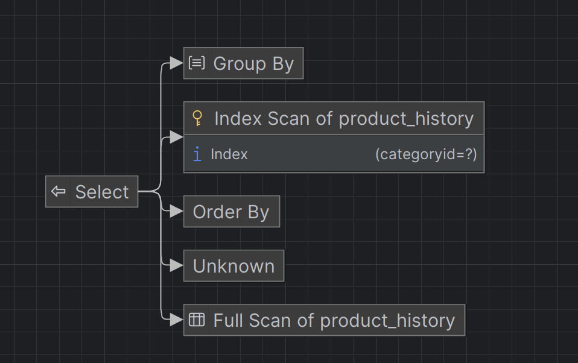

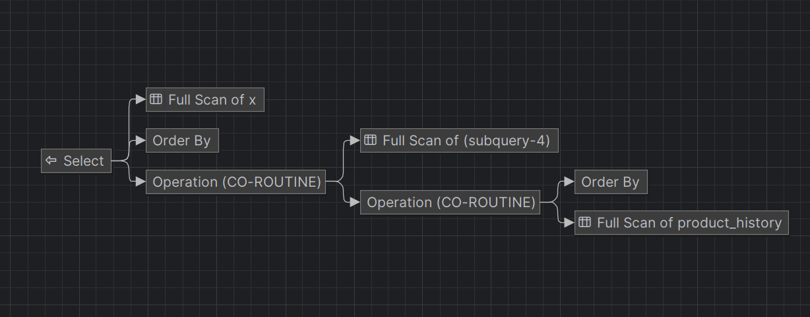

Ze względu na długi czas wykonania zapytań ograniczyliśmy liczbę wierszy.


Najlepiej we wszystkich trzech systemach wypada funkcja okna, bo liczy średnią raz z sortowaniem po categoryid. W PostgreSQL funkcja okna na zbiorze: ma total cost 21576 i Actual Time ~570 ms. Podzapytanie  wykonuje dwa Full Scan tabeli (każdy cost 0..87668) i osobny Aggregate dla każdej kategorii (cost 88388), dlatego total cost rośnie znacznie więcej niż w przypadku z funkcją okna.
Natomiast join wypada najgorzej, zwłaszcza w PostgreSQL, gdzie join tworzy bardzo dużo wierszy przed agregacją , końcowy total cost wynosi 1 757 236. W MS SQL Server różnice są mniejsze, bo wykorzystywane są Lazy Spool i Parallelism, ale i tak w planie funkcji okna dominuje Sort (61% kosztu), a w planie z joinem: Clustered Index Scan (88% kosztu). W SQLite join na tak dużej tabeli praktycznie nie wykonuje się bez ograniczenia liczby wierszy.


---

|         |     |
| ------- | --- |
| zadanie | pkt |
| 1       | 1   |
| 2       | 1   |
| 3       | 1   |
| 4       | 1   |
| 5       | 1   |
| 6       | 2   |
| razem:  | 7   |


