## SQL - Funkcje okna (Window functions) <br> Lab 1

---

**Imiona i nazwiska:** Natalia Bratek, Jakub Karczewski

---

Celem ćwiczenia jest przygotowanie środowiska pracy, wstępne zapoznanie się z działaniem funkcji okna (window functions) w SQL, analiza wydajności zapytań i porównanie z rozwiązaniami przy wykorzystaniu "tradycyjnych" konstrukcji SQL

Swoje odpowiedzi wpisuj w miejsca oznaczone jako:

---

> Wyniki:

```sql
--  ...
```

---

Ważne/wymagane są komentarze.

Zamieść kod rozwiązania oraz zrzuty ekranu pokazujące wyniki, (dołącz kod rozwiązania w formie tekstowej/źródłowej)

Zwróć uwagę na formatowanie kodu

---

## Oprogramowanie - co jest potrzebne?

Do wykonania ćwiczenia potrzebne jest następujące oprogramowanie:

- MS SQL Server - wersja 2019, 2022, 2025
- PostgreSQL - wersja 15/16/17/18
- SQLite
- Narzędzia do komunikacji z bazą danych
  - SSMS - Microsoft SQL Managment Studio
  - DtataGrip lub DBeaver
- Przykładowa baza Northwind
  - W wersji dla każdego z wymienionych serwerów

Oprogramowanie dostępne jest na przygotowanej maszynie wirtualnej

## Dokumentacja/Literatura

- Kathi Kellenberger,  Clayton Groom, Ed Pollack, Expert T-SQL Window Functions in SQL Server 2019, Apres 2019
- Itzik Ben-Gan, T-SQL Window Functions: For Data Analysis and Beyond, Microsoft 2020

- Kilka linków do materiałów które mogą być pomocne
   - [https://learn.microsoft.com/en-us/sql/t-sql/queries/select-over-clause-transact-sql?view=sql-server-ver16](https://learn.microsoft.com/en-us/sql/t-sql/queries/select-over-clause-transact-sql?view=sql-server-ver16)
  - [https://www.sqlservertutorial.net/sql-server-window-functions/](https://www.sqlservertutorial.net/sql-server-window-functions/)
  - [https://www.sqlshack.com/use-window-functions-sql-server/](https://www.sqlshack.com/use-window-functions-sql-server/)
  - [https://www.postgresql.org/docs/current/tutorial-window.html](https://www.postgresql.org/docs/current/tutorial-window.html)
  - [https://www.postgresqltutorial.com/postgresql-window-function/](https://www.postgresqltutorial.com/postgresql-window-function/)
  - [https://www.sqlite.org/windowfunctions.html](https://www.sqlite.org/windowfunctions.html)
  - [https://www.sqlitetutorial.net/sqlite-window-functions/](https://www.sqlitetutorial.net/sqlite-window-functions/)

- W razie potrzeby - opis Ikonek używanych w graficznej prezentacji planu zapytania w SSMS jest tutaj:
  - [https://docs.microsoft.com/en-us/sql/relational-databases/showplan-logical-and-physical-operators-reference](https://docs.microsoft.com/en-us/sql/relational-databases/showplan-logical-and-physical-operators-reference)

## Przygotowanie

Uruchom SSMS
- Skonfiguruj połączenie z bazą Northwind na lokalnym serwerze MS SQL 

Uruchom DataGrip (lub Dbeaver)

- Skonfiguruj połączenia z bazą Northwind3
  - na lokalnym serwerze MS SQL
  - na lokalnym serwerze PostgreSQL
  - z lokalną bazą SQLite

---

# Zadanie 1 - obserwacja

Wykonaj i porównaj wyniki następujących poleceń.

```sql
select avg(unitprice) avgprice
from products p;

select avg(unitprice) over () as avgprice
from products p;

select categoryid, avg(unitprice) avgprice
from products p
group by categoryid

select avg(unitprice) over (partition by categoryid) as avgprice
from products p;
```

Jaka jest są podobieństwa, jakie różnice pomiędzy grupowaniem danych a działaniem funkcji okna?

---

> Wyniki:

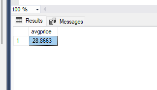

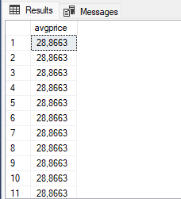

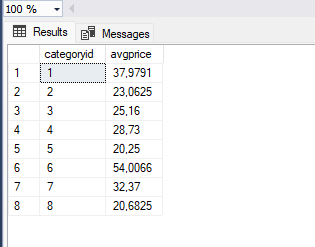

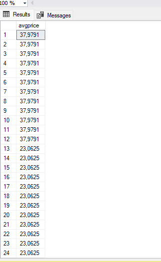


- podobieństwa: funkcja okna i grupowanie dają takie same wyniki dla średniej ceny kategorii i produktów
- różnice: grupowanie zwraca jeden wynik dla każdej grupy, a funkcja okna zwraca wszytskie rekordy razem z obliczonym wynikiem

---

# Zadanie 2 - obserwacja

Wykonaj i porównaj wyniki następujących poleceń.

```sql
--1)

select p.productid, p.ProductName, p.unitprice,
       (select avg(unitprice) from products) as avgprice
from products p
where productid < 10

--2)
select p.productid, p.ProductName, p.unitprice,
       avg(unitprice) over () as avgprice
from products p
where productid < 10
```

Jaka jest różnica? Czego dotyczy warunek w każdym z przypadków? Napisz polecenie równoważne

- 1. z wykorzystaniem funkcji okna. Napisz polecenie równoważne
- 2. z wykorzystaniem podzapytania

> Wyniki: 

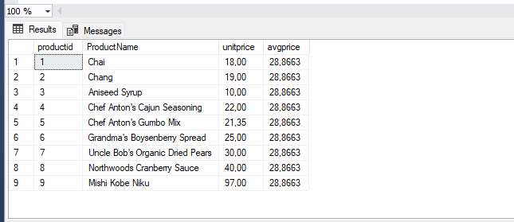


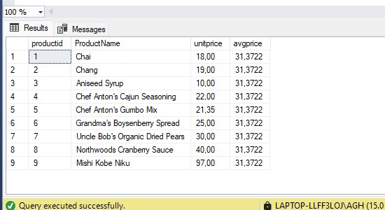

Różnica: w pierwszym zapytaniu średnia liczona jest w podzapytaniu, które nie widzi warunku where productid < 10 z głównego zapytania. Dlatego avg() bierze pod uwagę wszystkie produkty z tabeli products, a potem ta wartość jest doklejana do każdego rekordu spełniającego warunek.
W drugim zapytaniu występuje funkcja okna. Najpierw działa where, zostają tylko produkty o id < 10 i dopiero z nich liczona jest średnia.


### Podzapytanie równoważne 2

```sql
SELECT
    p.productid,
    p.ProductName,
    p.unitprice,
    (SELECT AVG(unitprice)
     FROM products
     WHERE productid < 10) AS avgprice
FROM products p
WHERE productid < 10;
```

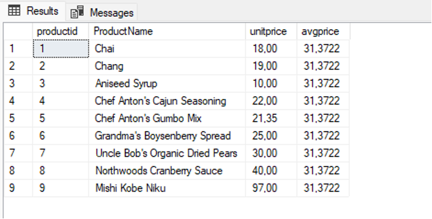

### funkcja okna równoważna 1

```sql
WITH calc AS (
    SELECT *, AVG(unitprice) OVER () AS avgprice
    FROM products              
)
SELECT productid, ProductName, unitprice, avgprice
FROM calc
WHERE productid < 10;
```
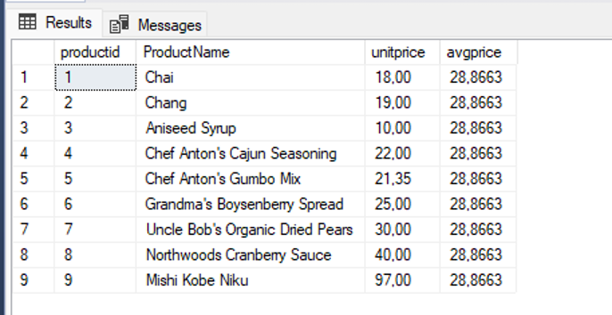

---

# Zadanie 3

Baza: Northwind, tabela: products

Napisz polecenie, które zwraca: id produktu, nazwę produktu, cenę produktu, średnią cenę wszystkich produktów.

Napisz polecenie z wykorzystaniem z wykorzystaniem podzapytania, join'a oraz funkcji okna. Porównaj czasy oraz plany wykonania zapytań.

Przetestuj działanie w różnych SZBD (MS SQL Server, PostgreSql, SQLite)

W SSMS włącz dwie opcje: Include Actual Execution Plan oraz Include Live Query Statistics

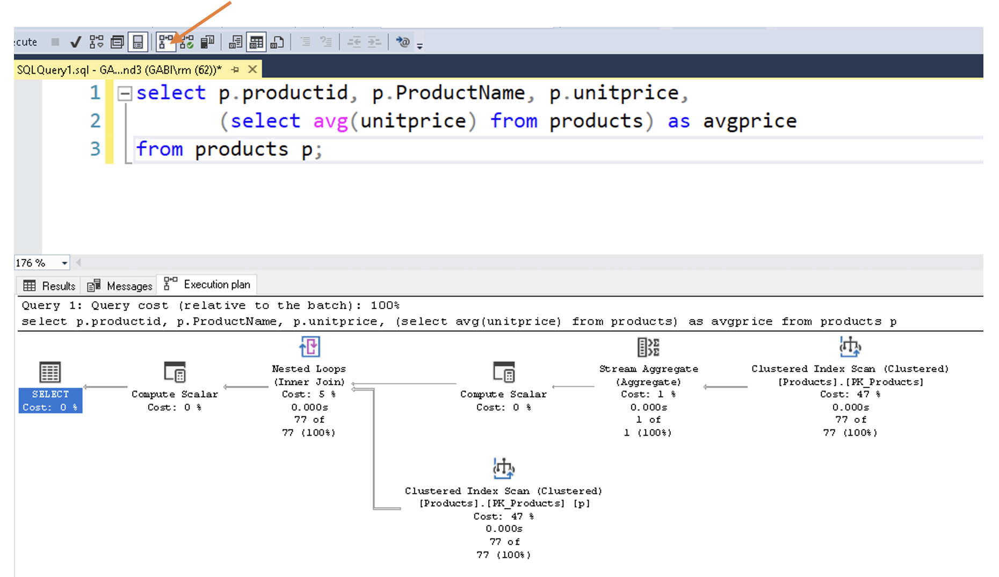

W DataGrip użyj opcji Explain Plan/Explain Analyze

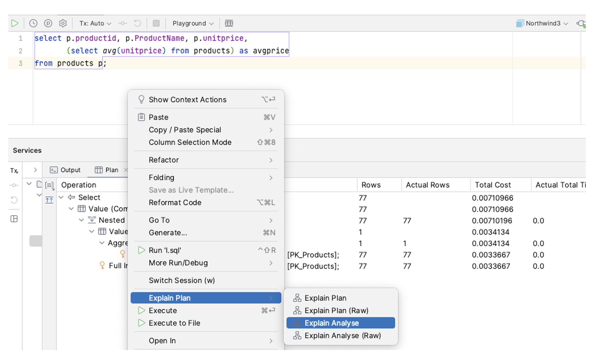

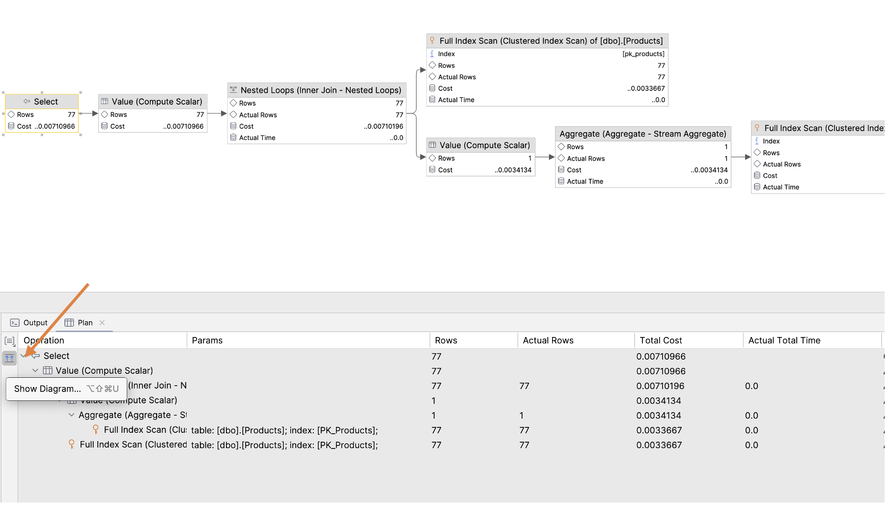

---

> Wyniki:

- podzapytanie

```sql
select productid, productname, unitprice, 
(select avg(unitprice) from products) as avgprice
from products p;

```

- funkcja okna 

```sql

select productid, productname, unitprice,
avg(unitprice) over () as avgprice
from products;
```

- join

```sql
select p.productid, p.productname, p.unitprice, avg(a.unitprice) as avgprice
from products p
cross join products a
group by p.productid, p.productname, p.unitprice;

```

### Plany zapytań dla MS SQL Server

- podzapytanie 

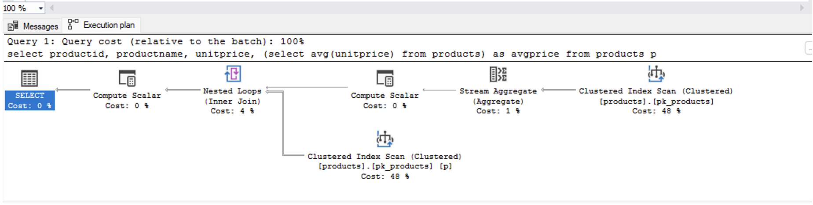

- funkcja okna

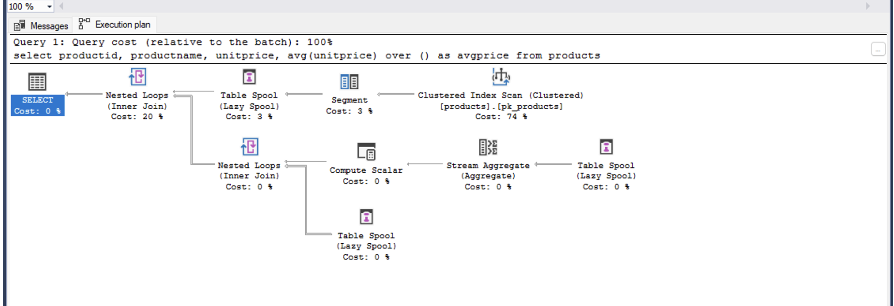

- join 

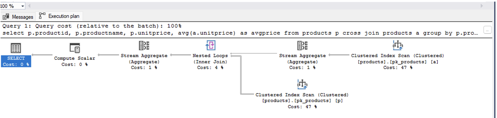

### Plany zapytań dla PostgreSQL

- podzapytanie 

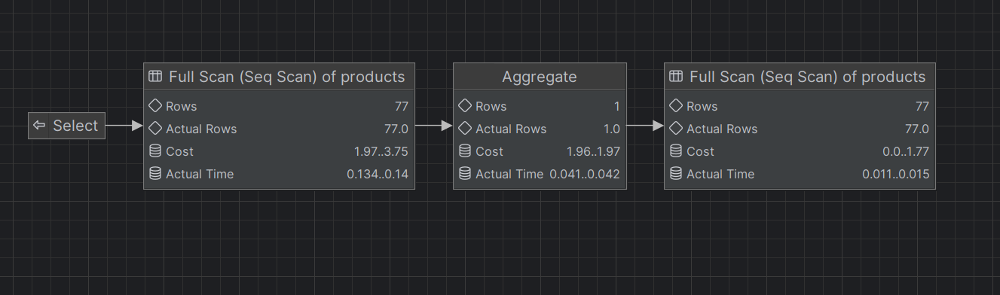

- funkcja okna

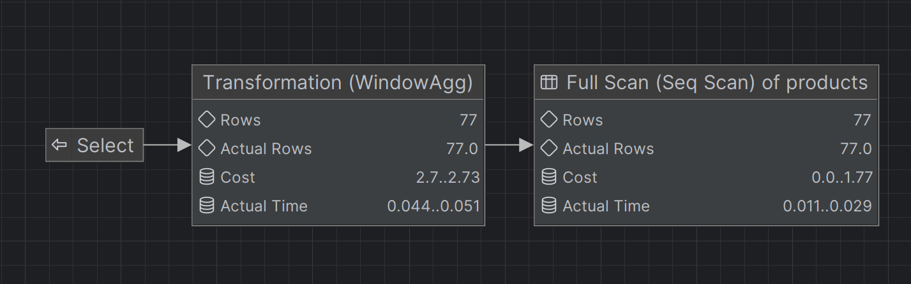

- join 

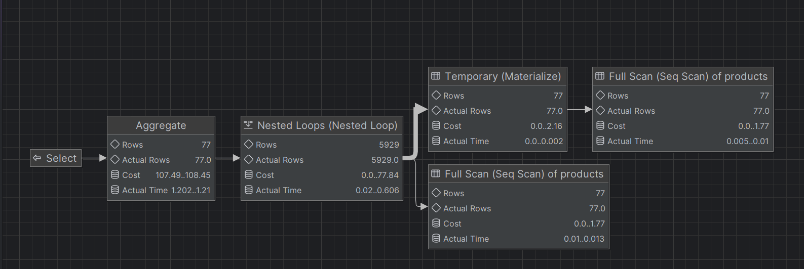


### Plany zapytań dla SQLite

- podzapytanie 

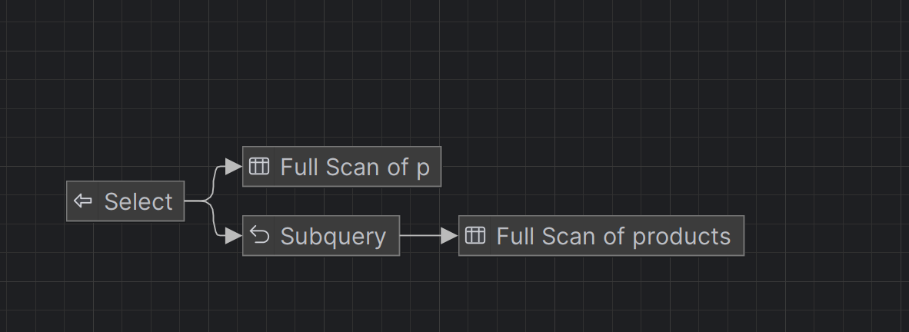

- funkcja okna

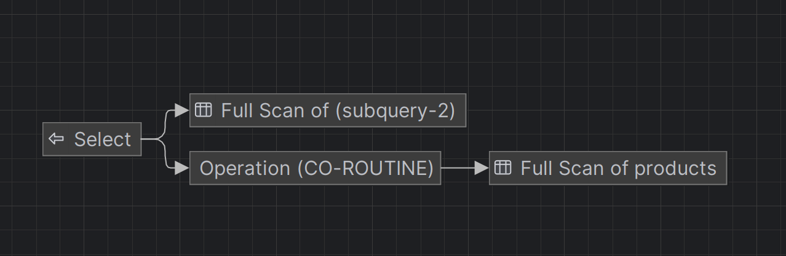

- join 

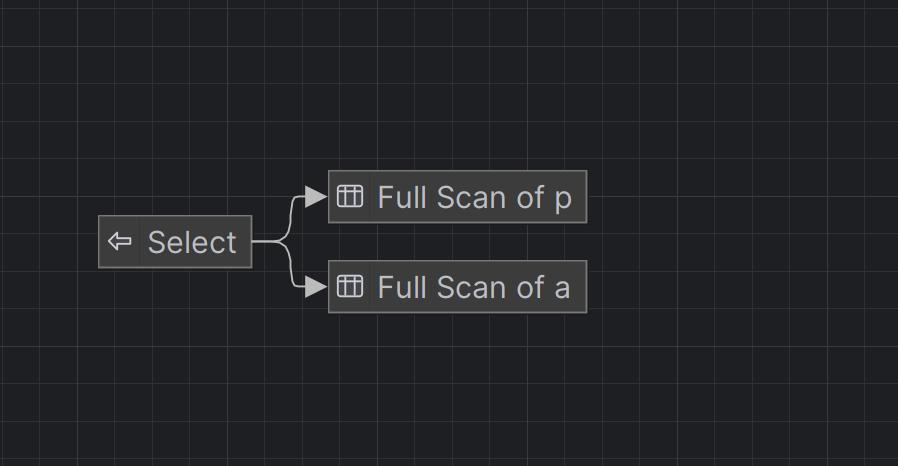


### Porównanie 
#### MS SQL SERVER
- Podzapytanie i join mają podobne plany. Oba wykonują dwa skanowania tabeli products
- Funkcja okna ma jeden skan tabeli, ale ma więcej operacji 


#### PostgreSQL
- Podzapytanie ma koszt 3.75, występują dwa Seq Scan dla tabeli products
- Funkcja okna ma koszt 2.73, jest tylko jeden Seq Scan i WindowAgg
- Join ma koszt 108, bo cross join tworzy 5929 wierszy (77 * 77)
- Najlepszy koszt ma funkcja okna, a najgorszy join


#### SQLite
- Wszystkie trzy plany mają Full Scan tabeli products dwa razy
- Plany wyglądają podobnie 


---


# Zadanie 4

Baza: Northwind, tabela products

Napisz polecenie, które zwraca: id produktu, nazwę produktu, cenę produktu, średnią cenę produktów w kategorii, do której należy dany produkt. Wyświetl tylko pozycje (produkty) których cena jest większa niż średnia cena.

Napisz polecenie z wykorzystaniem podzapytania, join'a oraz funkcji okna. Porównaj zapytania. Porównaj czasy oraz plany wykonania zapytań.

Przetestuj działanie w różnych SZBD (MS SQL Server, PostgreSql, SQLite)

---

> Wyniki:

- podzapytanie

```sql
select p.productid, p.productname, p.unitprice,
    (select avg(x.unitprice)
     from products x
     where x.categoryid = p.categoryid
    ) as avg_category_price
from products p
where p.unitprice > (
    select avg(x.unitprice)
    from products x
    where x.categoryid = p.categoryid
);
```

- funkcja okna 

```sql
select *
from (
    select p.productid, p.productname, p.unitprice,
           avg(p.unitprice) over (partition by p.categoryid) as avg_category_price
    from products p
) t
where t.unitprice > t.avg_category_price;
```

- join

```sql
select p.productid, p.productname, p.unitprice, avg(x.unitprice) as avg_category_price
from products p
left join products x
  on x.categoryid = p.categoryid
group by p.productid, p.productname, p.unitprice
having p.unitprice > avg(x.unitprice);

```

### Plany zapytań dla MS SQL Server

- podzapytanie 

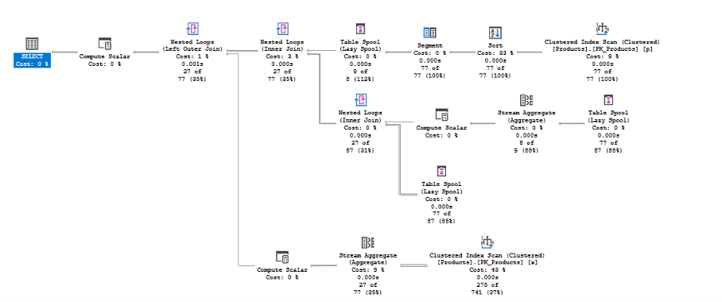

- funkcja okna 

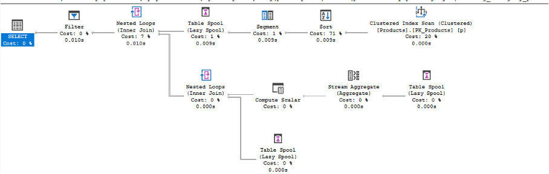

- join 

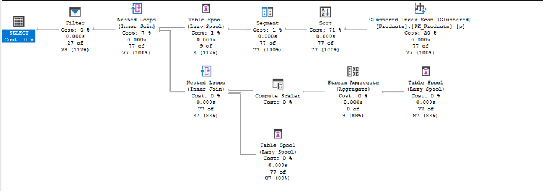

### Plany zapytań dla PostgreSQL

- podzapytanie 

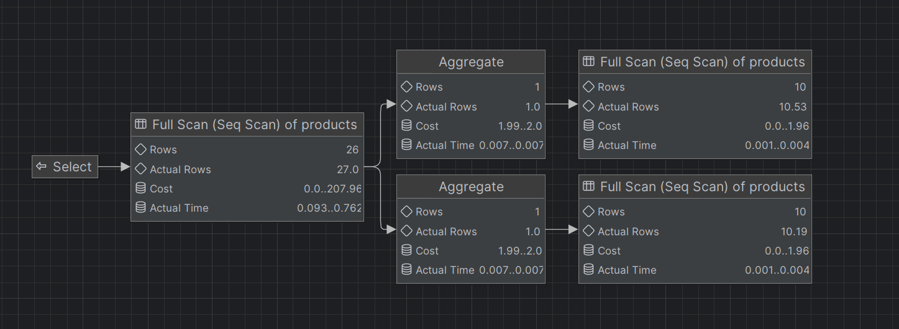

- funkcja okna 

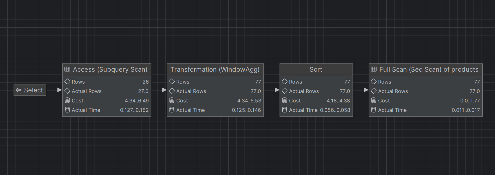

- join

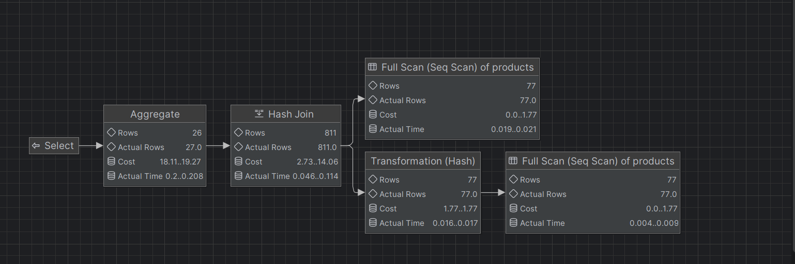

### Plany zapytań dla SQLite

- podzapytanie

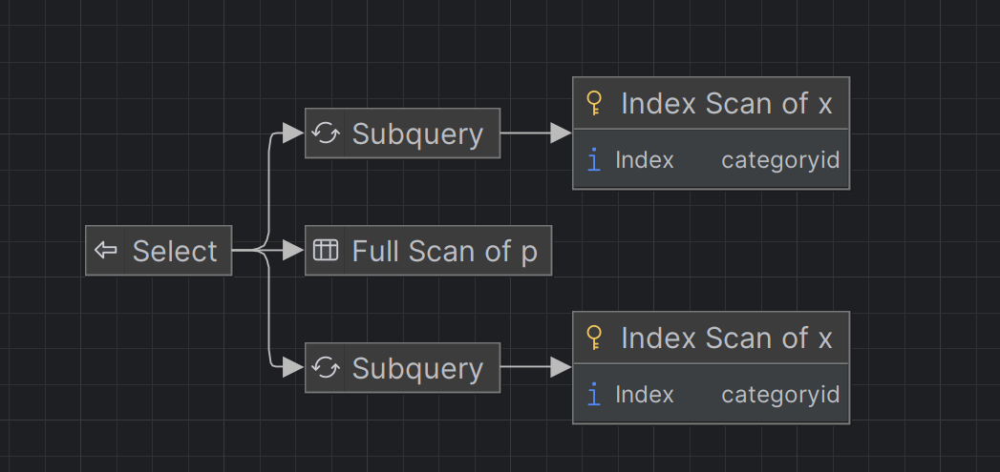

- funkcja okna 

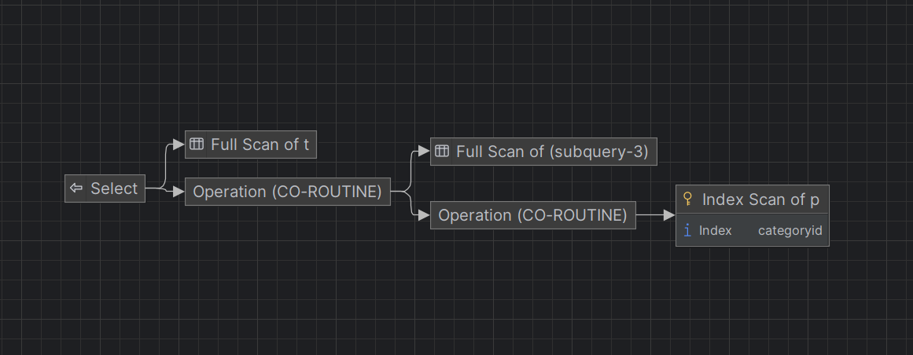

- join 

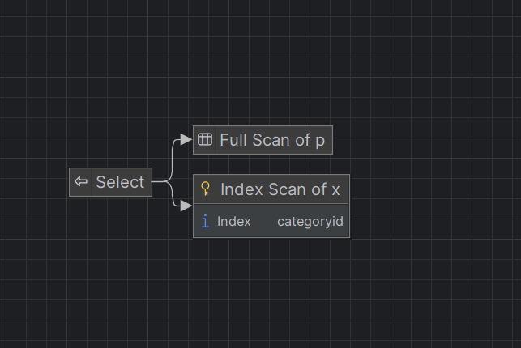

### Wnioski 
#### MS SQL Server

- Podzapytanie ma dwa Clustered Index Scan dla tabeli products
- Funkcja okna ma jeden Clustered Index Scan i mniej operacji niż podzapytanie
- Join ma jeden Clustered Index Scan, plan podobny do funkcji okna


#### PostgreSQL
- Podzapytanie ma koszt 207.96, występuje Seq Scan tabeli products trzy razy, ma
  najwyzszy koszt w porównaniu do pozostałych zapytań
- Funkcja okna ma koszt 6.49, jest jeden Seq Scan, WindowAgg i Sort
- Join ma koszt 19.27, używa Hash Join
- Najlepszy koszt ma funkcja okna, a najgorszy podzapytanie

#### SQLite
- Podzapytanie używa dwa razy Index Scan po categoryid, występuje jeden Full Scan 
- Funkcja okna ma najwięcej operacji
- Join ma najprostszy plan: Full Scan of p i Index Scan of x


---

# Zadanie 5 

Oryginalna baza Northwind jest bardzo mała. Warto zaobserwować działanie na nieco większym zbiorze danych.

Baza Northwind3 zawiera dodatkową tabelę product_history

- 2,2 mln wierszy

Bazę Northwind3 można pobrać z moodle (zakładka - Backupy baz danych)

Można też wygenerować tabelę product_history przy pomocy skryptu

Skrypt dla SQL Srerver

Stwórz tabelę o następującej strukturze:

```sql
create table product_history(
   id int identity(1,1) not null,
   productid int,
   productname varchar(40) not null,
   supplierid int null,
   categoryid int null,
   quantityperunit varchar(20) null,
   unitprice decimal(10,2) null,
   quantity int,
   value decimal(10,2),
   date date,
 constraint pk_product_history primary key clustered
    (id asc )
)
```

Wygeneruj przykładowe dane:

Dla 30000 iteracji, tabela będzie zawierała nieco ponad 2mln wierszy (dostostu ograniczenie do możliwości swojego komputera)

Skrypt dla SQL Srerver

```sql
declare @i int
set @i = 1
while @i <= 30000
begin
    insert product_history
    select productid, ProductName, SupplierID, CategoryID,
         QuantityPerUnit,round(RAND()*unitprice + 10,2),
         cast(RAND() * productid + 10 as int), 0,
         dateadd(day, @i, '1940-01-01')
    from products
    set @i = @i + 1;
end;

update product_history
set value = unitprice * quantity
where 1=1;
```

Skrypt dla Postgresql

```sql
create table product_history(
   id int generated always as identity not null
       constraint pkproduct_history
            primary key,
   productid int,
   productname varchar(40) not null,
   supplierid int null,
   categoryid int null,
   quantityperunit varchar(20) null,
   unitprice decimal(10,2) null,
   quantity int,
   value decimal(10,2),
   date date
);
```

Wygeneruj przykładowe dane:

Skrypt dla Postgresql

```sql
do $$
begin
  for cnt in 1..30000 loop
    insert into product_history(productid, productname, supplierid,
           categoryid, quantityperunit,
           unitprice, quantity, value, date)
    select productid, productname, supplierid, categoryid,
           quantityperunit,
           round((random()*unitprice + 10)::numeric,2),
           cast(random() * productid + 10 as int), 0,
           cast('1940-01-01' as date) + cnt
    from products;
  end loop;
end; $$;

update product_history
set value = unitprice * quantity
where 1=1;
```

Wykonaj polecenia: `select count(*) from product_history`, potwierdzające wykonanie zadania

---

> Wyniki:


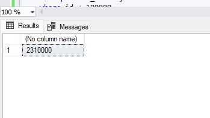


# Zadanie 6

Baza: Northwind, tabela product_history

Napisz polecenie, które zwraca: id pozycji, id produktu, nazwę produktu, id_kategorii, cenę produktu, średnią cenę produktów w kategorii do której należy dany produkt. Wyświetl tylko pozycje (produkty) których cena jest większa niż średnia cena.

W przypadku długiego czasu wykonania ogranicz zbiór wynikowy do kilkuset/kilku tysięcy wierszy

pomocna może być konstrukcja `with`

```sql
with t as (

....
)
select * from t
where id between ....
```

Napisz polecenie z wykorzystaniem podzapytania, join'a oraz funkcji okna. Porównaj zapytania. Porównaj czasy oraz plany wykonania zapytań.

Przetestuj działanie w różnych SZBD (MS SQL Server, PostgreSql, SQLite)

---

> Wyniki:

- podzapytanie 

```sql
WITH t AS (
    SELECT p.id, p.productid, p.productname, p.categoryid, p.unitprice,
        (SELECT AVG(p2.unitprice)
         FROM product_history p2
         WHERE p2.categoryid = p.categoryid
        ) AS avg_category_price
    FROM product_history p
    WHERE p.id BETWEEN 1 AND 1999
)
SELECT *
FROM t
WHERE unitprice > avg_category_price
ORDER BY id;
```
- join 
```sql
WITH t AS (
    SELECT *
    FROM product_history
    WHERE id < 2000
)
SELECT p.id, p.productid, p.productname, p.categoryid, p.unitprice,
    AVG(pp.unitprice) AS avg_price_in_category
FROM t p
JOIN t pp ON p.categoryid = pp.categoryid
GROUP BY p.id, p.productid, p.productname, p.categoryid, p.unitprice
HAVING p.unitprice > AVG(pp.unitprice)
ORDER BY p.id;
```

- funkcja okna 

```sql
WITH t AS (
    SELECT *
    FROM product_history
    WHERE id < 2000
)
SELECT *
FROM (
    SELECT id, productid, productname, categoryid, unitprice,
        AVG(unitprice) OVER (PARTITION BY categoryid) AS avg_price_in_category
    FROM t
) x
WHERE unitprice > avg_price_in_category
ORDER BY id;
```


### Wyniki zapytań dla MS SQL Server

- podzapytanie 

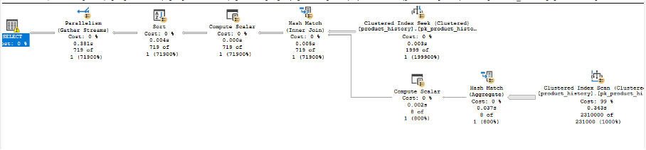

- join 

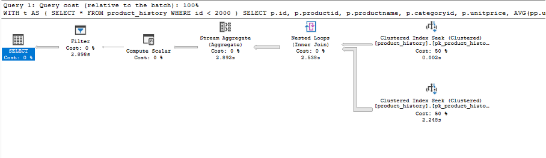

- funkcja okna

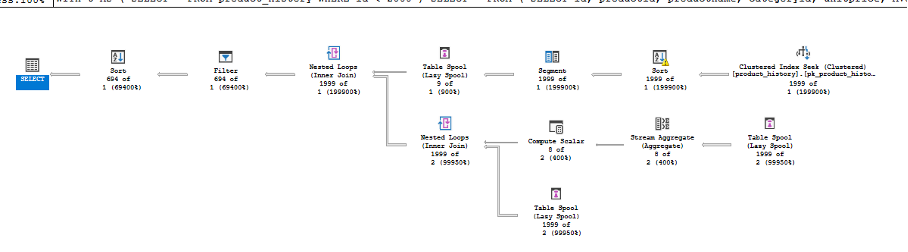

### Wyniki zapytań dla PostgreSQL:

- podzapytanie 

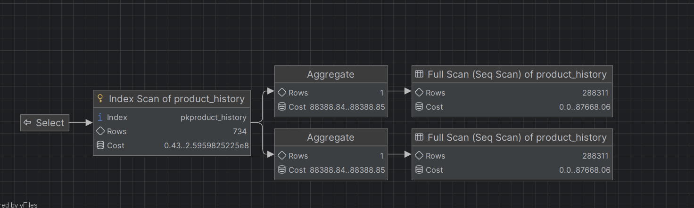

- join 

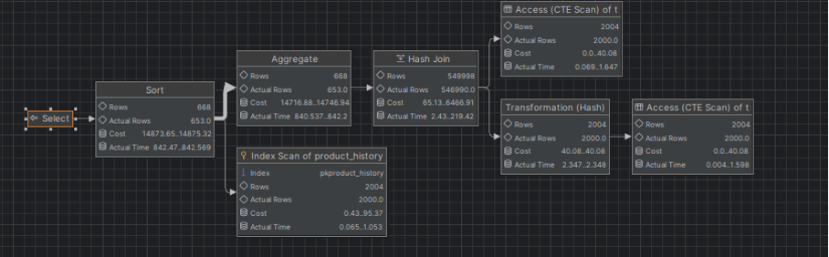

- funkcja okna

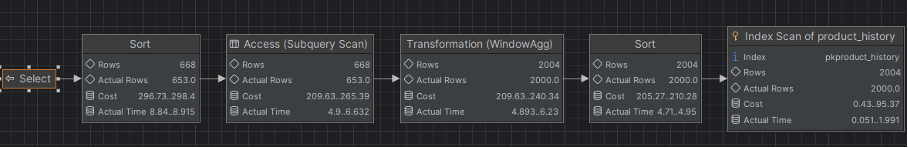

### Wyniki zapytań dla SQLite:

- podzapytanie 

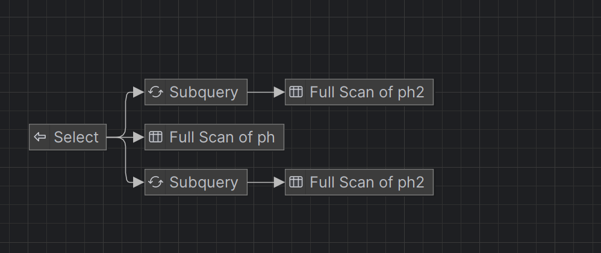

- join 

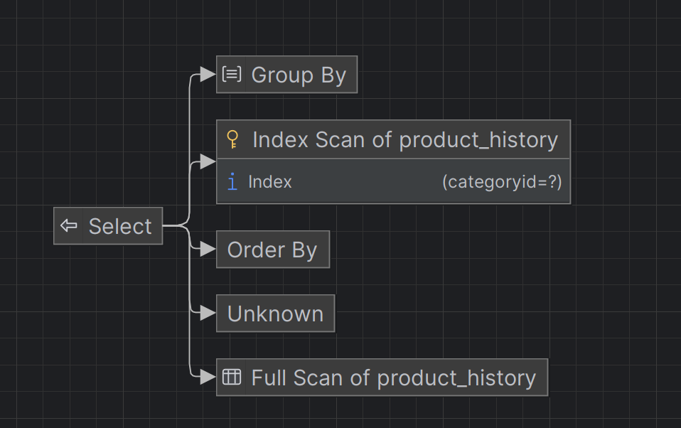

- funkcja okna

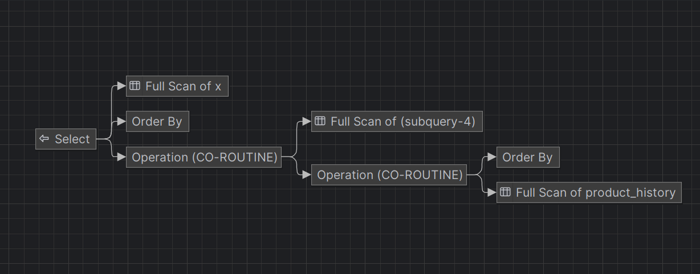


### Wnioski 
#### MS SQL Server
- Podzapytanie ma Clustered Index Seek i Clustered Index Scan
- Join ma dwa Clustered Index Seek
- Funkcja okna ma Clustered Index Seek i Sort, ma najwięcej operacji

#### PostgreSQL
- Join ma koszt 14875.32, używa Hash Join i Sort
- Funkcja okna ma koszt 298.4, używa Index Scan, Sort i WindowAgg, ma najlepszy koszt
- Podzapytanie ma koszt 88388.85, używa Full Scan dwa razy, ma najwyższy koszt

#### SQLite
- Podzapytanie wykonuje trzy Full Scan tabeli product_history
- Join używa Index Scan po categoryid i Full Scan
- Funkcja okna ma najwięcej operacji


---

|         |     |
| ------- | --- |
| zadanie | pkt |
| 1       | 1   |
| 2       | 1   |
| 3       | 1   |
| 4       | 1   |
| 5       | 1   |
| 6       | 2   |
| razem:  | 7   |


