## SQL - Funkcje okna (Window functions) <br> Lab 2

---

**Imiona i nazwiska:** Natalia Bratek, Jakub Karczewski

--- 


Celem ćwiczenia jest zapoznanie się z działaniem funkcji okna (window functions) w SQL, analiza wydajności zapytań i porównanie z rozwiązaniami przy wykorzystaniu "tradycyjnych" konstrukcji SQL

Swoje odpowiedzi wpisuj w miejsca oznaczone jako:

---
> Wyniki: 

```sql
--  ...
```

---

### Ważne/wymagane są komentarze.

Zamieść kod rozwiązania oraz zrzuty ekranu pokazujące wyniki, (dołącz kod rozwiązania w formie tekstowej/źródłowej)

Zwróć uwagę na formatowanie kodu

---

## Oprogramowanie - co jest potrzebne?

Do wykonania ćwiczenia potrzebne jest następujące oprogramowanie:
- MS SQL Server - wersja 2019, 2022
- PostgreSQL - wersja 15/16/17
- SQLite
- Narzędzia do komunikacji z bazą danych
	- SSMS - Microsoft SQL Managment Studio
	- DtataGrip lub DBeaver
-  Przykładowa baza Northwind/Northwind3
	- W wersji dla każdego z wymienionych serwerów

Oprogramowanie dostępne jest na przygotowanej maszynie wirtualnej

## Dokumentacja/Literatura

- Kathi Kellenberger,  Clayton Groom, Ed Pollack, Expert T-SQL Window Functions in SQL Server 2019, Apres 2019
- Itzik Ben-Gan, T-SQL Window Functions: For Data Analysis and Beyond, Microsoft 2020

- Kilka linków do materiałów które mogą być pomocne
	 - [https://learn.microsoft.com/en-us/sql/t-sql/queries/select-over-clause-transact-sql?view=sql-server-ver16](https://learn.microsoft.com/en-us/sql/t-sql/queries/select-over-clause-transact-sql?view=sql-server-ver16)
	- [https://www.sqlservertutorial.net/sql-server-window-functions/](https://www.sqlservertutorial.net/sql-server-window-functions/)
	- [https://www.sqlshack.com/use-window-functions-sql-server/](https://www.sqlshack.com/use-window-functions-sql-server/)
	- [https://www.postgresql.org/docs/current/tutorial-window.html](https://www.postgresql.org/docs/current/tutorial-window.html)
	- [https://www.postgresqltutorial.com/postgresql-window-function/](https://www.postgresqltutorial.com/postgresql-window-function/)
	- [https://www.sqlite.org/windowfunctions.html](https://www.sqlite.org/windowfunctions.html)
	- [https://www.sqlitetutorial.net/sqlite-window-functions/](https://www.sqlitetutorial.net/sqlite-window-functions/)


- W razie potrzeby - opis Ikonek używanych w graficznej prezentacji planu zapytania w SSMS jest tutaj:
	- [https://docs.microsoft.com/en-us/sql/relational-databases/showplan-logical-and-physical-operators-reference](https://docs.microsoft.com/en-us/sql/relational-databases/showplan-logical-and-physical-operators-reference)

## Przygotowanie

Uruchom SSMS
- Skonfiguruj połączenie  z bazą Northwind na lokalnym serwerze MS SQL 

Uruchom DataGrip (lub Dbeaver)
- Skonfiguruj połączenia z bazą Northwind3
	- na lokalnym serwerze MS SQL
	- na lokalnym serwerze PostgreSQL
	- z lokalną bazą SQLite

Można też skorzystać z innych narzędzi klienckich (wg własnego uznania)

Oryginalna baza Northwind jest bardzo mała. Warto zaobserwować działanie na nieco większym zbiorze danych.

Korzystamy ze "zmodyfikowanej wersji" bazy northwind

Baza Northwind3 zawiera dodatkową tabelę product_history
- 2,2 mln wierszy

Bazę Northwind3 można pobrać z moodle (zakładka - Backupy baz danych)


# Zadanie 1 

Funkcje rankingu, `row_number()`, `rank()`, `dense_rank()`


```sql 
select productid, productname, unitprice, categoryid,  
    row_number() over(partition by categoryid order by unitprice desc) as rowno,  
    rank() over(partition by categoryid order by unitprice desc) as rankprice,  
    dense_rank() over(partition by categoryid order by unitprice desc) as denserankprice  
from products;
```

Wykonaj polecenie, zaobserwuj wynik. Porównaj funkcje row_number(), rank(), dense_rank().  Skomentuj wyniki. 

Spróbuj uzyskać ten sam wynik bez użycia funkcji okna

Do analizy użyj wybranego systemu/bazy danych - wybierz MS SQLserver, Postgres lub SQLite)

---
> Wyniki: 

Funkcja row_number() nadaje każdemu wierszowi kolejny numer, nawet jeśli wartości są takie same.
rank() daje tę samą pozycję dla takich samych wartości, ale potem są przerwy w numeracji.
dense_rank() działa podobnie do rank(), tylko że nie ma tych przerw i numeracja idzie po kolei.

```sql
select p.productid,
       p.productname,
       p.unitprice,
       p.categoryid,
       (select count(pp.productid) + 1 as c
        from products pp
        where (pp.categoryid = p.categoryid and pp.unitprice > p.unitprice)
           or (pp.categoryid = p.categoryid and pp.unitprice = p.unitprice and pp.productid < p.productid)) as rowno,
       (select count(pp.productid) + 1
        from products pp
        where pp.categoryid = p.categoryid
          and pp.unitprice > p.unitprice) as rankprice,
       (select count(t.c) + 1
        from (select distinct pp.unitprice as c
              from products pp
              where pp.categoryid = p.categoryid
                and pp.unitprice > p.unitprice) t) as denserankprice
from products p
order by p.categoryid, p.unitprice desc, p.productid
```

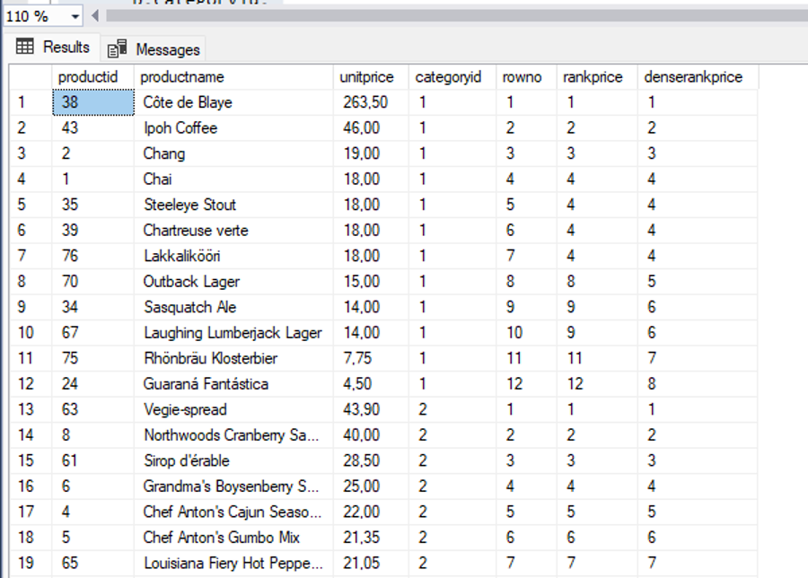
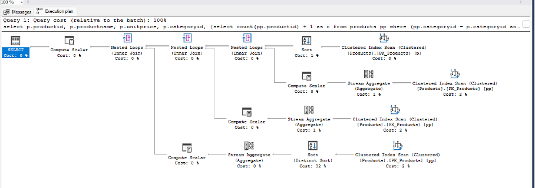


Zapytanie jest mniej wydajne, ponieważ dla każdego wiersza wykonywane są podzapytania, co widać w operacjach Nested Loop. Powoduje to wielokrotne przeszukiwanie tabeli i wydłuża czas wykonania.

---
# Zadanie 2

Baza: Northwind, tabela product_history

Dla każdego produktu, podaj 4 najwyższe ceny tego produktu w danym roku. Zbiór wynikowy powinien zawierać:
- rok
- id produktu
- nazwę produktu
- cenę
- datę (datę uzyskania przez produkt takiej ceny)
- pozycję w rankingu

- Uporządkuj wynik wg roku, nr produktu, pozycji w rankingu

W przypadku długiego czasu wykonania ogranicz zbiór wynikowy.

Spróbuj uzyskać ten sam wynik bez użycia funkcji okna, porównaj wyniki, czasy i plany zapytań (koszty). 

Przetestuj działanie w różnych SZBD (MS SQL Server, PostgreSql, SQLite)


# Wyniki: 

### Zapytanie z funkcją okna (row_number) dla MS SQL Server
```sql
with ranking as (
    select 
        YEAR([date]) as year,
        productid,
        productname,
        unitprice,
        [date],
        row_number() over (
            partition by productid, YEAR([date]) 
            order by unitprice desc
        ) as rank_pos
    from product_history
)
select *
from ranking
where rank_pos <= 4
order by year, productid, rank_pos;
```

### Zapytanie bez funkcji okna z ograniczeniem wierszy dla MS SQL Server:
```sql
WITH base AS (
    SELECT
        productid,
        productname,
        unitprice,
        [date],
        YEAR([date]) AS rok,
        id
    FROM product_history
    WHERE productid <= 10
)
, price_rank AS (
    SELECT
        b1.*,
        COUNT(b2.unitprice) + 1 AS rn
    FROM base b1
    LEFT JOIN base b2
        ON b1.productid = b2.productid
       AND b1.rok = b2.rok
       AND (
            b2.unitprice > b1.unitprice
         OR (b2.unitprice = b1.unitprice AND b2.[date] < b1.[date])
         OR (b2.unitprice = b1.unitprice AND b2.[date] = b1.[date] AND b2.id < b1.id)
       )
    GROUP BY
        b1.productid,
        b1.productname,
        b1.unitprice,
        b1.[date],
        b1.rok,
        b1.id
)
SELECT *
FROM price_rank
WHERE rn <= 4
ORDER BY rok, productid, rn;
```

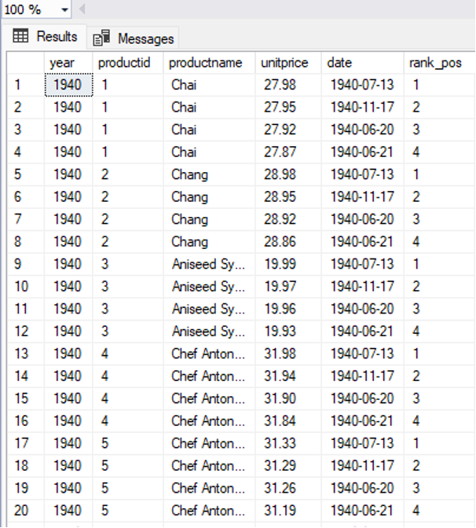

### Plany dla zapytań bez funkcji okna:
-SQLite:
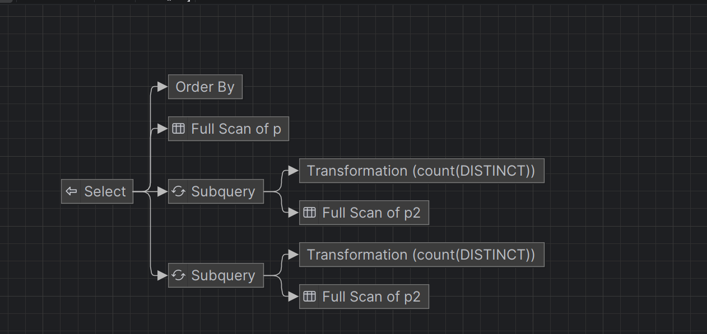
-PostgreSQL:
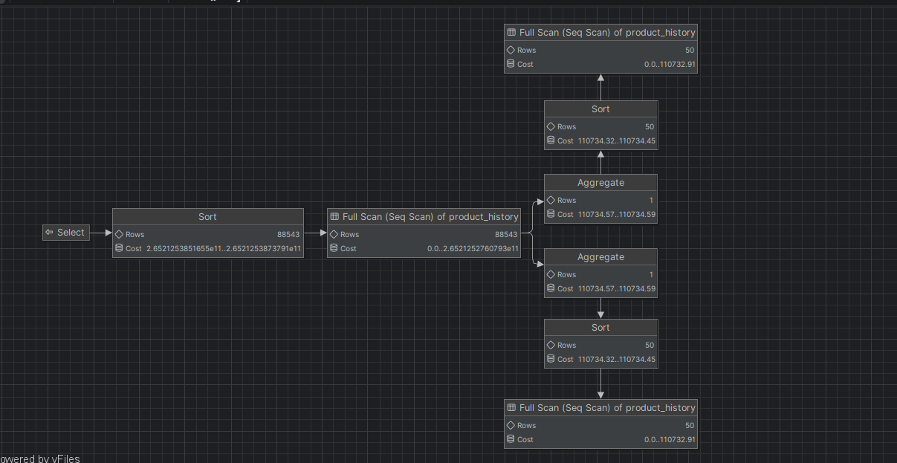
-MS SQL Server:
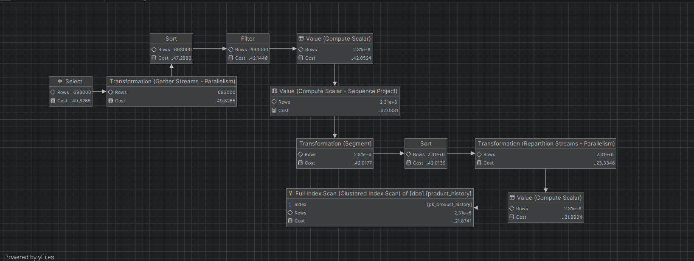


### Czasy zapytań bez funkcji okna:
- MS SQL Server: 5 m 17 s
- SQLite: 7 m 20 s
- PostgreSQL: 8 m 19 s

Zapytanie z funkcją okna jest bardziej wydajne, ponieważ wykonuje obliczenia w jednym przebiegu. Wersja z podzapytaniami jest wolniejsza, bo dla każdego wiersza przeszukuje tabelę. 

W SQLite zapytanie robi pełny skan tabeli, czyli sprawdza wszystkie dane. Przez to działa wolniej, szczególnie przy podzapytaniach. Funkcja okna trochę to poprawia.

### Wnioski 
- Wydajność funkcji okna:  
 Wykorzystanie funkcji row_number() jest znacznie bardziej efektywne niż stosowanie tradycyjnych podzapytań. W przypadku dużych zbiorów danych (tabela product_history), zapytania bez funkcji okna trwają kilka minut dla i tak istotnie ograniczonych danych.
  
- Optymalizacja planu zapytania:  
Funkcja okna wykonuje obliczenia w jednym przebiegu (skanie) danych.  Wersja alternatywna wymusza operacje typu Nested Loops oraz wielokrotne przeszukiwanie tabeli dla każdego wiersza, co drastycznie zwiększa koszt zapytania.
- Różnice między SZBD:  
We wszystkich testowanych systemach (MS SQL Server, PostgreSQL, SQLite) funkcje okna wykazały przewagę, przy czym SQLite bez ich użycia wykonuje pełny skan tabeli, co czyni go najmniej wydajnym przy złożonych podzapytaniach.


---


# Zadanie 3 

Funkcje `lag()`, `lead()`

Wykonaj polecenia, zaobserwuj wynik. Jak działają funkcje `lag()`, `lead()`

```sql
select productid, productname, categoryid, date, unitprice,  
       lag(unitprice) over (partition by productid order by date)   
as previousprodprice,  
       lead(unitprice) over (partition by productid order by date)   
as nextprodprice  
from product_history  
where productid = 1 and year(date) = 2022  
order by date;  
  
with t as (select productid, productname, categoryid, date, unitprice,  
                  lag(unitprice) over (partition by productid   
order by date) as previousprodprice,  
                  lead(unitprice) over (partition by productid   
order by date) as nextprodprice  
           from product_history  
           )  
select * from t  
where productid = 1 and year(date) = 2022  
order by date;
```

Jak działają funkcje `lag()`, `lead()`?

Spróbuj uzyskać ten sam wynik bez użycia funkcji okna

Do analizy użyj wybranego systemu/bazy danych - wybierz MS SQLserver, Postgres lub SQLite)

---
> Wyniki: 
Funkcja lag() zwraca wartość z poprzedniego wiersza, a dla pierwszego wiersza wartość wynosi NULL (brak poprzedniego).
Funkcja lead() zwraca wartość z następnego wiersza, a dla ostatnego wiersza wartość wynosi NULL(brak następnego).

```sql
select p.productid,
       p.productname,
       p.categoryid,
       p.date,
       p.unitprice,

       (select top 1 p1.unitprice
        from product_history p1
        where p1.productid = p.productid
          and year(p1.date) = 2022
          and p1.date < p.date
        order by p1.date desc) as previousprodprice,

       (select top 1 p1.unitprice
        from product_history p1
        where p1.productid = p.productid
          and year(p1.date) = 2022
          and p1.date > p.date
        order by p1.date asc) as nextprodprice

from product_history p
where p.productid = 1
  and year(p.date) = 2022
order by p.date;
```


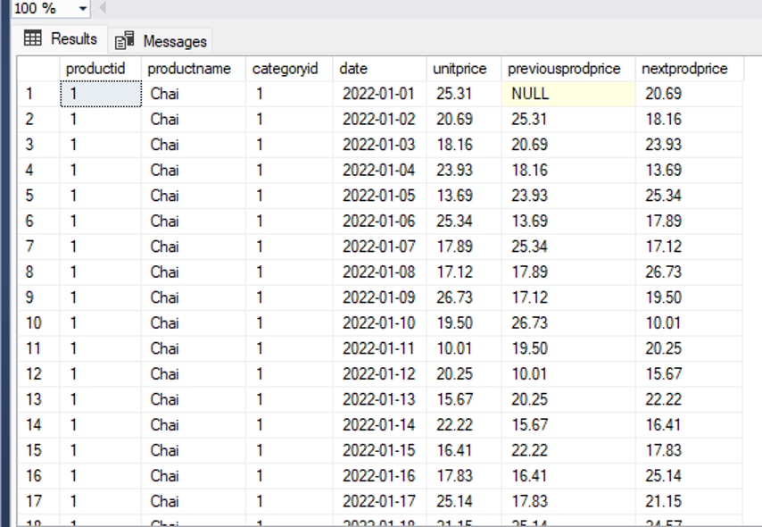
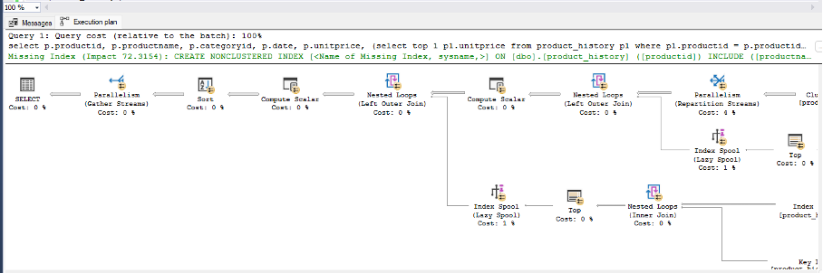
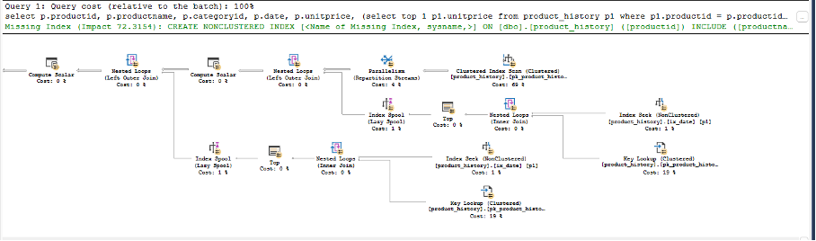

W zapytaniu bez funkcji okna pojawiają się operacje Nested Loop oraz dodatkowe Index Seek, co oznacza, że dla każdego wiersza wykonywane są podzapytania. Powoduje to wielokrotne przeszukiwanie tabeli i znacznie gorszą wydajność.

---


# Zadanie 4

Baza: Northwind, tabele customers, orders, order details

Napisz polecenie które wyświetla inf. o zamówieniach

Zbiór wynikowy powinien zawierać:
- nazwę klienta, nr zamówienia,
- datę zamówienia,
- wartość zamówienia (wraz z opłatą za przesyłkę),
- nr poprzedniego zamówienia danego klienta,
- datę poprzedniego zamówienia danego klienta,
- wartość poprzedniego zamówienia danego klienta.

Do analizy użyj wybranego systemu/bazy danych - wybierz MS SQLserver, Postgres lub SQLite)

---
> Wyniki: 

```sql
with order_values as (
    select 
        c.CompanyName,
        o.CustomerID,
        o.OrderID,
        o.OrderDate,
        o.Freight,
        CAST(
            SUM(od.UnitPrice * od.Quantity * (1 - od.Discount)) + o.Freight 
            AS decimal(10,2)
        ) as order_total
    from Orders o
    join [Order Details] od on o.OrderID = od.OrderID
    join Customers c on o.CustomerID = c.CustomerID
    group by 
        c.CompanyName, o.CustomerID, o.OrderID, o.OrderDate, o.Freight
)

select 
    CompanyName,
    OrderID,
    OrderDate,
    order_total,

    lag(OrderID) over (partition by CustomerID order by OrderDate) as prev_order_id,
    lag(OrderDate) over (partition by CustomerID order by OrderDate) as prev_order_date,
    lag(order_total) over (partition by CustomerID order by OrderDate) as prev_order_value

from order_values
order by CompanyName, OrderDate;
```

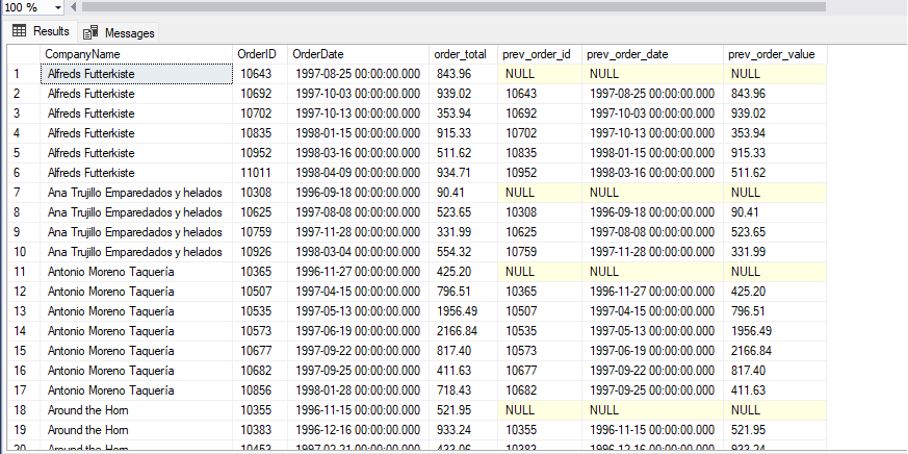
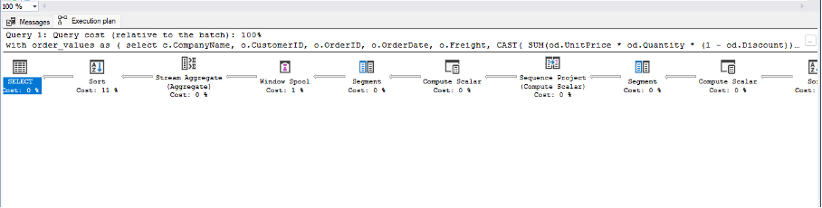
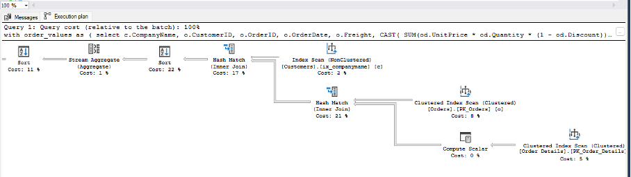


Zapytanie najpierw łączy tabele i liczy wartość zamówień, a potem używa funkcji lag(). W planie widać sortowanie i joiny, które mają największy koszt. Całość jest wydajna, bo nie ma podzapytań dla każdego wiersza.
---


# Zadanie 5 

Funkcje `first_value()`, `last_value()`

Baza: Northwind, tabele customers, orders, order details

Wykonaj polecenia, zaobserwuj wynik. Jak działają funkcje `first_value()`, `last_value()`. 

Skomentuj uzyskane wyniki. Czy funkcja `first_value` pokazuje w tym przypadku najdroższy produkt w danej kategorii, czy funkcja `last_value()` pokazuje najtańszy produkt? 

Co jest przyczyną takiego działania funkcji `last_value`. 

Co trzeba zmienić żeby funkcja last_value pokazywała najtańszy produkt w danej kategorii?

Do analizy użyj wybranego systemu/bazy danych - wybierz MS SQLserver, Postgres lub SQLite

```sql
select productid, productname, unitprice, categoryid,  
    first_value(productname) over (partition by categoryid   
order by unitprice desc) first,  
    last_value(productname) over (partition by categoryid   
order by unitprice desc) last  
from products  
order by categoryid, unitprice desc;
```

<div style="page-break-after: always;"></div>

### Wyniki: 
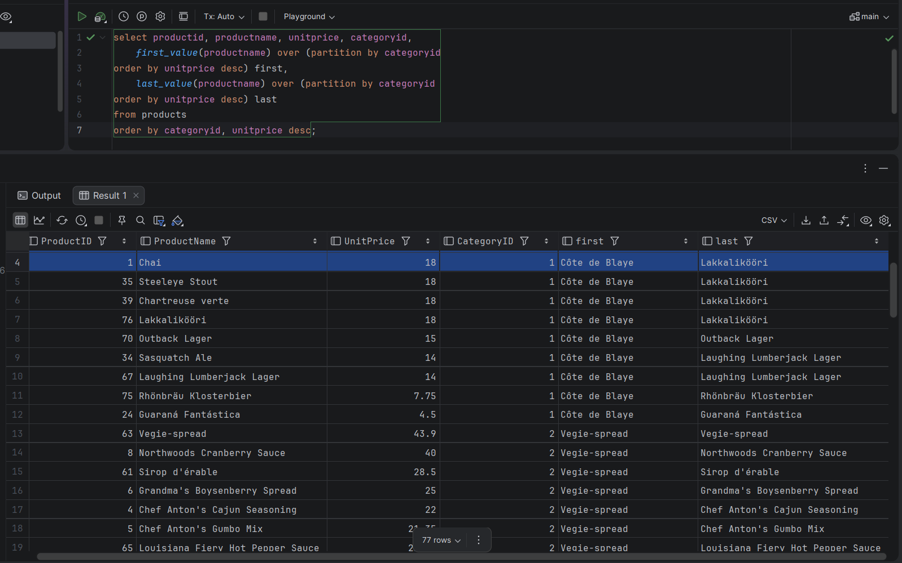


`first_value` bierze wartość z pierwszego wiersza w danym oknie, czyli zwraca najdroższy produkt w danej kategorii.  
 `last_value` bierze wartość z ostatniego wiersza w danym oknie.  
 W przypadku funkcji `last_value` - okno jest definiowane jako "od początku do aktualnego wiersza"
 Dlatego funkcja `last_value` nie pokazuje najtańszego produktu, tylko pokazuje produkt z aktualnego wiersza, czyli najtańszy produkt w danej chwili, bez uwzględnienia wierszy, które są po nim.

Aby funkcja `last_value` pokazywała najtańszy produkt w danej kategorii, trzeba rozszerzyć okno, tak aby obejmowało wszystkie wiersze w danej kategorii. Można to zrobić za pomocą klauzuli `ROWS BETWEEN UNBOUNDED PRECEDING AND UNBOUNDED FOLLOWING`
### Poprawione zapytanie:
```sql
select productid, productname, unitprice, categoryid,
    first_value(productname) over (
        partition by categoryid
        order by unitprice desc
    ) as first,
    last_value(productname) over (
        partition by categoryid
        order by unitprice desc
        rows between unbounded preceding and unbounded following
    ) as last
from products
order by categoryid, unitprice desc;
```
### Wynik zapytania z poprawionym last_value:

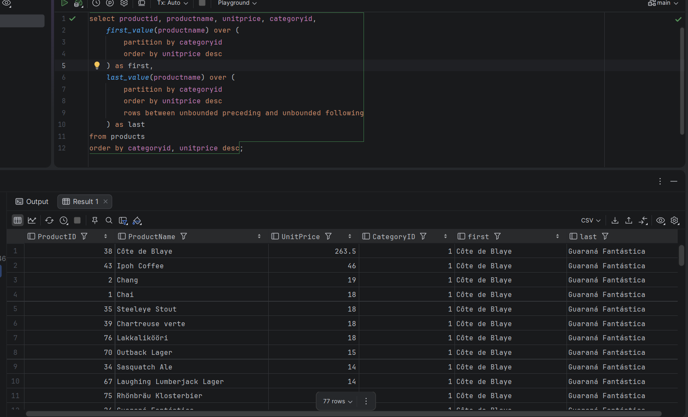

<div style="page-break-after: always;"></div>

# Zadanie 6

Baza: Northwind, tabele orders, order details

Napisz polecenie które wyświetla inf. o zamówieniach

Zbiór wynikowy powinien zawierać:
- Id klienta,
- nr zamówienia,
- datę zamówienia,
- wartość zamówienia (wraz z opłatą za przesyłkę),
- dane zamówienia klienta o najniższej wartości w danym miesiącu
	- nr zamówienia o najniższej wartości w danym miesiącu
	- datę tego zamówienia
	- wartość tego zamówienia
- dane zamówienia klienta o najwyższej wartości w danym miesiącu
	- nr zamówienia o najniższej wartości w danym miesiącu
	- datę tego zamówienia
	- wartość tego zamówienia

Do analizy użyj wybranego systemu/bazy danych - wybierz MS SQLserver, Postgres lub SQLite

### Wyniki: 

```sql
with order_values as (
    select
        o.customerid,
        o.orderid,
        o.orderdate,
        sum(od.unitprice * od.quantity * (1 - od.discount)) + o.freight as order_value,
        strftime('%Y-%m', o.orderdate) as year_month
    from orders o
    join "Order Details" od on o.orderid = od.orderid
    group by o.customerid, o.orderid, o.orderdate, o.freight
)

select
    *,

    -- MIN
    first_value(orderid) over (
        partition by year_month
        order by order_value asc
    ) as min_order_id,

    first_value(orderdate) over (
        partition by year_month
        order by order_value asc
    ) as min_order_date,

    first_value(order_value) over (
        partition by year_month
        order by order_value asc
    ) as min_order_value,

    -- MAX
    first_value(orderid) over (
        partition by year_month
        order by order_value desc
    ) as max_order_id,

    first_value(orderdate) over (
        partition by year_month
        order by order_value desc
    ) as max_order_date,

    first_value(order_value) over (
        partition by year_month
        order by order_value desc
    ) as max_order_value

from order_values;
```
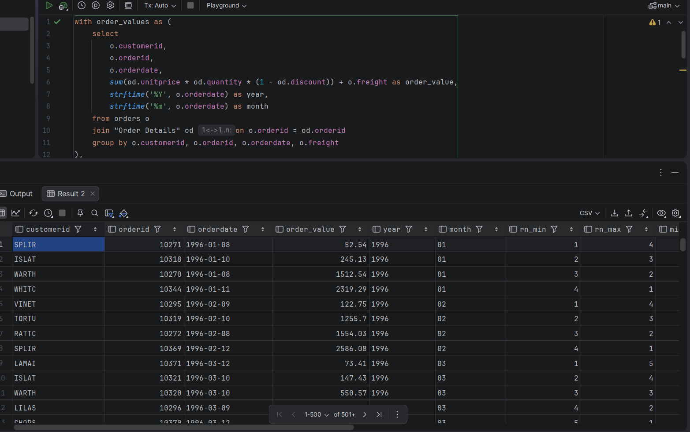
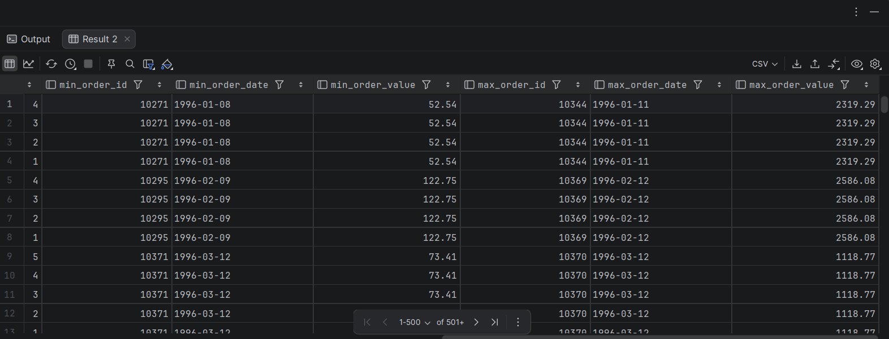

<div style="page-break-after: always;"></div>

### Plan zapytania dla SQLite:
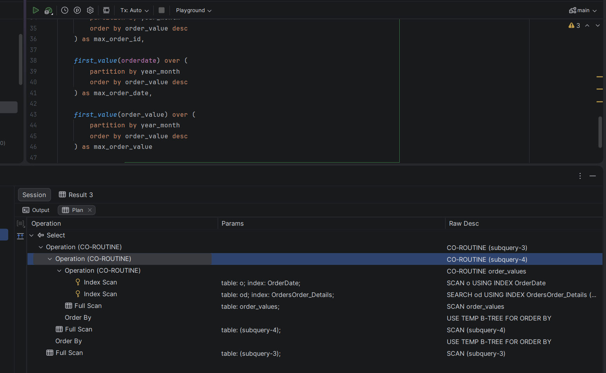
---

Uzycie first value umożliwia wykonanie zadania bez użycia dodatkowych joinów, podzapytań czy agregacji.

<div style="page-break-after: always;"></div>

# Zadanie 7

Baza: Northwind, tabela product_history

Napisz polecenie które pokaże wartość sprzedaży każdego produktu narastająco od początku każdego miesiąca. Użyj funkcji okna

Zbiór wynikowy powinien zawierać:
- id pozycji
- id produktu
- datę
- wartość sprzedaży produktu w danym dniu
- wartość sprzedaży produktu narastające od początku miesiąca

Spróbuj uzyskać ten sam wynik bez użycia funkcji okna, porównaj wyniki, czasy i plany zapytań (koszty). 

Przetestuj działanie w różnych SZBD (MS SQL Server, PostgreSql, SQLite)

### Wyniki: 

Kod SQL z funkcją okna dla SQLite:

```sql
with base as (
    select 
        id,
        productid,
        date,
        value * quantity as sales_value
    from product_history
)

select 
    *,
    sum(sales_value) over (
        partition by productid, strftime('%Y-%m', date)
        order by date
    ) as cumulative_sales
from base;
```
Rezultat wywołania powyższego zapytania:

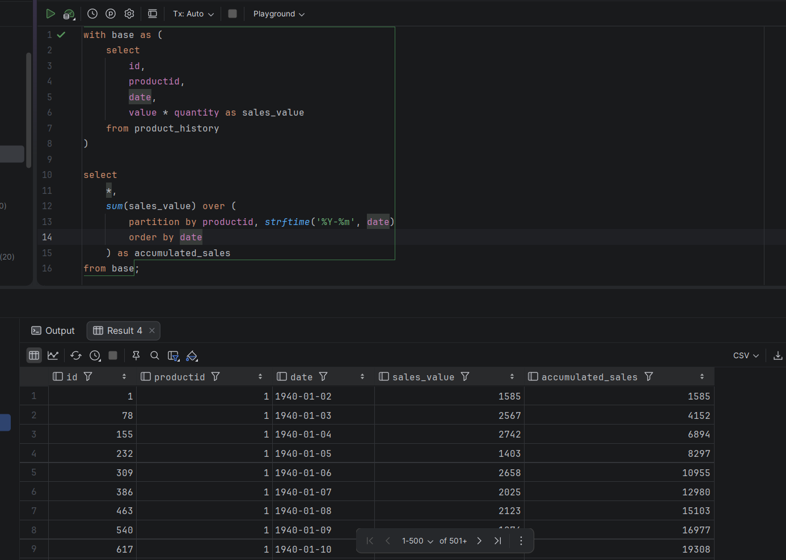

Kod SQL bez funkcji okna dla PostgreSQL:

```sql
SELECT
    p1.id,
    p1.productid,
    p1.date,
    p1.value * p1.quantity AS sales_value,

    (
        SELECT SUM(p2.value * p2.quantity)
        FROM product_history p2
        WHERE p2.productid = p1.productid
          AND date_trunc('month', p2.date) = date_trunc('month', p1.date)
          AND p2.date <= p1.date
    ) AS cumulative_sales

FROM product_history p1
ORDER BY p1.productid, p1.date
LIMIT 100;
```
Rezultat wywołania powyższego zapytania:
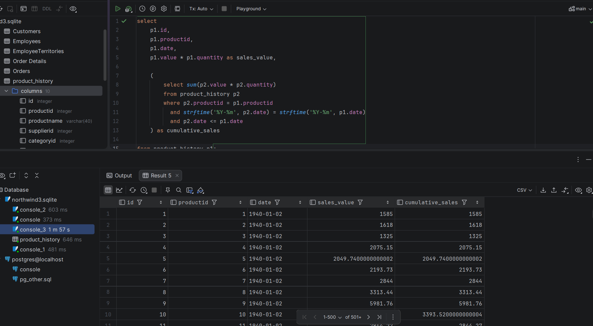

### Czasy zapytań z funkcją okna (bez ograniczenia wierszy):
- MS SQL Server: 29 s
- SQLite: 1,7 s
- PostgreSQL: 7 s

### Czasy zapytań bez funkcji okna:
- MS SQL Server: 18 s
- SQLite: 1m 28s
- PostgreSQL: 2m 9s


### Plany dla zapytań z funkcją okna:
Dla zapytań bez funkcji okna wynik został ograniczony do 100 wierszy, gdyż w przeciwnym razie koszt obliczeniowy byłby zbyt duży, aby uzyskać rozwiązanie w rozsądnym czasie.

-SQLite:
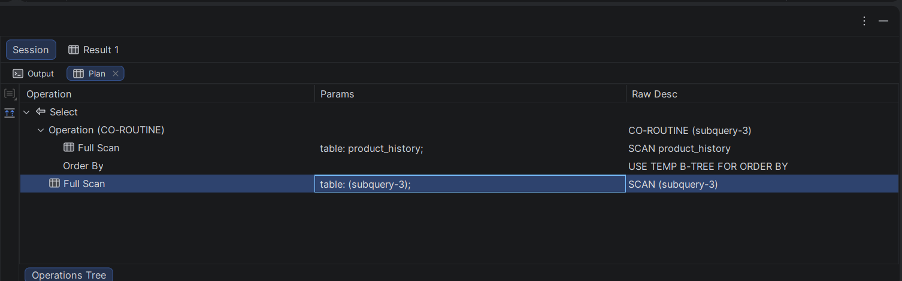
-PostgreSQL:
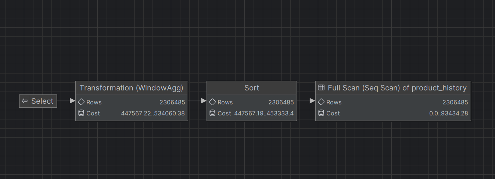
-MS SQL Server
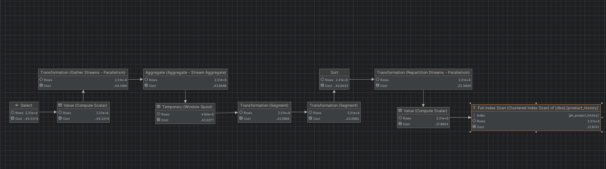


<div style="page-break-after: always;"></div>

### Plany dla zapytań bez funkcji okna:
-SQLite:
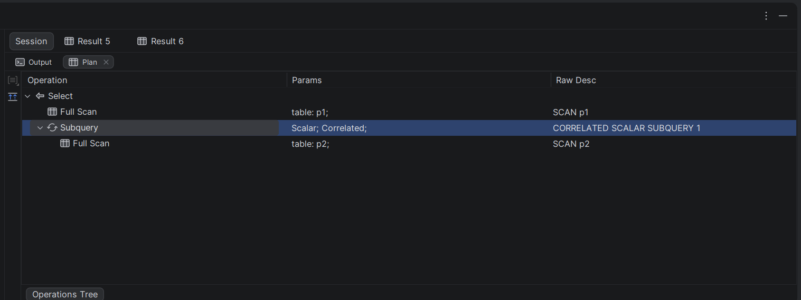
-PostgreSQL:
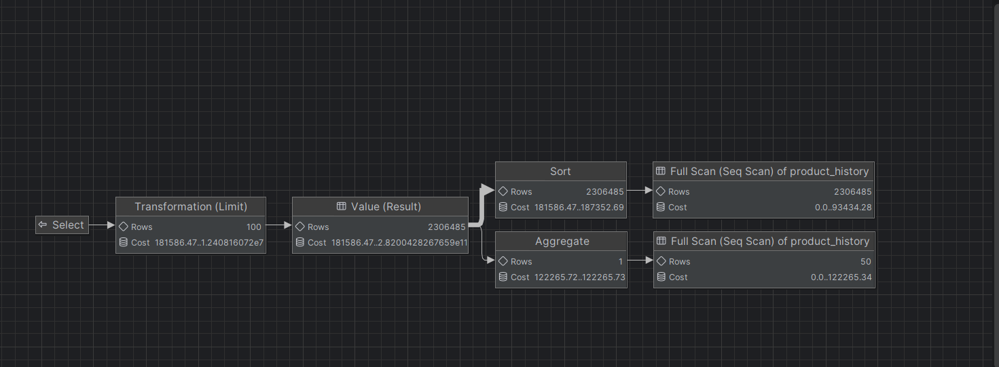
-MS SQL Server:
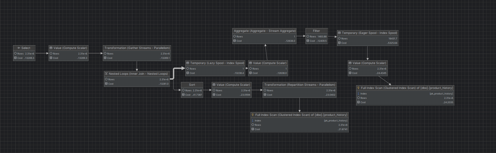


### Wnioski
- Złożoność obliczeniowa sum narastających:  
 Zadanie wykazuje, że obliczanie wartości narastających za pomocą tradycyjnego SQL jest skrajnie nieoptymalne na dużych zbiorach danych. Bez funkcji okna konieczne było ograniczenie wyników do 100 wierszy, aby zapytanie zakończyło się w rozsądnym czasie.


- Przewaga SUM() OVER:  
 Zastosowanie funkcji okna pozwala na uzyskanie wyników dla całego zbioru 2,2 mln wierszy w czasie kilku sekund bez ograniczenia liczby wierszy. Bez funkcji okna czas ten wydłuża się wielokrotnie nawet przy małej próbce danych.


- Czytelność i prostota kodu:
 Funkcje okna pozwalają na sformułowanie zwięzłego i czytelnego zapytania bez konieczności stosowania skomplikowanych JOINów tej samej tabeli ze sobą czy korelacji czasowych w podzapytaniach.

<div style="page-break-after: always;"></div>

# Zadanie 8

Wykonaj kilka "własnych" przykładowych analiz. 

Czy są jeszcze jakieś ciekawe/przydatne funkcje okna (z których nie korzystałeś w ćwiczeniu)? Spróbuj ich użyć w zaprezentowanych przykładach.

Do analizy użyj wybranego systemu/bazy danych - wybierz MS SQLserver, Postgres lub SQLite

### Średnia ruchoma (moving average) dla wartości sprzedaży produktu w danym dniu, z oknem 3 dniowym:

```sql
select 
    productid,
    date,
    value * quantity as sales_value,

    avg(value * quantity) over (
        partition by productid
        order by date
        rows between 2 preceding and current row
    ) as moving_avg

from product_history;
```

### Rezultat wywołania powyższego zapytania:
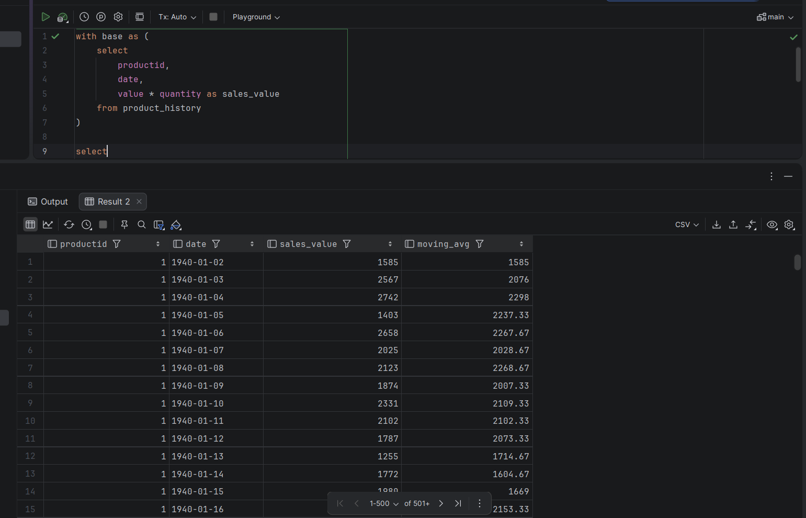

### Użycie funkcji percet_rank(), procentowa pozycja produktu w kategorii względem ceny

```sql
select 
    productid,
    productname,
    categoryid,
    unitprice,

    percent_rank() over (
        partition by categoryid
        order by unitprice
    ) as price_percent_rank

from products;
```

### Rezultat wywołania powyższego zapytania:
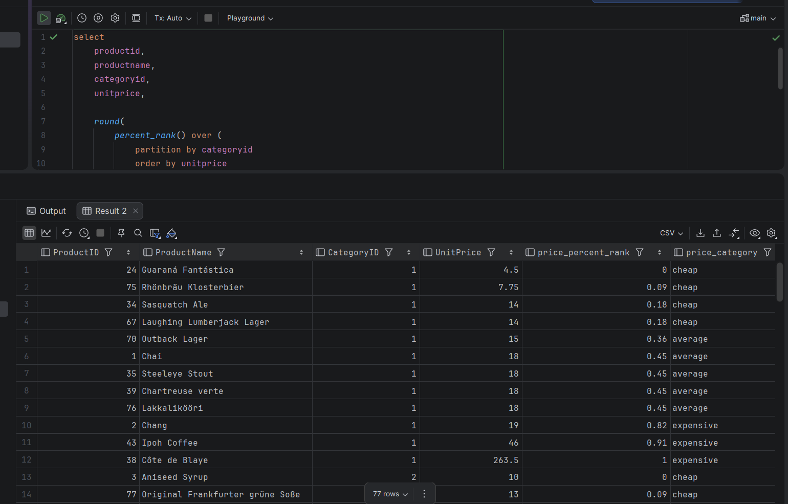


### Ranking klientów na podstawie łącznej wartości zamówień, z podziałem na kwartyle z wykorzystaniem funkcji ntile():

```sql
WITH CustomerSpending AS (
    SELECT 
        o.CustomerID, 
        SUM(od.UnitPrice * od.Quantity) as TotalSpent
    FROM Orders o
    JOIN [Order Details] od ON o.OrderID = od.OrderID
    GROUP BY o.CustomerID
)
SELECT 
    CustomerID, 
    TotalSpent,
    NTILE(4) OVER(ORDER BY TotalSpent DESC) as SpendingQuartile
FROM CustomerSpending;
```

### Rezultat wywołania powyższego zapytania:
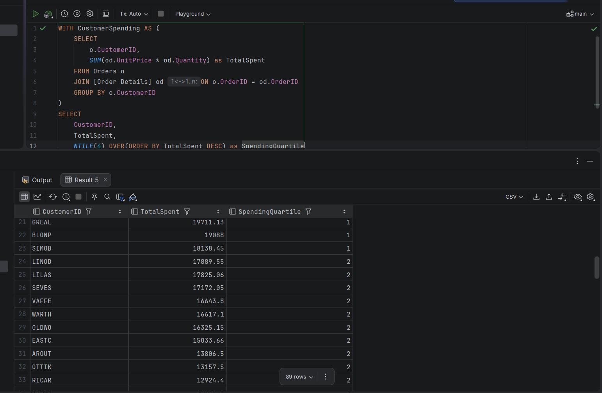

Punktacja

|         |     |
| ------- | --- |
| zadanie | pkt |
| 1       | 1   |
| 2       | 2   |
| 3       | 1   |
| 4       | 1   |
| 5       | 1   |
| 6       | 1   |
| 7       | 2   |
| 8       | 2   |
| razem   | 11  |