## SQL - Funkcje okna (Window functions) <br> Lab 2

---

**Imiona i nazwiska:** Natalia Bratek, Jakub Karczewski

--- 


Celem ćwiczenia jest zapoznanie się z działaniem funkcji okna (window functions) w SQL, analiza wydajności zapytań i porównanie z rozwiązaniami przy wykorzystaniu "tradycyjnych" konstrukcji SQL

Swoje odpowiedzi wpisuj w miejsca oznaczone jako:

---
> Wyniki: 

```sql
--  ...
```

<style>
pre, code {
    font-size: 9px !important;
    line-height: 1.3;
}
</style>

---

### Ważne/wymagane są komentarze.

Zamieść kod rozwiązania oraz zrzuty ekranu pokazujące wyniki, (dołącz kod rozwiązania w formie tekstowej/źródłowej)

Zwróć uwagę na formatowanie kodu

---

## Oprogramowanie - co jest potrzebne?

Do wykonania ćwiczenia potrzebne jest następujące oprogramowanie:
- MS SQL Server - wersja 2019, 2022
- PostgreSQL - wersja 15/16/17
- SQLite
- Narzędzia do komunikacji z bazą danych
	- SSMS - Microsoft SQL Managment Studio
	- DtataGrip lub DBeaver
-  Przykładowa baza Northwind/Northwind3
	- W wersji dla każdego z wymienionych serwerów

Oprogramowanie dostępne jest na przygotowanej maszynie wirtualnej

## Dokumentacja/Literatura

- Kathi Kellenberger,  Clayton Groom, Ed Pollack, Expert T-SQL Window Functions in SQL Server 2019, Apres 2019
- Itzik Ben-Gan, T-SQL Window Functions: For Data Analysis and Beyond, Microsoft 2020

- Kilka linków do materiałów które mogą być pomocne
	 - [https://learn.microsoft.com/en-us/sql/t-sql/queries/select-over-clause-transact-sql?view=sql-server-ver16](https://learn.microsoft.com/en-us/sql/t-sql/queries/select-over-clause-transact-sql?view=sql-server-ver16)
	- [https://www.sqlservertutorial.net/sql-server-window-functions/](https://www.sqlservertutorial.net/sql-server-window-functions/)
	- [https://www.sqlshack.com/use-window-functions-sql-server/](https://www.sqlshack.com/use-window-functions-sql-server/)
	- [https://www.postgresql.org/docs/current/tutorial-window.html](https://www.postgresql.org/docs/current/tutorial-window.html)
	- [https://www.postgresqltutorial.com/postgresql-window-function/](https://www.postgresqltutorial.com/postgresql-window-function/)
	- [https://www.sqlite.org/windowfunctions.html](https://www.sqlite.org/windowfunctions.html)
	- [https://www.sqlitetutorial.net/sqlite-window-functions/](https://www.sqlitetutorial.net/sqlite-window-functions/)


- W razie potrzeby - opis Ikonek używanych w graficznej prezentacji planu zapytania w SSMS jest tutaj:
	- [https://docs.microsoft.com/en-us/sql/relational-databases/showplan-logical-and-physical-operators-reference](https://docs.microsoft.com/en-us/sql/relational-databases/showplan-logical-and-physical-operators-reference)

## Przygotowanie

Uruchom SSMS
- Skonfiguruj połączenie  z bazą Northwind na lokalnym serwerze MS SQL 

Uruchom DataGrip (lub Dbeaver)
- Skonfiguruj połączenia z bazą Northwind3
	- na lokalnym serwerze MS SQL
	- na lokalnym serwerze PostgreSQL
	- z lokalną bazą SQLite

Można też skorzystać z innych narzędzi klienckich (wg własnego uznania)

Oryginalna baza Northwind jest bardzo mała. Warto zaobserwować działanie na nieco większym zbiorze danych.

Korzystamy ze "zmodyfikowanej wersji" bazy northwind

Baza Northwind3 zawiera dodatkową tabelę product_history
- 2,2 mln wierszy

Bazę Northwind3 można pobrać z moodle (zakładka - Backupy baz danych)


# Zadanie 1 

Funkcje rankingu, `row_number()`, `rank()`, `dense_rank()`


```sql 
select productid, productname, unitprice, categoryid,  
    row_number() over(partition by categoryid order by unitprice desc) as rowno,  
    rank() over(partition by categoryid order by unitprice desc) as rankprice,  
    dense_rank() over(partition by categoryid order by unitprice desc) as denserankprice  
from products;
```

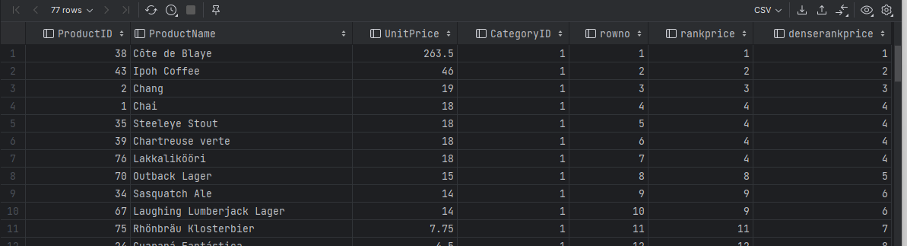
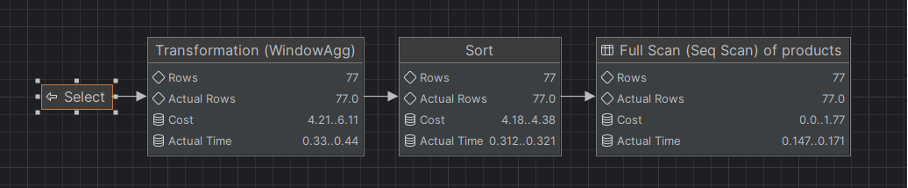

Wykonaj polecenie, zaobserwuj wynik. Porównaj funkcje row_number(), rank(), dense_rank().  Skomentuj wyniki. 

Spróbuj uzyskać ten sam wynik bez użycia funkcji okna

Do analizy użyj wybranego systemu/bazy danych - wybierz MS SQLserver, Postgres lub SQLite)

---
> Wyniki: 

Funkcja row_number() nadaje każdemu wierszowi kolejny numer, nawet jeśli wartości są takie same.
rank() daje tę samą pozycję dla takich samych wartości, ale potem są przerwy w numeracji.
dense_rank() działa podobnie do rank(), tylko że nie ma tych przerw i numeracja idzie po kolei.

```sql
select p.productid,
       p.productname,
       p.unitprice,
       p.categoryid,
       (select count(pp.productid) + 1 as c
        from products pp
        where (pp.categoryid = p.categoryid and pp.unitprice > p.unitprice)
           or (pp.categoryid = p.categoryid and pp.unitprice = p.unitprice and pp.productid < p.productid)) as rowno,
       (select count(pp.productid) + 1
        from products pp
        where pp.categoryid = p.categoryid
          and pp.unitprice > p.unitprice) as rankprice,
       (select count(t.c) + 1
        from (select distinct pp.unitprice as c
              from products pp
              where pp.categoryid = p.categoryid
                and pp.unitprice > p.unitprice) t) as denserankprice
from products p
order by p.categoryid, p.unitprice desc, p.productid
```


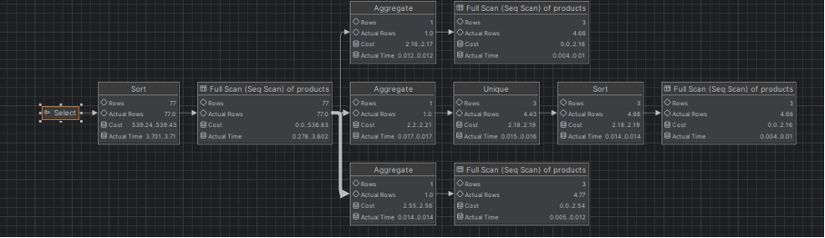


#### Wniosek

- Zapytanie z funkcją okna ma koszt 6.11, używa jednego Seq Scan tabeli products, Sort i WindowAgg
- Wersja bez funkcji okna ma koszt 539.43, wykonuje cztery Seq Scan tabeli products
- Zapytanie z funkcją okna ma mniejszy koszt 

---
# Zadanie 2

Baza: Northwind, tabela product_history

Dla każdego produktu, podaj 4 najwyższe ceny tego produktu w danym roku. Zbiór wynikowy powinien zawierać:
- rok
- id produktu
- nazwę produktu
- cenę
- datę (datę uzyskania przez produkt takiej ceny)
- pozycję w rankingu

- Uporządkuj wynik wg roku, nr produktu, pozycji w rankingu

W przypadku długiego czasu wykonania ogranicz zbiór wynikowy.

Spróbuj uzyskać ten sam wynik bez użycia funkcji okna, porównaj wyniki, czasy i plany zapytań (koszty). 

Przetestuj działanie w różnych SZBD (MS SQL Server, PostgreSql, SQLite)


# Wyniki: 

### Zapytanie z funkcją okna (row_number) dla MS SQL Server
```sql
with ranking as (
    select 
        YEAR([date]) as year,
        productid,
        productname,
        unitprice,
        [date],
        row_number() over (
            partition by productid, YEAR([date]) 
            order by unitprice desc
        ) as rank_pos
    from product_history
)
select *
from ranking
where rank_pos <= 4
order by year, productid, rank_pos;
```


### Zapytanie z funkcją okna (row_number) z ograniczeniem wierszy dla MS SQL Server

```sql 
with ranking as (
    select 
        YEAR([date]) as year,
        productid,
        productname,
        unitprice,
        [date],
        row_number() over (
            partition by productid, YEAR([date]) 
            order by unitprice desc
        ) as rank_pos
    from product_history
    where productid <= 10        
)
select *
from ranking
where rank_pos <= 4
order by year, productid, rank_pos;
```


### Zapytanie bez funkcji okna z ograniczeniem wierszy dla MS SQL Server:
```sql
WITH base AS (
    SELECT
        productid,
        productname,
        unitprice,
        [date],
        YEAR([date]) AS rok,
        id
    FROM product_history
    WHERE productid <= 10
)
, price_rank AS (
    SELECT
        b1.*,
        COUNT(b2.unitprice) + 1 AS rn
    FROM base b1
    LEFT JOIN base b2
        ON b1.productid = b2.productid
       AND b1.rok = b2.rok
       AND (
            b2.unitprice > b1.unitprice
         OR (b2.unitprice = b1.unitprice AND b2.[date] < b1.[date])
         OR (b2.unitprice = b1.unitprice AND b2.[date] = b1.[date] AND b2.id < b1.id)
       )
    GROUP BY
        b1.productid,
        b1.productname,
        b1.unitprice,
        b1.[date],
        b1.rok,
        b1.id
)
SELECT *
FROM price_rank
WHERE rn <= 4
ORDER BY rok, productid, rn;
```


MS SQL Server 

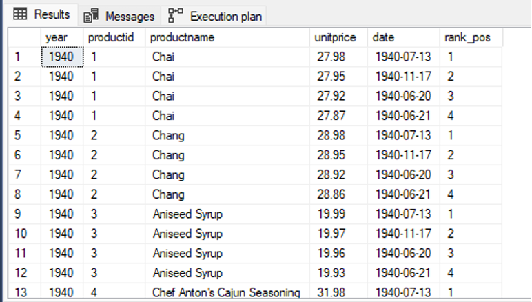 

- pierwsze zapytanie 

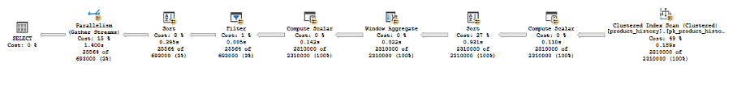

- drugie zapytanie 

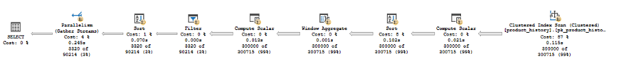

- trzecie zapytanie 

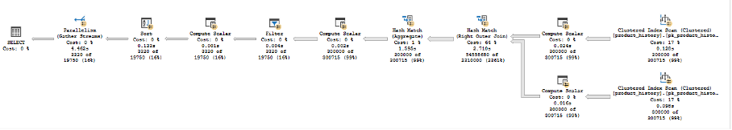


PostgreSQL 

- pierwsze zapytanie

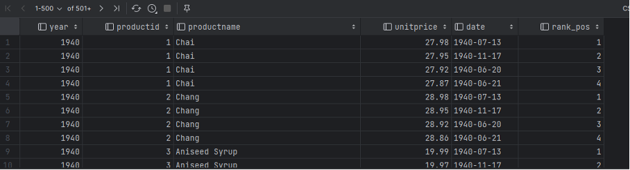

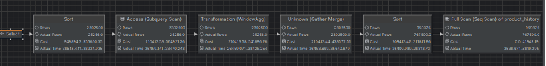

- drugie zapytanie 

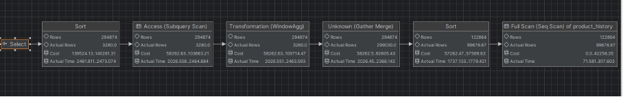

- trzecie zapytanie  

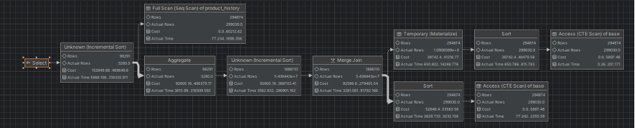


SQLite

- pierwsze zapytanie

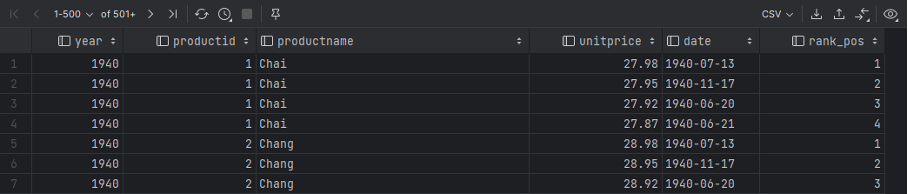

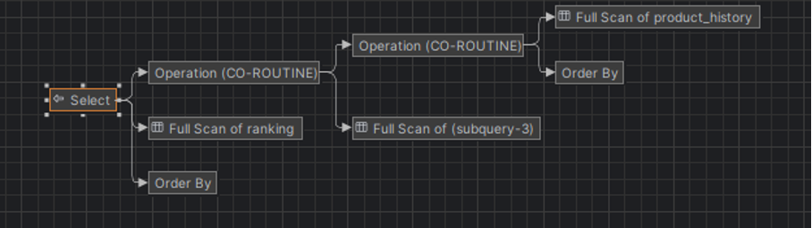

- drugie zapytanie 

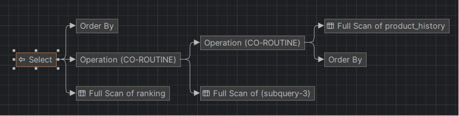


- trzecie zapytanie  

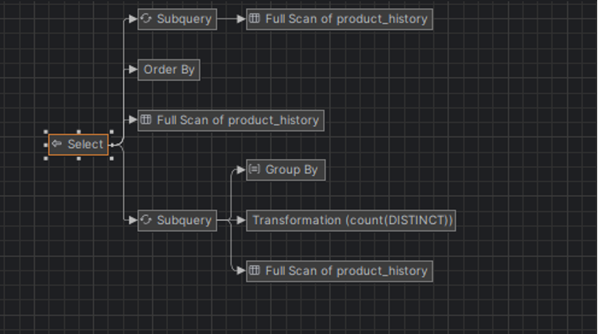


### Czasy zapytań

| Baza danych | Funkcja okna | Funkcja okna z ograniczeniem | Bez funkcji okna z ograniczeniem |
|-------------|--------------|------------------------------|----------------------------------|
| MS SQL Server | 2 s | 0 s | 4 s |
| PostgreSQL | 39 s | 5 s | 4 min 34 s |
| SQLite | 21 s | 2 s | 9 min 32 s |


### Wnioski 

#### MS SQL Server
- Zapytanie z funkcją okna ma Clustered Index Scan dla tabeli product_history , Window Aggregate i Sort. Skanuje całą tabelę, 2310000 wierszy
- Zapytanie z funkcją okna z ograniczeniem ma podobny plan, ale przetwarza mniej wierszy (300000)
- Zapytanie bez funkcji okna ma dwa Clustered Index Scan i Hash Match
- Funkcja okna ma prostszy plan niż wersja bez okna

#### PostgreSQL
- Zapytanie z funkcją okna ma koszt 955055.55, używa Seq Scan, Sort i WindowAgg
- Zapytanie z funkcją okna z ograniczeniem ma koszt 140261.31, dużo mniej niz wersja bez ograniczenia
- Zapytanie bez funkcji okna ma koszt 459640.6, ma Merge Join i Aggregate
- Zapytanie bez funkcji okna ma duzo większy koszt niz funkcja okna z ograniczeniem


#### SQLite
#### SQLite
- Pierwsze i drugie zapytanie (z funkcją okna) mają taki sam plan, m.in. Full Scan tabel product_history i ranking
- Trzecie zapytanie (bez funkcji okna) ma trzy Full Scan tabeli product_history
- Wersja bez funkcji okna ma dużo więcej operacji i skanów tabeli
- Funkcja okna ma prostszy plan w MS SQL Server, PostgreSQL, SQLite


---


# Zadanie 3 

Funkcje `lag()`, `lead()`

Wykonaj polecenia, zaobserwuj wynik. Jak działają funkcje `lag()`, `lead()`

```sql
select productid, productname, categoryid, date, unitprice,  
       lag(unitprice) over (partition by productid order by date) as previousprodprice,  
       lead(unitprice) over (partition by productid order by date) as nextprodprice  
from product_history  
where productid = 1 and year(date) = 2022  
order by date;  
  
with t as (select productid, productname, categoryid, date, unitprice, 
lag(unitprice) over (partition by productid order by date) as previousprodprice,  
                  lead(unitprice) over (partition by productid order by date) as nextprodprice  
           from product_history)  
select * from t  
where productid = 1 and year(date) = 2022  
order by date;
```

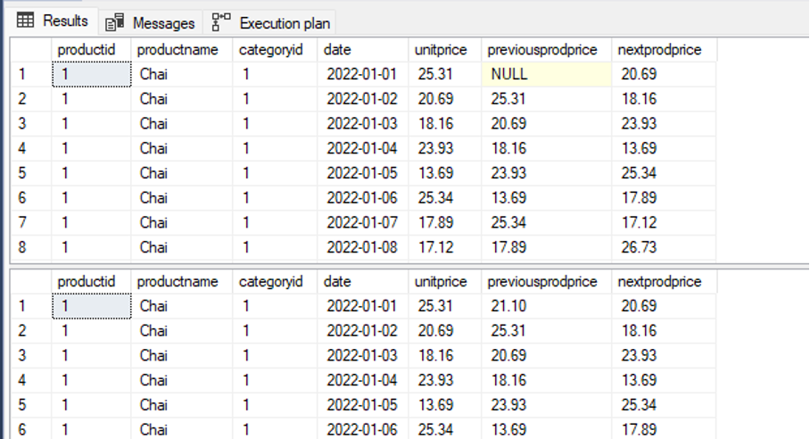
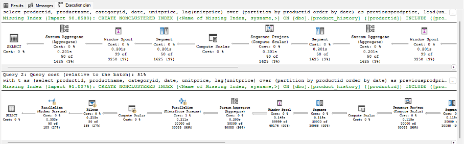
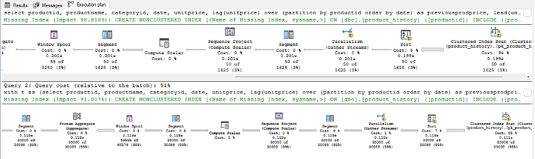

Jak działają funkcje `lag()`, `lead()`?

Spróbuj uzyskać ten sam wynik bez użycia funkcji okna

Do analizy użyj wybranego systemu/bazy danych - wybierz MS SQLserver, Postgres lub SQLite)

---
> Wyniki: 


Funkcja lag() zwraca wartość z poprzedniego wiersza, a dla pierwszego wiersza wartość wynosi NULL (brak poprzedniego).
Funkcja lead() zwraca wartość z następnego wiersza, a dla ostatnego wiersza wartość wynosi NULL(brak następnego).

```sql
select p.productid,
       p.productname,
       p.categoryid,
       p.date,
       p.unitprice,
       (select top 1 p1.unitprice
        from product_history p1
        where p1.productid = p.productid and year(p1.date) = 2022 and p1.date < p.date
        order by p1.date desc) as previousprodprice,
       (select top 1 p1.unitprice
        from product_history p1
        where p1.productid = p.productid and year(p1.date) = 2022 and p1.date > p.date
        order by p1.date asc) as nextprodprice

from product_history p
where p.productid = 1
  and year(p.date) = 2022
order by p.date;
```


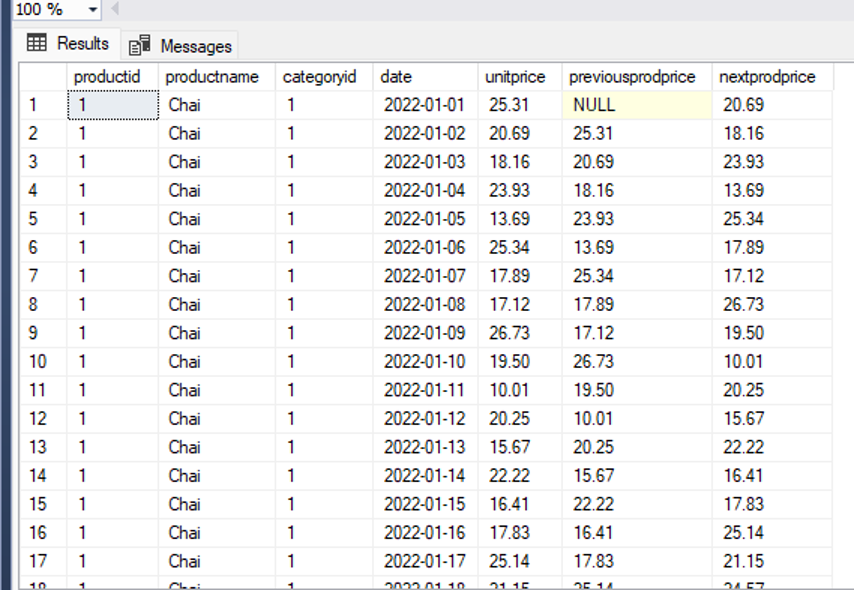
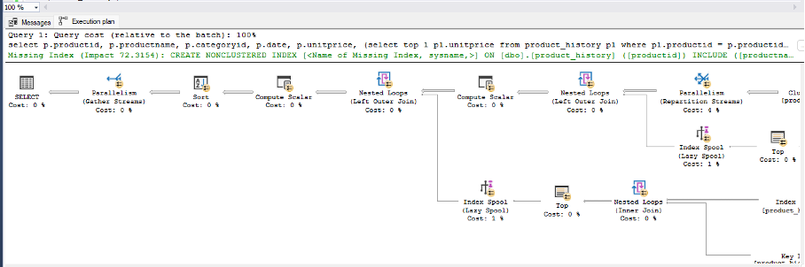
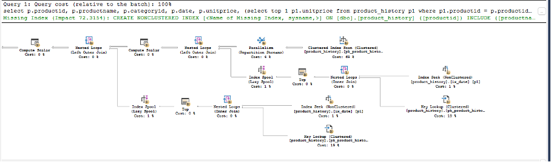

#### Wnioski 

- Funkcja okna ma jeden Clustered Index Scan tabeli `product_history`, używa Window Spool, Segment i Sequence Project.
- W obu poleceniach z funkcją okna jest po jednym Clustered Index Scan tabeli product_history
- Wersja bez funkcji okna ma Clustered Index Scan, dwa Index Seek 
- Wersja bez funkcji okna ma dużo więcej operacji, funkcja okna ma prostszy plan
---


# Zadanie 4

Baza: Northwind, tabele customers, orders, order details

Napisz polecenie które wyświetla inf. o zamówieniach

Zbiór wynikowy powinien zawierać:
- nazwę klienta, nr zamówienia,
- datę zamówienia,
- wartość zamówienia (wraz z opłatą za przesyłkę),
- nr poprzedniego zamówienia danego klienta,
- datę poprzedniego zamówienia danego klienta,
- wartość poprzedniego zamówienia danego klienta.

Do analizy użyj wybranego systemu/bazy danych - wybierz MS SQLserver, Postgres lub SQLite)

---
> Wyniki: 

```sql
with order_values as (
    select 
        c.CompanyName,
        o.CustomerID,
        o.OrderID,
        o.OrderDate,
        o.Freight,
        CAST(
            SUM(od.UnitPrice * od.Quantity * (1 - od.Discount)) + o.Freight AS decimal(10,2)) as order_total
    from Orders o
    join [Order Details] od on o.OrderID = od.OrderID
    join Customers c on o.CustomerID = c.CustomerID
    group by c.CompanyName, o.CustomerID, o.OrderID, o.OrderDate, o.Freight)
select 
    CompanyName,
    OrderID,
    OrderDate,
    order_total,
    lag(OrderID) over (partition by CustomerID order by OrderDate) as prev_order_id,
    lag(OrderDate) over (partition by CustomerID order by OrderDate) as prev_order_date,
    lag(order_total) over (partition by CustomerID order by OrderDate) as prev_order_value
from order_values
order by CompanyName, OrderDate;
```
- MS SQL SERVER 

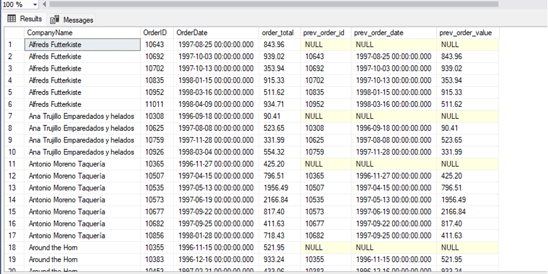
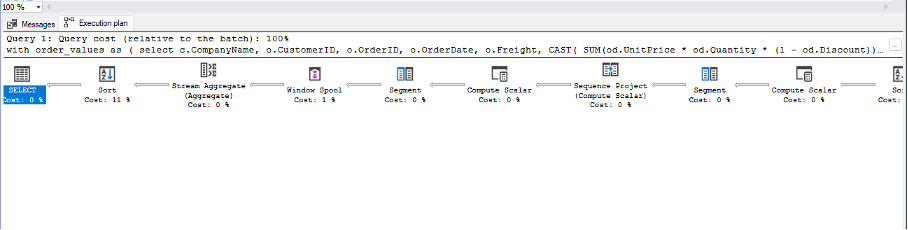
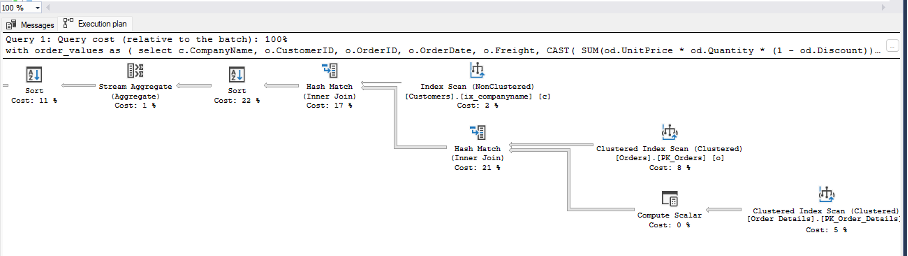


- PostreSQL

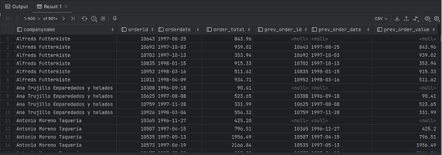

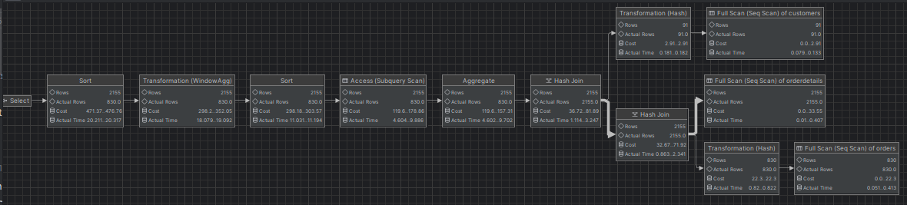


### Wnioski

#### MS SQL Server
- Występuje jeden skan każdej tabeli: Clustered Index Scan dla Orders, Order Details, Index Scan dla Customers
- Są dwa Hash Match (Inner Join) do połączenia tabel 

#### PostgreSQL
- Jest jeden Seq Scan każdej tabeli: customers, orders, orderdetails
- Występują dwa Hash Join do połączenia tabel
- Funkcja okna jest realizowana przez Transformation (WindowAgg)
- Koszt wynosi 475.76


---


# Zadanie 5 

Funkcje `first_value()`, `last_value()`

Baza: Northwind, tabele customers, orders, order details

Wykonaj polecenia, zaobserwuj wynik. Jak działają funkcje `first_value()`, `last_value()`. 

Skomentuj uzyskane wyniki. Czy funkcja `first_value` pokazuje w tym przypadku najdroższy produkt w danej kategorii, czy funkcja `last_value()` pokazuje najtańszy produkt? 

Co jest przyczyną takiego działania funkcji `last_value`. 

Co trzeba zmienić żeby funkcja last_value pokazywała najtańszy produkt w danej kategorii?

Do analizy użyj wybranego systemu/bazy danych - wybierz MS SQLserver, Postgres lub SQLite

```sql
select productid, productname, unitprice, categoryid,  
    first_value(productname) over (partition by categoryid   
order by unitprice desc) first,  
    last_value(productname) over (partition by categoryid   
order by unitprice desc) last  
from products  
order by categoryid, unitprice desc;
```

<div style="page-break-after: always;"></div>

### Wyniki: 
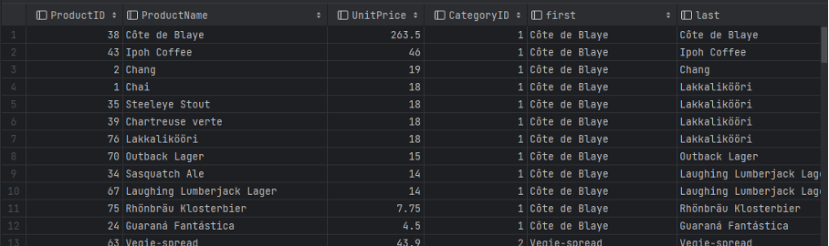

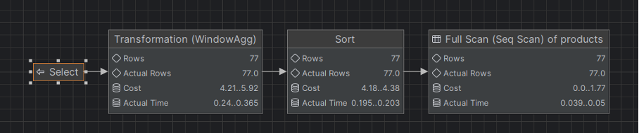


`first_value` bierze wartość z pierwszego wiersza w danym oknie, czyli zwraca najdroższy produkt w danej kategorii.  
 `last_value` bierze wartość z ostatniego wiersza w danym oknie.  
 W przypadku funkcji `last_value` - okno jest definiowane jako "od początku do aktualnego wiersza"
 Dlatego funkcja `last_value` nie pokazuje najtańszego produktu, tylko pokazuje produkt z aktualnego wiersza, czyli najtańszy produkt w danej chwili, bez uwzględnienia wierszy, które są po nim.

Aby funkcja `last_value` pokazywała najtańszy produkt w danej kategorii, trzeba rozszerzyć okno, tak aby obejmowało wszystkie wiersze w danej kategorii. Można to zrobić za pomocą klauzuli `ROWS BETWEEN UNBOUNDED PRECEDING AND UNBOUNDED FOLLOWING`
### Poprawione zapytanie:
```sql
select productid, productname, unitprice, categoryid,
    first_value(productname) over (
        partition by categoryid
        order by unitprice desc
    ) as first,
    last_value(productname) over (
        partition by categoryid
        order by unitprice desc
        rows between unbounded preceding and unbounded following
    ) as last
from products
order by categoryid, unitprice desc;
```
### Wynik zapytania z poprawionym last_value:

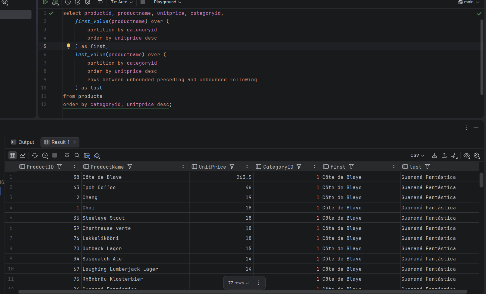

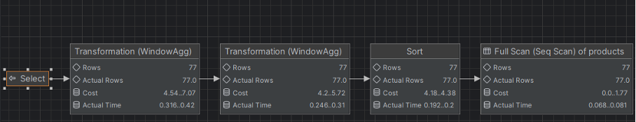

<div style="page-break-after: always;"></div>


```sql
select productid, productname, unitprice, categoryid,
    first_value(productname) over (
        partition by categoryid
        order by unitprice desc
    ) as first,
    last_value(productname) over (
        partition by categoryid
        order by unitprice desc
        rows between current row and unbounded following
    ) as last
from products
order by categoryid, unitprice desc;
```


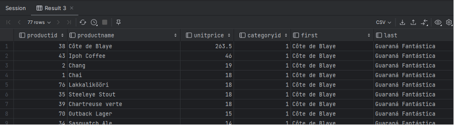
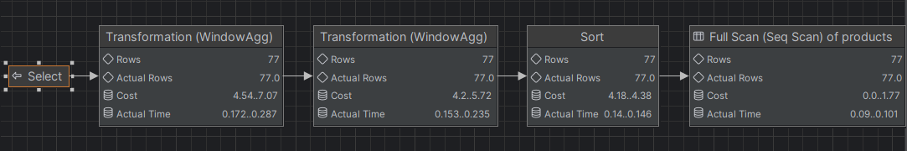


### Wnioski

- Wersja bez rows between ma koszt 5.92, używa jednego Seq Scan, Sort i jednego WindowAgg 
- Wersja z rows between unbounded preceding and unbounded following ma koszt 7.07 i używa dwóch WindowAgg 
- Wersja z rows between current row and unbounded following ma koszt 7.07, również używa dwóch WindowAgg 
- Wersja bez rows between ma najmniejszy koszt
- We wszystkich wersjach jest tylko jeden Seq Scan tabeli products


# Zadanie 6

Baza: Northwind, tabele orders, order details

Napisz polecenie które wyświetla inf. o zamówieniach

Zbiór wynikowy powinien zawierać:
- Id klienta,
- nr zamówienia,
- datę zamówienia,
- wartość zamówienia (wraz z opłatą za przesyłkę),
- dane zamówienia klienta o najniższej wartości w danym miesiącu
	- nr zamówienia o najniższej wartości w danym miesiącu
	- datę tego zamówienia
	- wartość tego zamówienia
- dane zamówienia klienta o najwyższej wartości w danym miesiącu
	- nr zamówienia o najniższej wartości w danym miesiącu
	- datę tego zamówienia
	- wartość tego zamówienia

Do analizy użyj wybranego systemu/bazy danych - wybierz MS SQLserver, Postgres lub SQLite

### Wyniki: 

```sql
WITH order_values AS (
    SELECT
        o.customerid,
        o.orderid,
        o.orderdate,
        SUM(od.unitprice * od.quantity * (1 - COALESCE(od.discount, 0))) 
            + COALESCE(o.freight, 0) AS order_value,
        to_char(o.orderdate, 'YYYY-MM') AS year_month
    FROM orders o
    JOIN "Order Details" od
        ON o.orderid = od.orderid
    GROUP BY
        o.customerid,
        o.orderid,
        o.orderdate,
        o.freight
)
SELECT
    customerid,
    orderid,
    orderdate,
    order_value,
    -- MIN 
    FIRST_VALUE(orderid) OVER (
        PARTITION BY customerid, year_month
        ORDER BY order_value ASC
    ) AS min_order_id,
    FIRST_VALUE(orderdate) OVER (
        PARTITION BY customerid, year_month
        ORDER BY order_value ASC
    ) AS min_order_date,
    FIRST_VALUE(order_value) OVER (
        PARTITION BY customerid, year_month
        ORDER BY order_value ASC
    ) AS min_order_value,
    -- MAX 
    FIRST_VALUE(orderid) OVER (
        PARTITION BY customerid, year_month
        ORDER BY order_value DESC
    ) AS max_order_id,
    FIRST_VALUE(orderdate) OVER (
        PARTITION BY customerid, year_month
        ORDER BY order_value DESC
    ) AS max_order_date,
    FIRST_VALUE(order_value) OVER (
        PARTITION BY customerid, year_month
        ORDER BY order_value DESC
    ) AS max_order_value
FROM order_values
ORDER BY customerid, year_month, order_value;

```

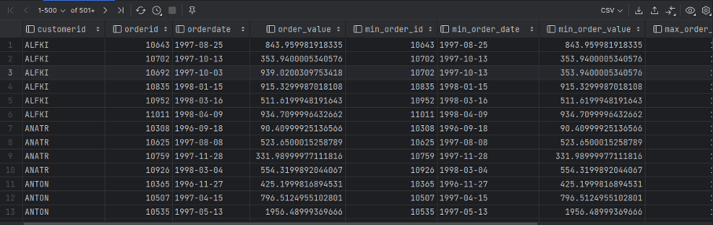

<div style="page-break-after: always;"></div>

### Plan zapytania
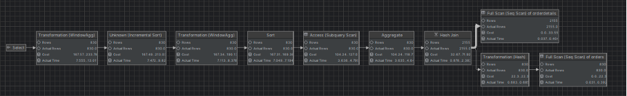

---

### Wnioski

- Plan ma jeden Seq Scan tabel orders i orderdetails, połączone przez Hash Join 
- Są dwa WindowAgg: jeden dla wartości MIN (ASC), drugi dla MAX (DESC)
- Koszt zapytania to 233.71


<div style="page-break-after: always;"></div>

# Zadanie 7

Baza: Northwind, tabela product_history

Napisz polecenie które pokaże wartość sprzedaży każdego produktu narastająco od początku każdego miesiąca. Użyj funkcji okna

Zbiór wynikowy powinien zawierać:
- id pozycji
- id produktu
- datę
- wartość sprzedaży produktu w danym dniu
- wartość sprzedaży produktu narastające od początku miesiąca

Spróbuj uzyskać ten sam wynik bez użycia funkcji okna, porównaj wyniki, czasy i plany zapytań (koszty). 

Przetestuj działanie w różnych SZBD (MS SQL Server, PostgreSql, SQLite)

### Wyniki: 

Kod SQL z funkcją okna:

```sql
with base as (
    select
        id,
        productid,
        [date],
        value * quantity as sales_value
    from product_history
)
select TOP 100
    *,
    sum(sales_value) over (
        partition by productid, format([date], 'yyyy-MM')
        order by [date]
    ) as cumulative_sales
from base;

```


Kod SQL bez funkcji okna:

```sql
select TOP 100
    p1.id,
    p1.productid,
    p1.[date],
    p1.value * p1.quantity as sales_value,
    (select sum(p2.value * p2.quantity)
     from product_history p2
     where p2.productid = p1.productid
       and year(p2.[date]) = year(p1.[date])
       and month(p2.[date]) = month(p1.[date])
       and p2.[date] <= p1.[date]
    ) as cumulative_sales
from product_history p1
```


| Baza danych | Funkcja okna | Bez funkcji okna |
|-------------|--------------|------------------|
| MS SQL Server | 44 s | 1 min 57 s |
| PostgreSQL | 17 s | 2 min 9 s |
| SQLite | 1,7 s | 1 min 28 s |


MS SQL Server 

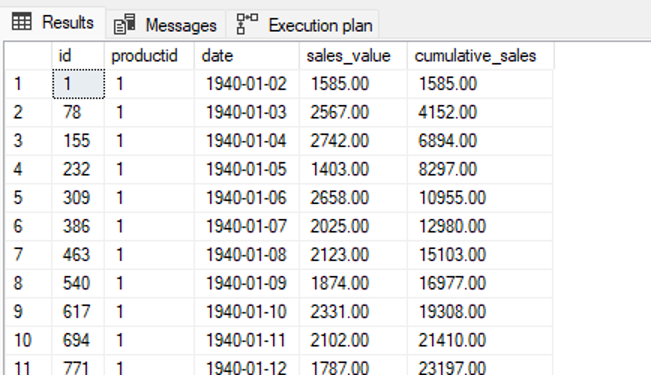

- zapytanie pierwsze


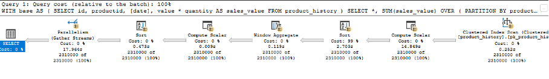


- zapytanie drugie 

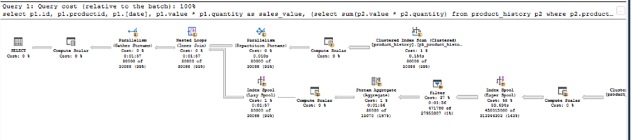
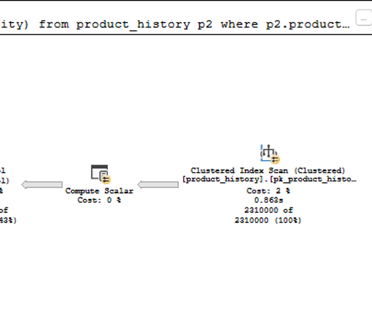


PostgreSQL


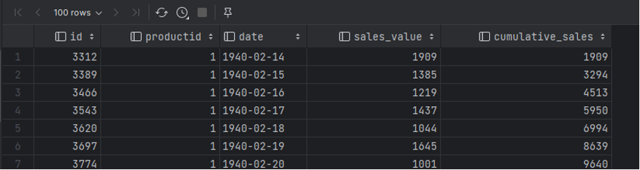

- zapytanie pierwsze 

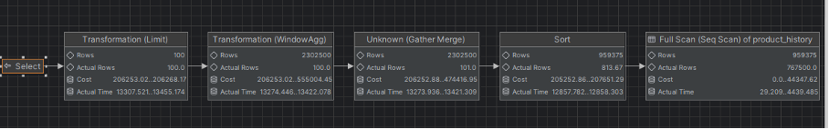

- zapytanie drugie 


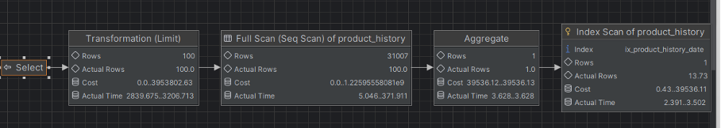

SQLite

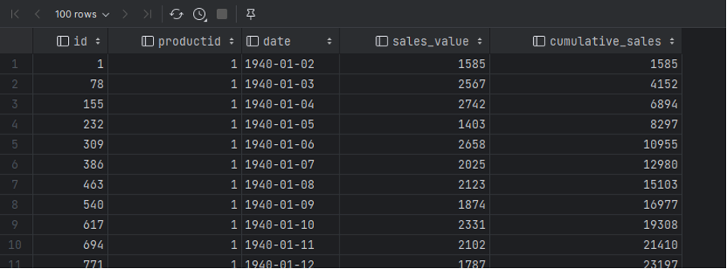

- zapytanie pierwsze 

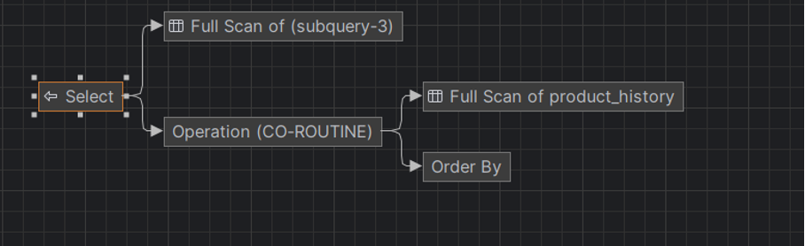

- zapytanie drugie 

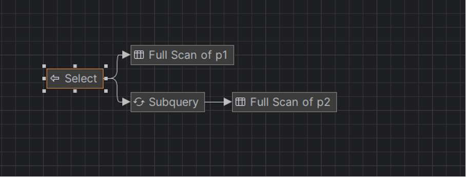


### Wnioski


#### MS SQL Server
- Zapytanie z funkcją okna ma jeden Clustered Index Scan dla tabeli product_history, Window Aggregate i Sort
- Zapytanie bez funkcji okna ma dwa Clustered Index Scan
- Plan zapytania z wersją z funkcją okna jest prostsza

#### PostgreSQL
- Zapytanie z funkcją okna ma koszt 206268.17, używa jednego Seq Scan, Sort i WindowAgg
- Zapytanie bez funkcji okna ma koszt 3953802.63 (prawie 20 razy więcej), używa Aggregate i Index Scan 
- Koszt jest duzo większy w zapytaniu bez funkcji okna 


#### SQLite
- Zapytanie z funkcją okna używa Full Scan tabeli product_history 
- Zapytanie bez funkcji okna wykonuje Full Scan tabeli dwa razy


# Zadanie 8

Wykonaj kilka "własnych" przykładowych analiz. 

Czy są jeszcze jakieś ciekawe/przydatne funkcje okna (z których nie korzystałeś w ćwiczeniu)? Spróbuj ich użyć w zaprezentowanych przykładach.

Do analizy użyj wybranego systemu/bazy danych - wybierz MS SQLserver, Postgres lub SQLite

### Średnia ruchoma (moving average) dla wartości sprzedaży produktu w danym dniu, z oknem 3 dniowym:

```sql
select 
    productid,
    date,
    value * quantity as sales_value,

    avg(value * quantity) over (
        partition by productid
        order by date
        rows between 2 preceding and current row
    ) as moving_avg

from product_history;
```

### Rezultat wywołania powyższego zapytania:
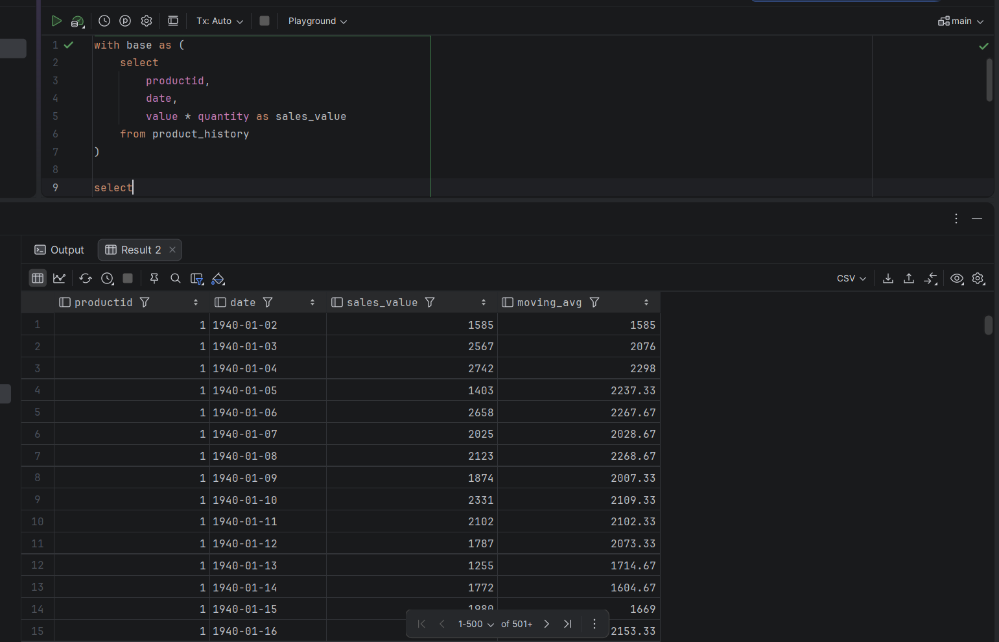

### Użycie funkcji percet_rank(), procentowa pozycja produktu w kategorii względem ceny

```sql
select 
    productid,
    productname,
    categoryid,
    unitprice,

    percent_rank() over (
        partition by categoryid
        order by unitprice
    ) as price_percent_rank

from products;
```

### Rezultat wywołania powyższego zapytania:
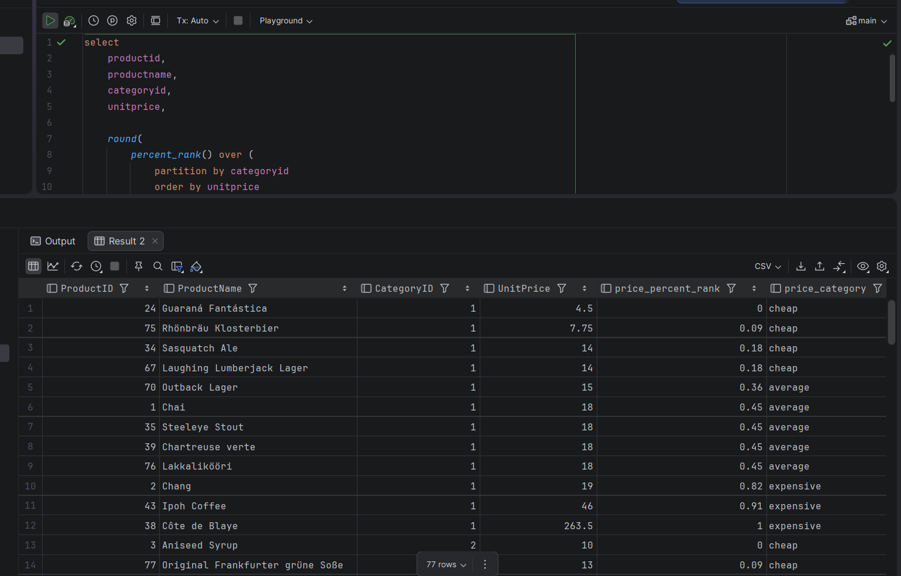


### Ranking klientów na podstawie łącznej wartości zamówień, z podziałem na kwartyle z wykorzystaniem funkcji ntile():

```sql
WITH CustomerSpending AS (
    SELECT 
        o.CustomerID, 
        SUM(od.UnitPrice * od.Quantity) as TotalSpent
    FROM Orders o
    JOIN [Order Details] od ON o.OrderID = od.OrderID
    GROUP BY o.CustomerID
)
SELECT 
    CustomerID, 
    TotalSpent,
    NTILE(4) OVER(ORDER BY TotalSpent DESC) as SpendingQuartile
FROM CustomerSpending;
```

### Rezultat wywołania powyższego zapytania:
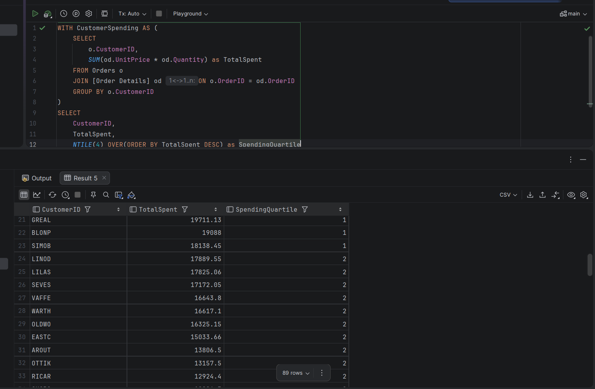

Punktacja

|         |     |
| ------- | --- |
| zadanie | pkt |
| 1       | 1   |
| 2       | 2   |
| 3       | 1   |
| 4       | 1   |
| 5       | 1   |
| 6       | 1   |
| 7       | 2   |
| 8       | 2   |
| razem   | 11  |