# Indeksy,  optymalizator <br>Lab1

<!-- <style scoped>
 p,li {
    font-size: 12pt;
  }
</style>  -->

<!-- <style scoped>
 pre {
    font-size: 8pt;
  }
</style>  -->


---

**Imiona i nazwiska:** Natalia Bratek, Jakub Karczewski 

--- 

Celem ćwiczenia jest zapoznanie się z planami wykonania zapytań (execution plans), oraz z budową i możliwością wykorzystaniem indeksów.

Swoje odpowiedzi wpisuj w miejsca oznaczone jako:

---
> Wyniki: 

```sql
--  ...
```

---

Ważne/wymagane są komentarze.

Zamieść kod rozwiązania oraz zrzuty ekranu pokazujące wyniki
- dołącz kod rozwiązania w formie tekstowej/źródłowej
- najlepiej plik  .md 
	- ewentualnie sql

Zwróć uwagę na formatowanie kodu

## Oprogramowanie - co jest potrzebne?

Do wykonania ćwiczenia potrzebne jest następujące oprogramowanie
- MS SQL Server
- SSMS - SQL Server Management Studio    
	- ewentualnie inne narzędzie umożliwiające komunikację z MS SQL Server i analizę planów zapytań
- przykładowa baza danych AdventureWorks2017.
    
Oprogramowanie dostępne jest na przygotowanej maszynie wirtualnej


## Przygotowanie  
    
Stwórz swoją bazę danych o nazwie lab1. 

```sql
create database lab1  
go  
  
use lab1 
go
```


# Część 1

Celem tej części ćwiczenia jest zapoznanie się z planami wykonania zapytań (execution plans) oraz narzędziem do automatycznego generowania indeksów.

## Dokumentacja/Literatura

Przydatne materiały/dokumentacja. Proszę zapoznać się z dokumentacją:
- [https://docs.microsoft.com/en-us/sql/tools/dta/tutorial-database-engine-tuning-advisor](https://docs.microsoft.com/en-us/sql/tools/dta/tutorial-database-engine-tuning-advisor)
- [https://docs.microsoft.com/en-us/sql/relational-databases/performance/start-and-use-the-database-engine-tuning-advisor](https://docs.microsoft.com/en-us/sql/relational-databases/performance/start-and-use-the-database-engine-tuning-advisor)
- [https://www.simple-talk.com/sql/performance/index-selection-and-the-query-optimizer](https://www.simple-talk.com/sql/performance/index-selection-and-the-query-optimizer)
- [https://blog.quest.com/sql-server-execution-plan-what-is-it-and-how-does-it-help-with-performance-problems/](https://blog.quest.com/sql-server-execution-plan-what-is-it-and-how-does-it-help-with-performance-problems/)


Operatory (oraz reprezentujące je piktogramy/Ikonki) używane w graficznej prezentacji planu zapytania opisane są tutaj:
- [https://docs.microsoft.com/en-us/sql/relational-databases/showplan-logical-and-physical-operators-reference](https://docs.microsoft.com/en-us/sql/relational-databases/showplan-logical-and-physical-operators-reference)

<div style="page-break-after: always;"></div>


Wykonaj poniższy skrypt, aby przygotować dane:

```sql
select * into [salesorderheader]  
from [adventureworks2017].sales.[salesorderheader]  
go  
  
select * into [salesorderdetail]  
from [adventureworks2017].sales.[salesorderdetail]  
go
```


# Zadanie 1 - Obserwacja


Wpisz do MSSQL Managment Studio (na razie nie wykonuj tych zapytań):

```sql
-- zapytanie 1  
select *  
from salesorderheader sh  
inner join salesorderdetail sd on sh.salesorderid = sd.salesorderid  
where orderdate = '2008-06-01 00:00:00.000'  
go  

-- zapytanie 1.1
select *  
from salesorderheader sh  
inner join salesorderdetail sd on sh.salesorderid = sd.salesorderid  
where orderdate = '2013-01-28 00:00:00.000' 
go  
  
-- zapytanie 2  
select orderdate, productid, sum(orderqty) as orderqty, 
       sum(unitpricediscount) as unitpricediscount, sum(linetotal)  
from salesorderheader sh  
inner join salesorderdetail sd on sh.salesorderid = sd.salesorderid  
group by orderdate, productid  
having sum(orderqty) >= 100  
go  
  
-- zapytanie 3  
select salesordernumber, purchaseordernumber, duedate, shipdate  
from salesorderheader sh  
inner join salesorderdetail sd on sh.salesorderid = sd.salesorderid  
where orderdate in ('2008-06-01','2008-06-02', '2008-06-03', '2008-06-04', '2008-06-05')  
go  
  
-- zapytanie 4  
select sh.salesorderid, salesordernumber, purchaseordernumber, duedate, shipdate  
from salesorderheader sh  
inner join salesorderdetail sd on sh.salesorderid = sd.salesorderid  
where carriertrackingnumber in ('ef67-4713-bd', '6c08-4c4c-b8')  
order by sh.salesorderid  
go
```


Włącz dwie opcje: **Include Actual Execution Plan** oraz **Include Live Query Statistics**:


<!-- ![[_img/index1-1.png | 500]] -->


Teraz wykonaj poszczególne zapytania (najlepiej każde analizuj oddzielnie). Co można o nich powiedzieć? Co sprawdzają? Jak można je zoptymalizować?  

---
> Wyniki: 

- zapytanie 1 

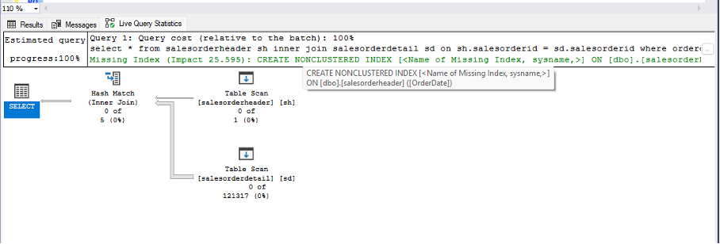


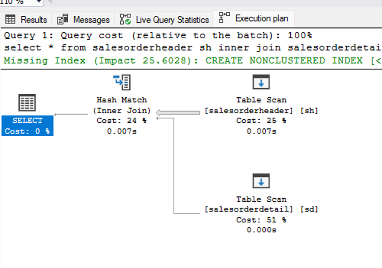

Zapytanie pobiera wszystkie dane z połączenia dwóch tabel oraz filtruje po konkretnej dacie zamówienia.
Zapytanie nie zwraca żadnego wyniku, ponieważ nic nie pasuje do danej daty.

Plan składa się z dwóch Table Scan (jeden na salesorderheader, drugi na salesorderdetail) oraz Hash Match (Inner Join)
Mozna zauważyć, że brakuje indeksu na kolumnie OrderDate. Pojawia się komunikat Missing Index. 
Zapytanie można zoptymalizować dodając indeks na kolumnie OrderDate w tabeli salesorderheader.

- zapytanie 1.1 


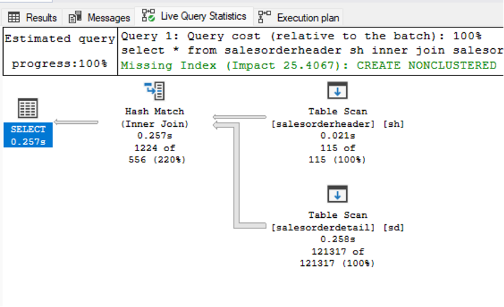

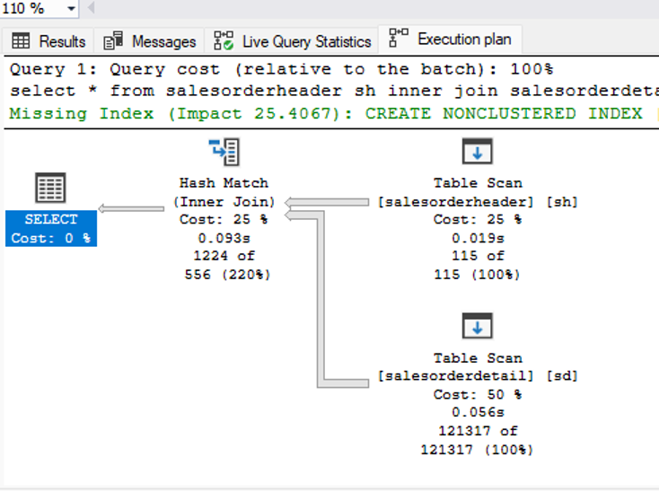

Zapytanie jest podobne do pierwszego, ale filtruje po innej dacie. Otrzymujemy wynik. 
Plan oraz komunikat o brakującym indeksie jest podobny jak w pierwszym zapytaniu. Zapytanie można zoptymalizować dodając indeks na kolumnie OrderDate w tabeli salesorderheader.


- zapytanie 2 

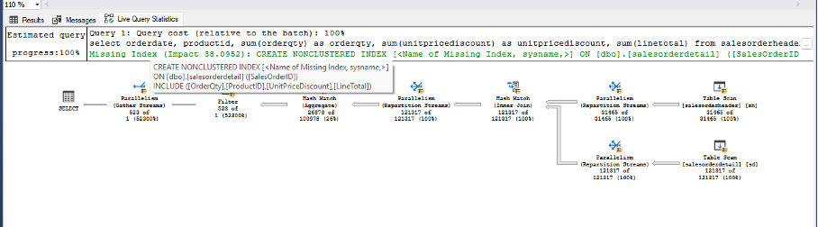

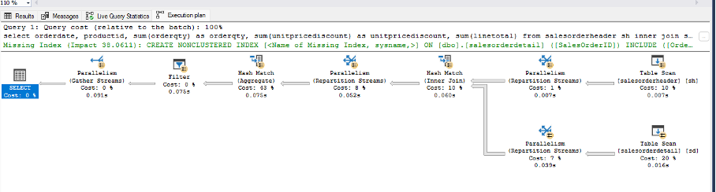


Zapytanie pokazuje łączną ilość, rabaty i wartość sprzedaży dla każdego produktu w danym dniu. Uwzględnia tylko te przypadki, gdzie sprzedano co najmniej 100 sztuk.


Plan zawiera dwa równoległe skanowania obu tabel (Table Scan i Parallelism), Filter, Hash Match (Aggregate) oraz Hash Match (Inner Join). Pojawiał się Missing Index na kolumnie SalesOrderID w salesorderdetail. Zapytanie można zoptymalizować dodając indeks na SalesOrderID (przyspieszy join) oraz indeks na kolumnach używanych w GROUP BY i kolumny w INCLUDE.


- zapytanie 3 


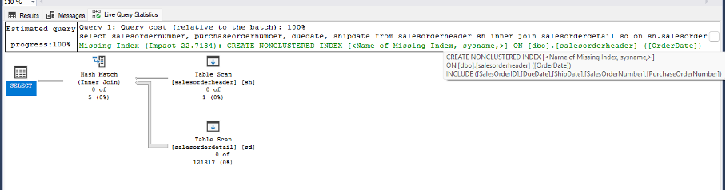

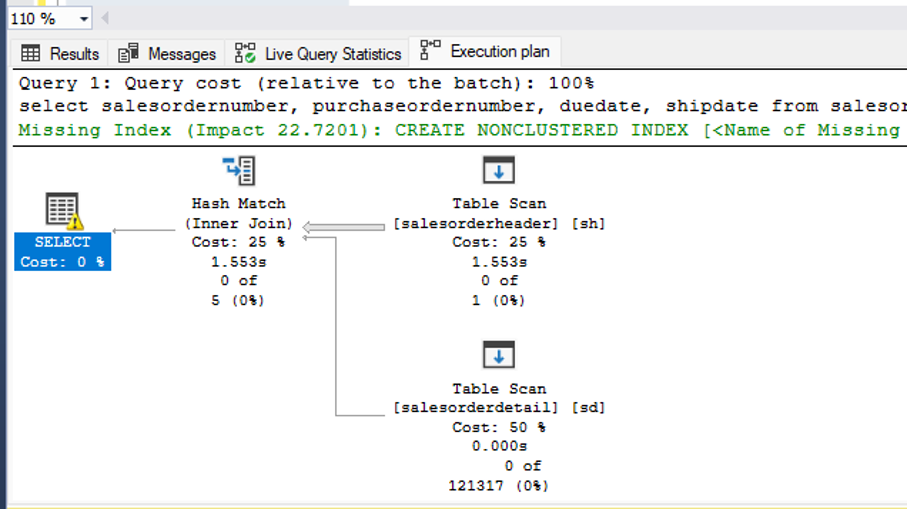

Zapytanie pobiera dane zamówień dla zakresu 5 dni.

Zapytanie nie zwraca żadnych wyników, mimo to czas jest wysoki, bo skanowana jest cała tabela. W zapytaniu IN na wielu datach bez indeksu powoduje pełne skanowanie przy każdej wartości. Zapytanie można zoptymalizować dodając indeks na OrderDate z INCLUDE dla kolumn wynikowych.


- zapytanie 4

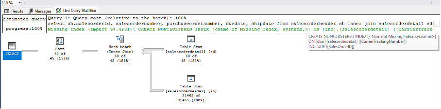

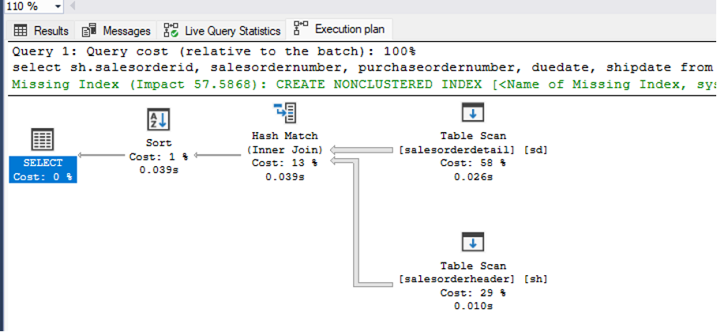


Zapytanie wyszukuje zamówienia po numerze śledzenia przesyłki. 
Aby zoptymalizować zapytanie można dodać indeks na kolumnie CarrierTrackingNumber. 

Plan zawiera dwa Table Scan (na salesorderdetail i salesorderheader), Hash Match (Inner Join) oraz Sort. Pojawia się Missing Index na kolumnie CarrierTrackingNumber w salesorderdetail. Zapytanie można zoptymalizować dodając indeks na CarrierTrackingNumber (przyspieszy WHERE) oraz indeks na SalesOrderID w salesorderheader (przyspieszy join). Sortowanie na kilkudziesięciu wierszach wynikowych indeks raczej nie przyspieszy.

---

# Zadanie 2 - Dobór indeksów / optymalizacja

Do wykonania tego ćwiczenia potrzebne jest narzędzie SSMS


Zapytania 1, 2, 3, 4 z  poprzedniego zadania 

```sql
select *  
from salesorderheader sh  
inner join salesorderdetail sd on sh.salesorderid = sd.salesorderid  
where orderdate = '2008-06-01 00:00:00.000'  
go  
  
-- zapytanie 2  
select orderdate, productid, sum(orderqty) as orderqty, 
       sum(unitpricediscount) as unitpricediscount, sum(linetotal)  
from salesorderheader sh  
inner join salesorderdetail sd on sh.salesorderid = sd.salesorderid  
group by orderdate, productid  
having sum(orderqty) >= 100  
go  
  
-- zapytanie 3  
select salesordernumber, purchaseordernumber, duedate, shipdate  
from salesorderheader sh  
inner join salesorderdetail sd on sh.salesorderid = sd.salesorderid  
where orderdate in ('2008-06-01','2008-06-02', '2008-06-03', '2008-06-04', '2008-06-05')  
go  
  
-- zapytanie 4  
select sh.salesorderid, salesordernumber, purchaseordernumber, duedate, shipdate  
from salesorderheader sh  
inner join salesorderdetail sd on sh.salesorderid = sd.salesorderid  
where carriertrackingnumber in ('ef67-4713-bd', '6c08-4c4c-b8')  
order by sh.salesorderid  
go

```


Zaznacz wszystkie zapytania, i uruchom je w **Database Engine Tuning Advisor**:

<!-- ![[_img/index1-12.png | 500]] -->

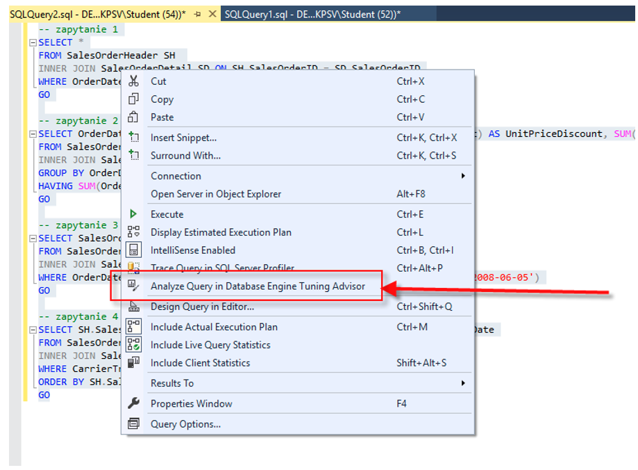


Sprawdź zakładkę **Tuning Options**, co tam można skonfigurować?

---
> Wyniki: 


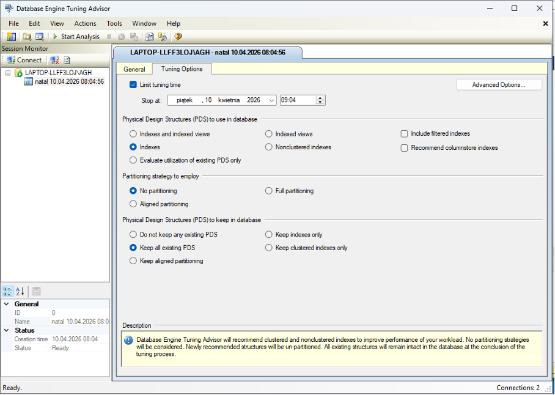

Można wybrać Physical Design Structures (PDS), czyli struktury, jakich można do tuningu (m.in Indexes and indexed views
Indexes, Indexed views, Nonclustered indexes, Filtered indexes, Columnstore indexes). Można również wybrać strategię partycjonowania (No partitioning, Full partitioning, Aligned partitioning) oraz Physical Design Structures to keep, czyli które istniejące struktury zachować (np. Keep all existing PDS, Keep indexes only itp.)

---


Użyj **Start Analysis**:

<!-- ![[_img/index1-3.png | 500]] -->

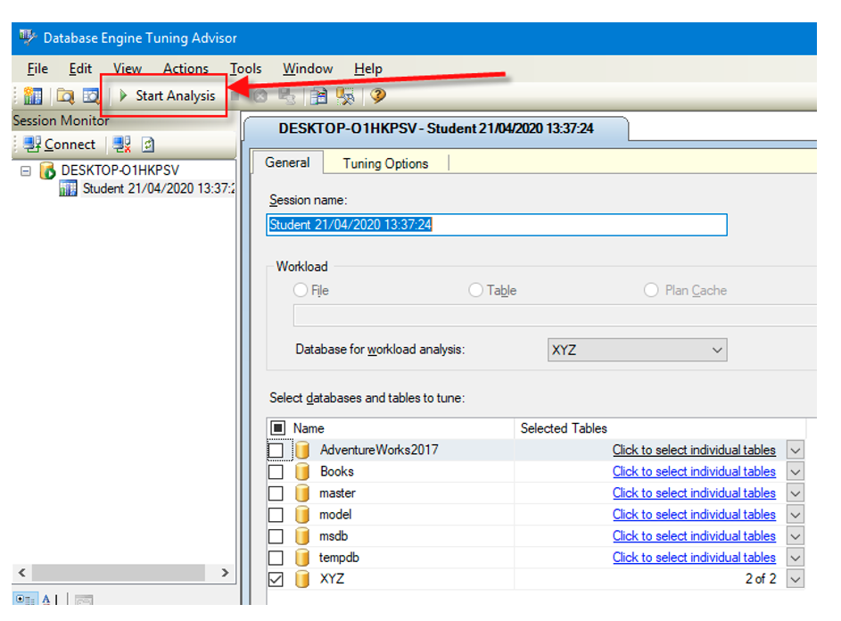


Zaobserwuj wyniki w **Recommendations**.

Przejdź do zakładki **Reports**. Sprawdź poszczególne raporty. Główną uwagę zwróć na koszty i ich poprawę:


<!-- ![[_img/index4-1.png | 500]] -->

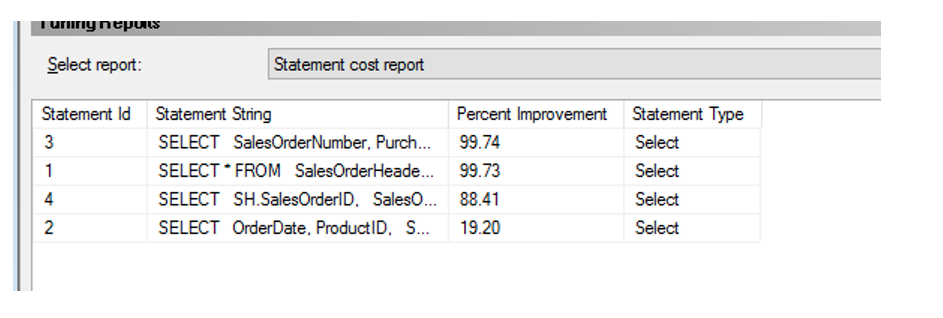


Zapisz poszczególne rekomendacje:

Uruchom zapisany skrypt w Management Studio.

Opisz, dlaczego dane indeksy zostały zaproponowane do zapytań:

---
> Wyniki: 

Po uruchomieniu Start Analysis narzędzie zaproponowało 7 indeksów: 4 dla tabeli salesorderdetail i 3 dla salesorderheader oraz 1 obiekt statystyk. Szacowana poprawa wynosi 61%. 

W zakładce Reports widoczny jest Statement cost report. Największą poprawę uzyskały zapytania 3 i 1 (99.74% i 99.73%), zapytanie 4 poprawiło się o 94.39%, a zapytanie 2 jedynie o 19.10%.

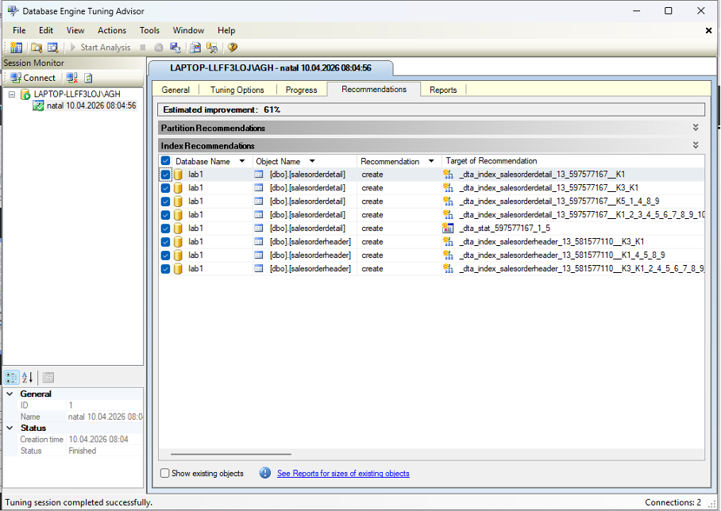


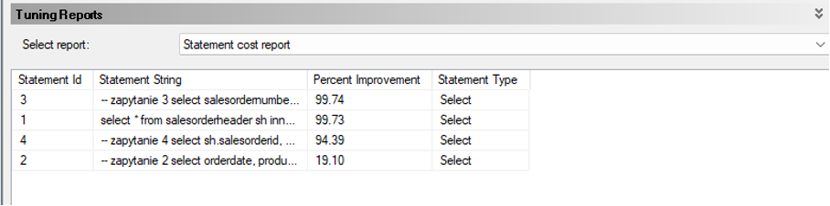

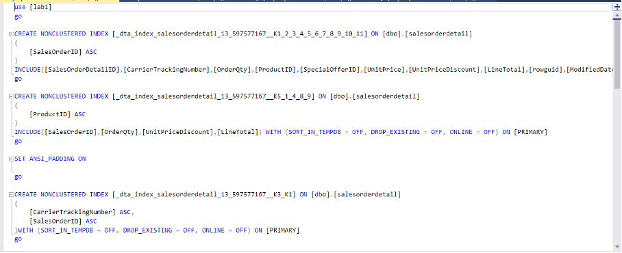

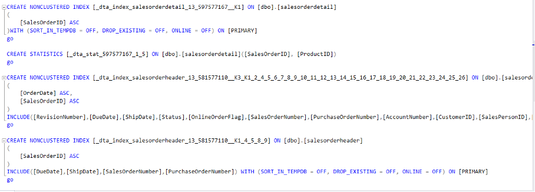

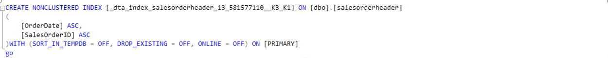

Dla tabeli salesorderdetail zostały zaproponowane indeksy: 
1. _K1_2_3_4_5_6_7_8_9_10_11 [SalesOrderID] ASC z INCLUDE na pozostałych kolumnach, aby pobrać wszytskie potrzebne dane 
2. _K5_1_4_8_9 [ProductID] ASC z INCLUDE na SalesOrderID, OrderQty, UnitPriceDiscount, LineTotal, bo wszystkie potrzebne dane będą bezpośrednio w indeksie
3. _K3_K1 [CarrierTrackingNumber], [SalesOrderID], bo przyspiesza WHERE w zapytaniu 4, SalesOrderID w kluczu eliminuje operator Sort
4. _K1 [SalesOrderID] – indeks na SalesOrderID, bo przyspiesza JOIN z salesorderheader

Dla tabeli salesorderheader zostały zaproponowane indeksy:

5. _K3_K1_2_4_5_6_7_8_9... [OrderDate], [SalesOrderID] z INCLUDE na wszystkich kolumnach, bo pozwala pobrać wszystkie dane
6. _K1_4_5_8_9  [SalesOrderID] z INCLUDE na [DueDate], [ShipDate], [SalesOrderNumber], [PurchaseOrderNumber], bo (dla zapytania 3) wszystkie potrzebne dane będą bezpośrednio w indeksie
7. _K3_K1  [OrderDate], [SalesOrderID], bo przyspiesza WHERE 

---


Sprawdź jak zmieniły się Execution Plany. Opisz zmiany:

---
> Wyniki: 

- zapytanie 1 

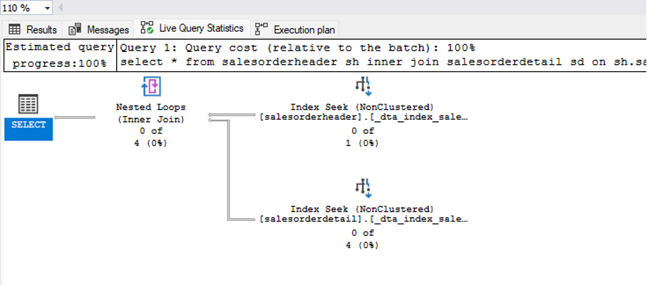

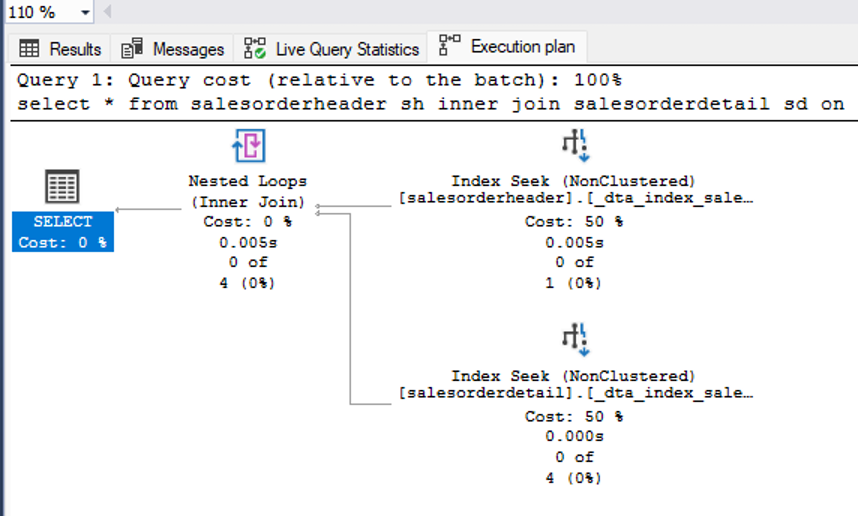

Dzięki indeksom 5 i 1 Table Scan na obu tabelach został zastąpiony przez Index Seek na salesorderheader. Nie trzeba już skanować całej tabeli, tylko wyszukiwanie jest po OrderDate, dla znalezionych SalesOrderID wykonywany jest drugi Index Seek na salesorderdetail. Hash Match jest zastąpiony przez Nested Loops, bo liczba wierszy jest mała.


- zapytanie 2

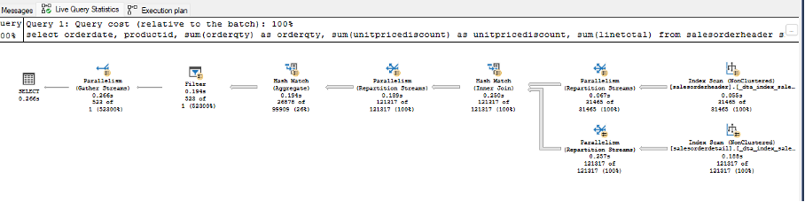

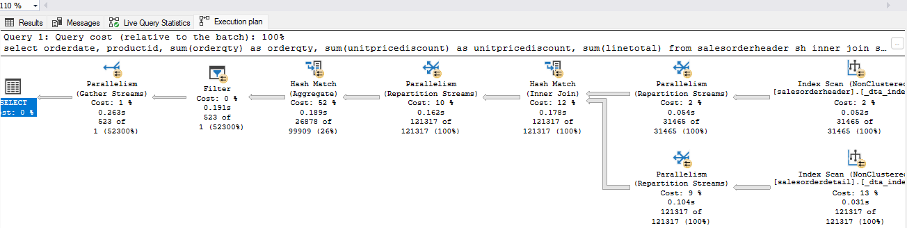

Za pomocą indeksu 2 Table Scan został zastąpiony przez Index Scan, czyli nie skanujemy juz całej tabeli, tylko potrzebne kolumny. Pozostałe operatory (np. Parallelism) pozostały bez zmian, 
poniewaz nadal są potrzebne dla GROUP BY i HAVING.

- zapytanie 3

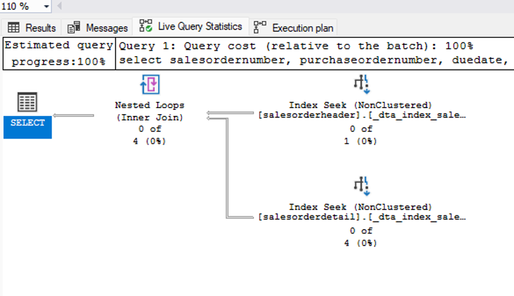

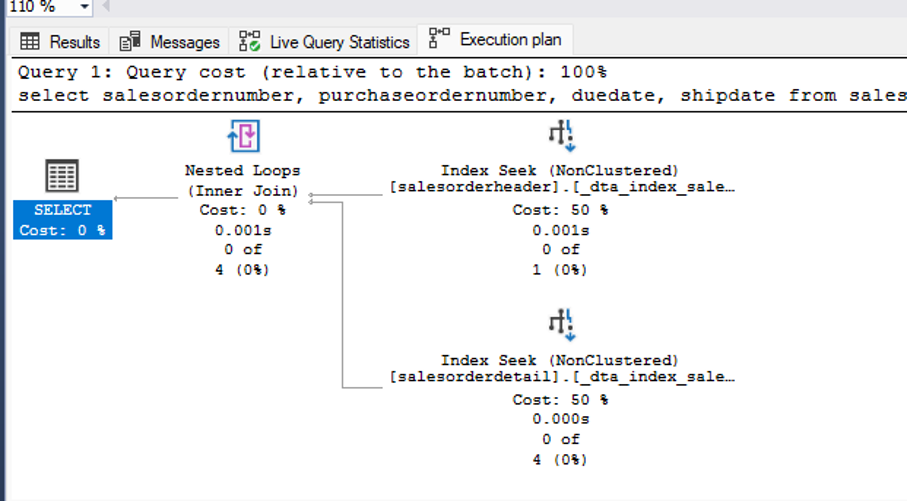

Dzięki indeksom 6 i 7 Table Scan w obu tabelach został zastąpiony przez Index Seek (wyszukiwanie po OrderDate), dla znalezionych SalesOrderID wykonywany jest drugi Index Seek na salesorderdetail. 
Hash Match został zastąpiony przez Nested Loops.


- zapytanie 4


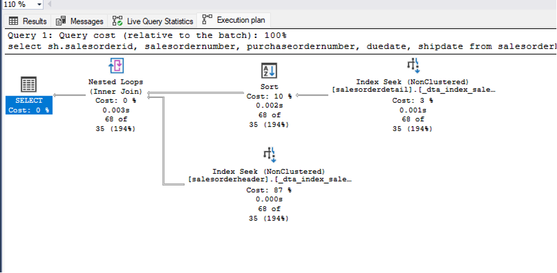

Za pomocą indeksu 3 wykonywany jest Index Seek na salesorderdetail po carriertrackingnumber, dane są od razu posortowane po SalesOrderID. Następnie dla znalezionych SalesOrderID wykonywany jest drugi Index Seek na salesorderheader przy pomocy indeksu 4. Sort pozostaje w planie, ale operuje tylko na 68 wierszach.


---

# Część 2

Celem ćwiczenia jest zapoznanie się z różnymi rodzajami  indeksów  oraz możliwością ich wykorzystania

## Dokumentacja/Literatura

Przydatne materiały/dokumentacja. Proszę zapoznać się z dokumentacją:
- [https://docs.microsoft.com/en-us/sql/relational-databases/indexes/indexes](https://docs.microsoft.com/en-us/sql/relational-databases/indexes/indexes)
- [https://docs.microsoft.com/en-us/sql/relational-databases/sql-server-index-design-guide](https://docs.microsoft.com/en-us/sql/relational-databases/sql-server-index-design-guide)
- [https://www.simple-talk.com/sql/performance/14-sql-server-indexing-questions-you-were-too-shy-to-ask/](https://www.simple-talk.com/sql/performance/14-sql-server-indexing-questions-you-were-too-shy-to-ask/)
- [https://www.sqlshack.com/sql-server-query-execution-plans-examples-select-statement/](https://www.sqlshack.com/sql-server-query-execution-plans-examples-select-statement/)

# Zadanie 3 - Indeksy klastrowane I nieklastrowane


Skopiuj tabelę `Customer` do swojej bazy danych:

```sql
select * into customer from adventureworks2017.sales.customer
```

Wykonaj analizy zapytań:

```sql
select * from customer where storeid = 594  
  
select * from customer where storeid between 594 and 610
```

Zanotuj czas zapytania oraz jego koszt koszt:

---
> Wyniki: 


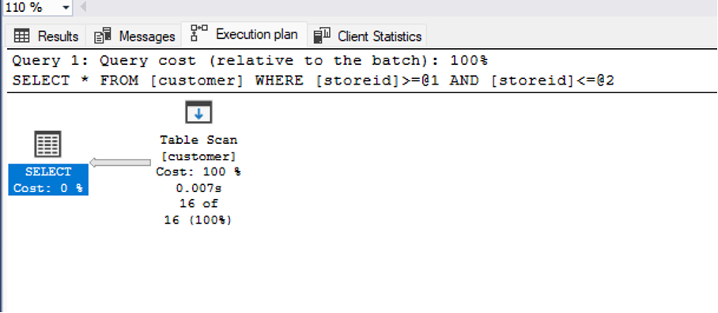


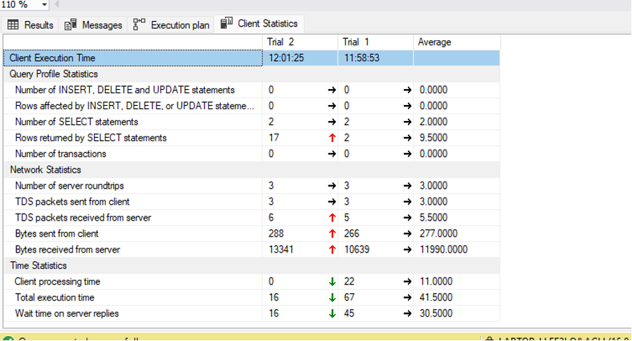


Dodaj indeks:

```sql
create  index customer_store_cls_idx on customer(storeid)
```

### Jak zmienił się plan i czas? Czy jest możliwość optymalizacji?

Zmiany w planie wykonania:

Zamiast Table Scan pojawia się Index Seek (dla storeid = 594) oraz Index Range Scan (dla BETWEEN).
Optymalizator wykorzystuje indeks do bezpośredniego odnalezienia danych zamiast przeszukiwania całej tabeli.
Może pojawić się Key Lookup, ponieważ używane jest SELECT * (czyli potrzeba pobrania dodatkowych kolumn spoza indeksu).

Zmiany w czasie i koszcie:

Znaczne zmniejszenie czasu wykonania zapytań.
Wyraźny spadek kosztu zapytania (mniej odczytów logicznych).
Największa poprawa widoczna dla zapytania z warunkiem =.

Istnieje możliwość optymalizacji, można użyć indeksu klastrowanego


---
> Wyniki: 

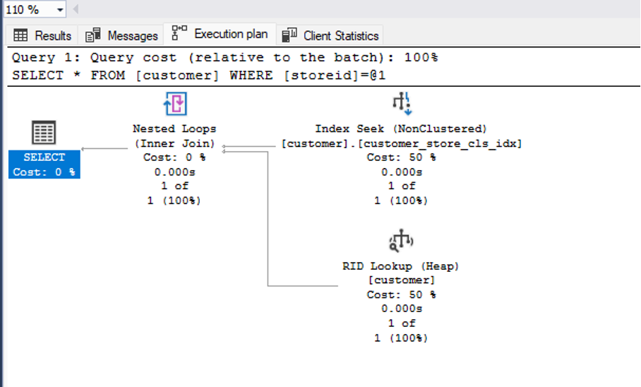

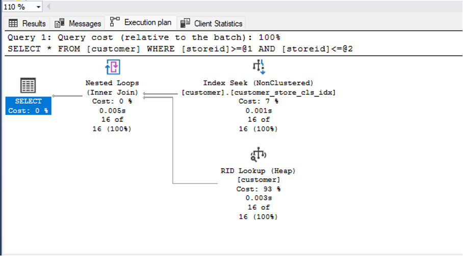


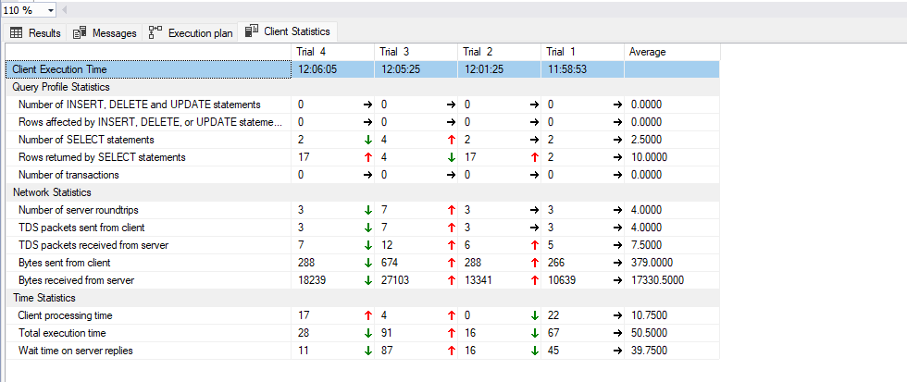


Dodaj indeks klastrowany:

```sql
create clustered index customer_store_cls_idx on customer(storeid)
```

### Czy zmienił się plan/koszt/czas? Skomentuj dwa podejścia w wyszukiwaniu krotek.

Zmiany w planie wykonania:  
Plan nadal wykorzystuje Index Seek / Range Scan, ale teraz na indeksie klastrowanym.
Znika operacja Key Lookup, ponieważ:
dane tabeli są fizycznie przechowywane w indeksie klastrowanym.
Dostęp do danych odbywa się bezpośrednio z jednego źródła.

Zmiany w czasie i koszcie:  
Dalsze zmniejszenie czasu wykonania (szczególnie dla zapytań zakresowych BETWEEN).
Niższy koszt zapytania niż przy indeksie nieklastrowanym.


---
> Wyniki: 


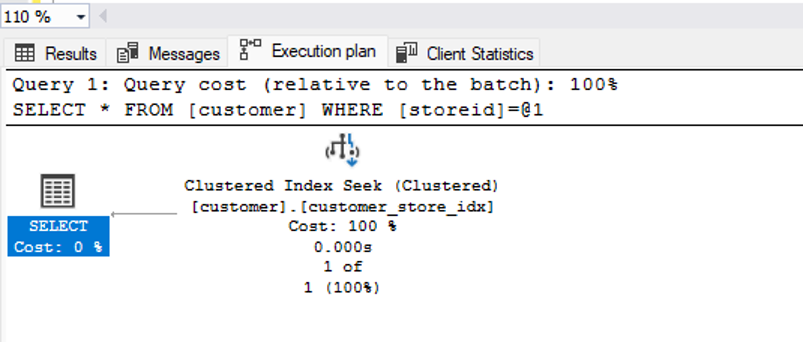

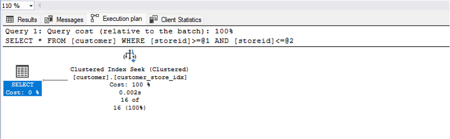


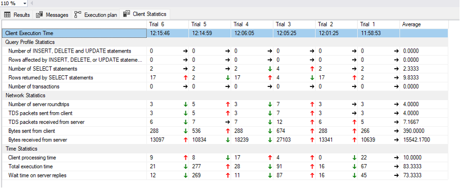


# Zadanie 4 - dodatkowe kolumny w indeksie

Celem zadania jest porównanie indeksów zawierających dodatkowe kolumny.

Skopiuj tabelę `Address` do swojej bazy danych:

```sql
select * into address from  adventureworks2017.person.address
```

W tej części będziemy analizować następujące zapytanie:

```sql
select addressline1, addressline2, city, stateprovinceid, postalcode  
from address  
where postalcode between '98000' and '99999'
```

```sql
create index address_postalcode_1  
on address (postalcode)  
include (addressline1, addressline2, city, stateprovinceid);  
go  
  
create index address_postalcode_2  
on address (postalcode, addressline1, addressline2, city, stateprovinceid);  
go
```


Czy jest widoczna różnica w planach/kosztach zapytań? 
- w sytuacji gdy nie ma indeksów
- przy wykorzystaniu indeksu:
	- address_postalcode_1
	- address_postalcode_2

Jeśli tak to jaka? 

Aby wymusić użycie indeksu użyj `WITH(INDEX(Address_PostalCode_1))` po `FROM`

```sql
select addressline1, addressline2, city, stateprovinceid, postalcode
from address  WITH(INDEX(Address_PostalCode_1))
where postalcode between '98000' and '99999'


select addressline1, addressline2, city, stateprovinceid, postalcode
from address  WITH(INDEX(Address_PostalCode_2))
where postalcode between '98000' and '99999'
```


# Wyniki: 
### Bez indeksów:

wykonywany jest Table Scan (Clustered Index Scan)
przeszukiwana jest cała tabela
najwyższy koszt I/O i czasu
brak możliwości szybkiego filtrowania po postalcode


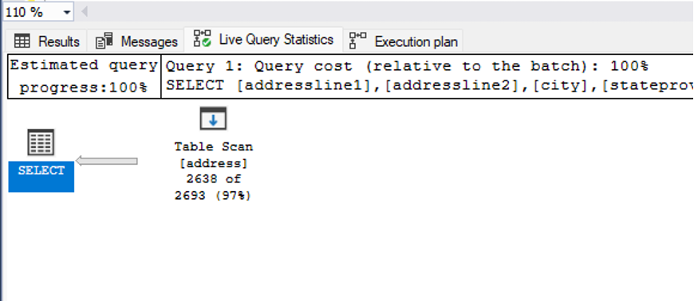


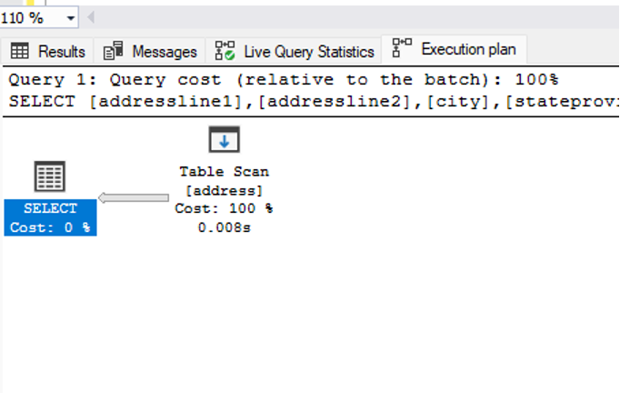


### przy wykorzystaniu  indeksu address_postalcode_1
Plan:  
- Index Seek po postalcode  
- brak Key Lookup  
- indeks jest pokrywający (covering index), wszystkie potrzebne kolumny są dostępne w indeksie

Ogólne wnioski:   
- bardzo dobra wydajność
- minimalny koszt I/O
- brak dodatkowych odwołań do tabeli

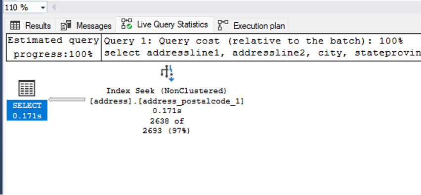

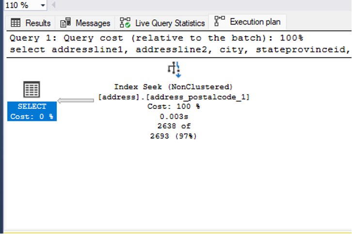


- przy wykorzystaniu  indeksu address_postalcode_2

Plan:
- również Index Seek
- brak Key Lookup
- Różnica:
indeks jest większy
więcej danych w kluczu, zatem mniej efektywna struktura drzewa B+

Ogólne wnioski:

- wydajność podobna do INCLUDE, ale struktura indeksu jest cięższa

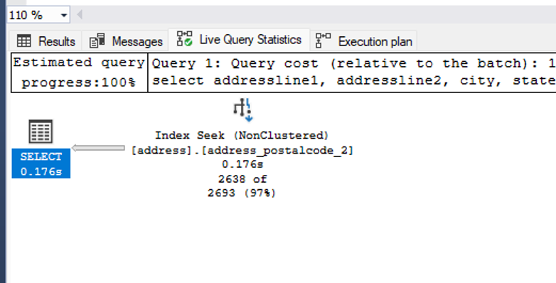

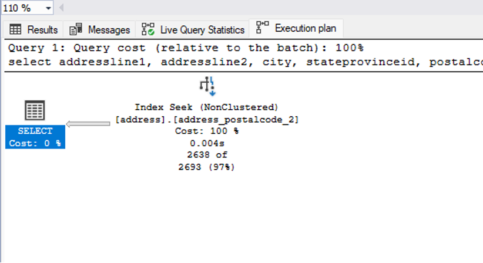


Sprawdź rozmiar Indeksów:

```sql
select i.name as indexname, sum(s.used_page_count) * 8 as indexsizekb  
from sys.dm_db_partition_stats as s  
inner join sys.indexes as i on s.object_id = i.object_id and s.index_id = i.index_id  
where i.name = 'address_postalcode_1' or i.name = 'address_postalcode_2'  
group by i.name  
go
```


### Który jest większy? Jak można skomentować te dwa podejścia do indeksowania? Które kolumny na to wpływają?

Address_postalcode_2 jest większy.
Jest to spowodowane tym, że wszystkie kolumny są częścią klucza indeksu, klucz musi być przechowywany na każdym poziomie drzewa B+, zatem większe zużycie pamięci i stron.


> Wyniki: 

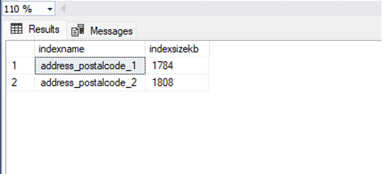


# Zadanie 5  - kolejność atrybutów


Skopiuj tabelę `Person` do swojej bazy danych:

```sql
select businessentityid  
      ,persontype  
      ,namestyle  
      ,title  
      ,firstname  
      ,middlename  
      ,lastname  
      ,suffix  
      ,emailpromotion  
      ,rowguid  
      ,modifieddate  
into person  
from adventureworks2017.person.person
```
---

Wykonaj analizę planu dla trzech zapytań:

```sql
select * from [person] where lastname = 'Agbonile'  
  
select * from [person] where lastname = 'Agbonile' and firstname = 'Osarumwense'  
  
select * from [person] where firstname = 'Osarumwense'
```

Co można o nich powiedzieć?


---
> Wyniki: 

- zapytanie 1 

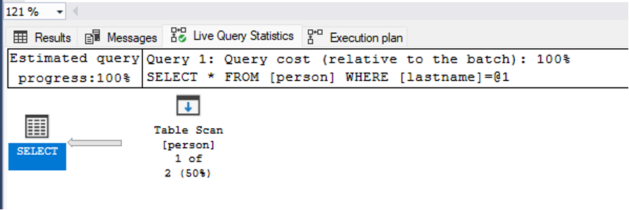

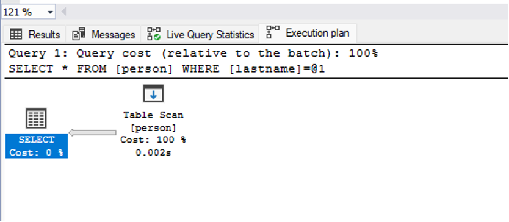

- zapytanie 2

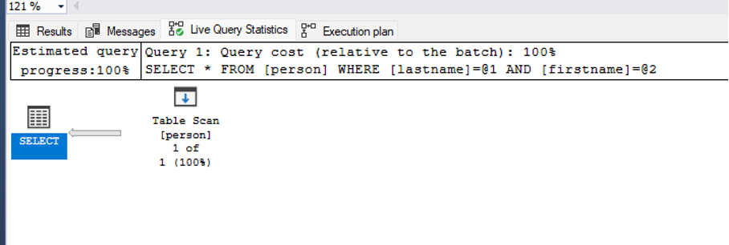

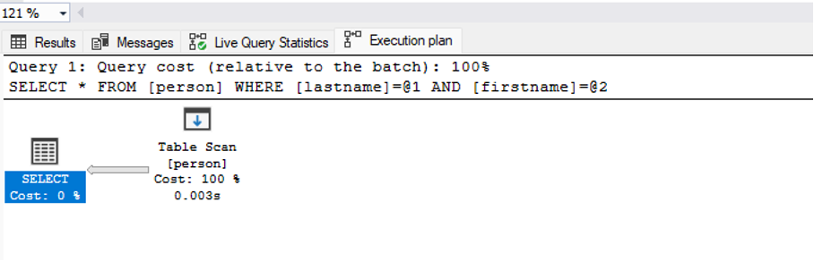

- zapytanie 3 

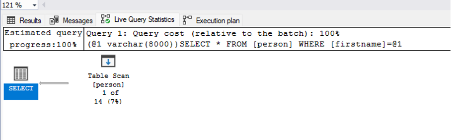

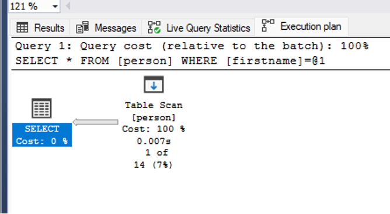


Przygotuj indeks obejmujący te zapytania:

```sql
create index person_first_last_name_idx  
on person(lastname, firstname)
```

Sprawdź plan zapytania. Co się zmieniło?


---
> Wyniki: 

- zapytanie 1 

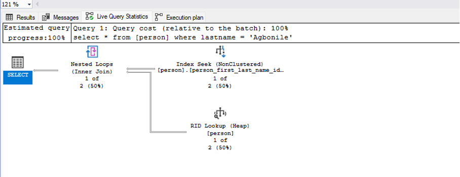

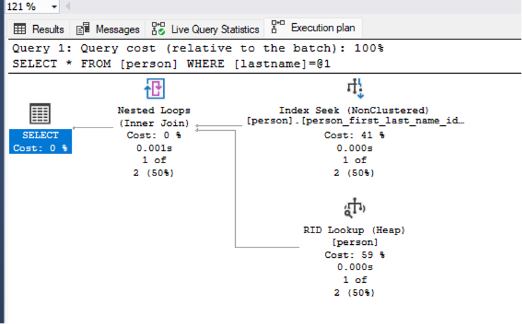

- zapytanie 2

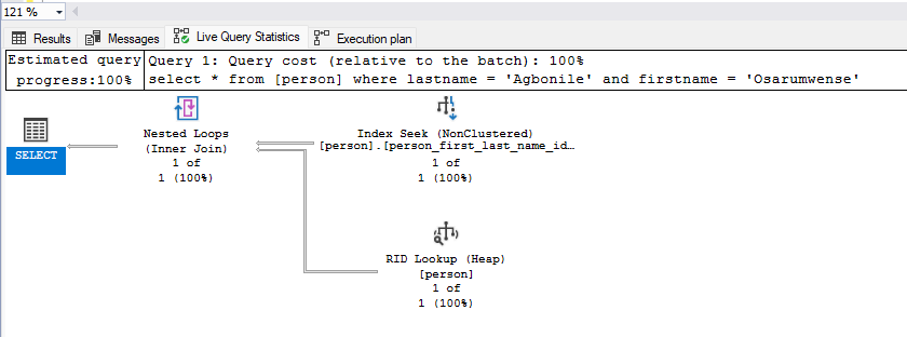

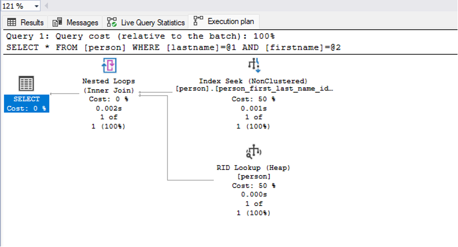

- zapytanie 3 

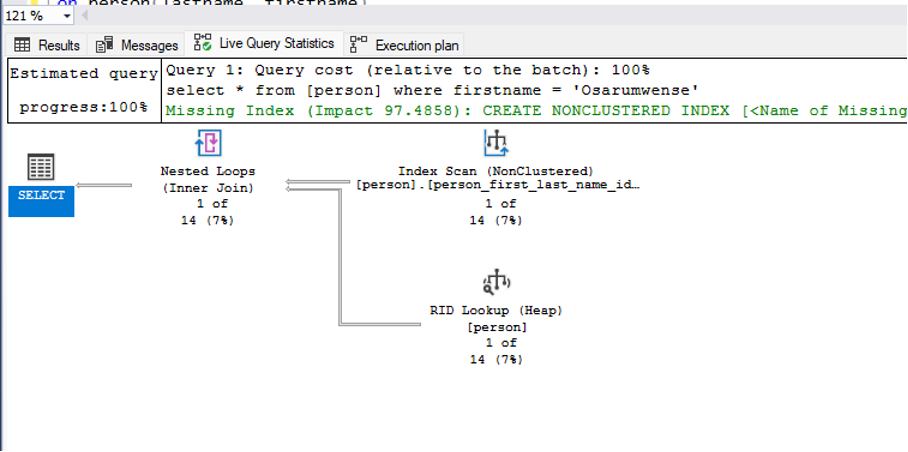

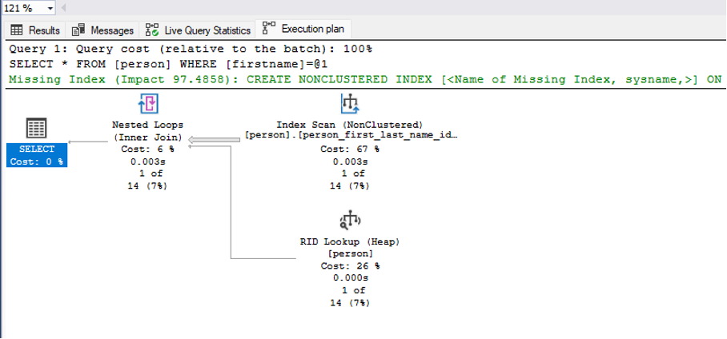


Przeprowadź ponownie analizę zapytań tym razem dla parametrów: `FirstName = ‘Angela’` `LastName = ‘Price’`. (Trzy zapytania, różna kombinacja parametrów). 

Czym różni się ten plan od zapytania o `'Osarumwense Agbonile'` . Dlaczego tak jest?


---
> Wyniki: 

Przed dodaniem indeksu:
- zapytanie 1 

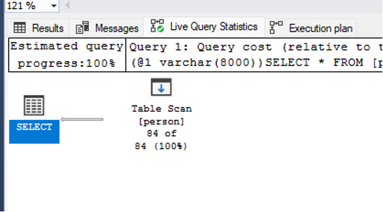

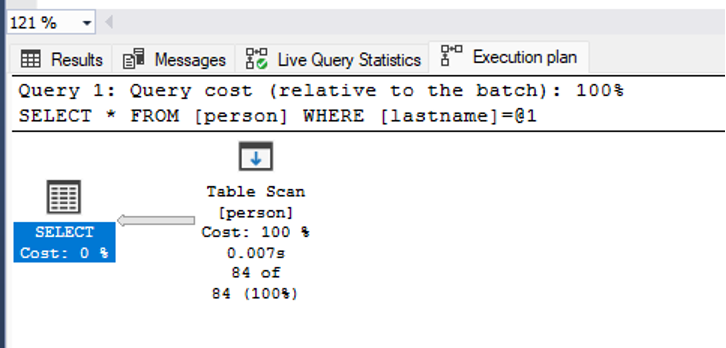

- zapytanie 2

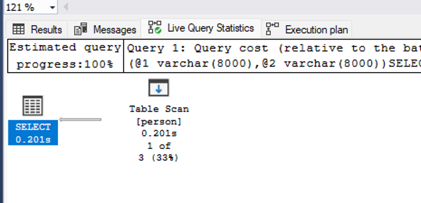

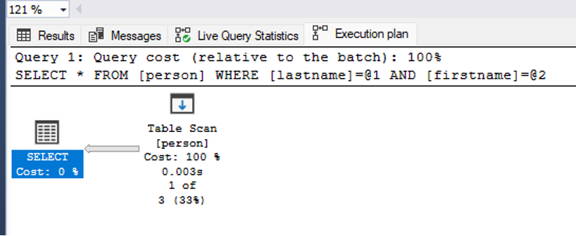

- zapytanie 3 

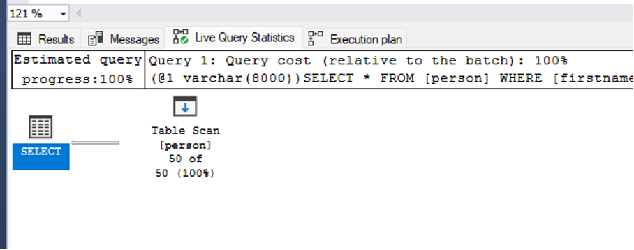

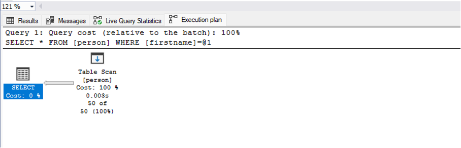


Po dodaniu indeksu:

- zapytanie 1 

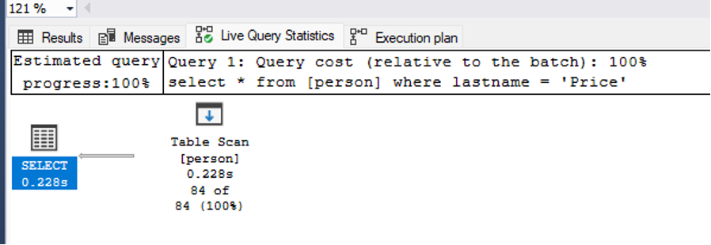

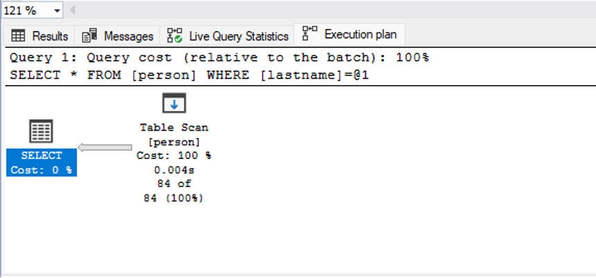

- zapytanie 2

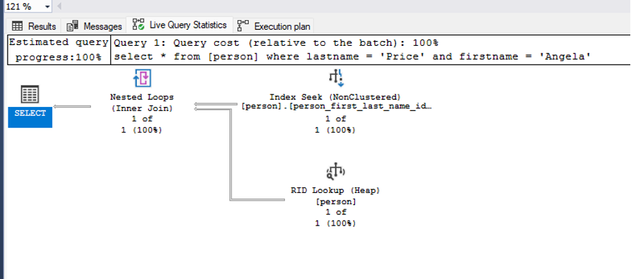

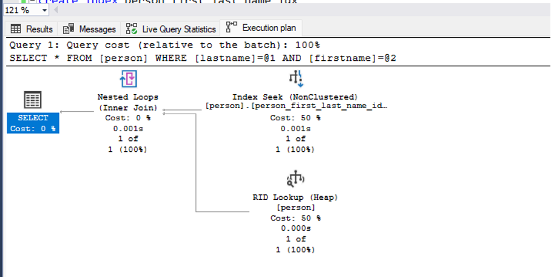

- zapytanie 3 

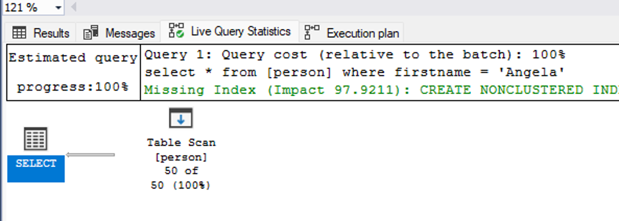

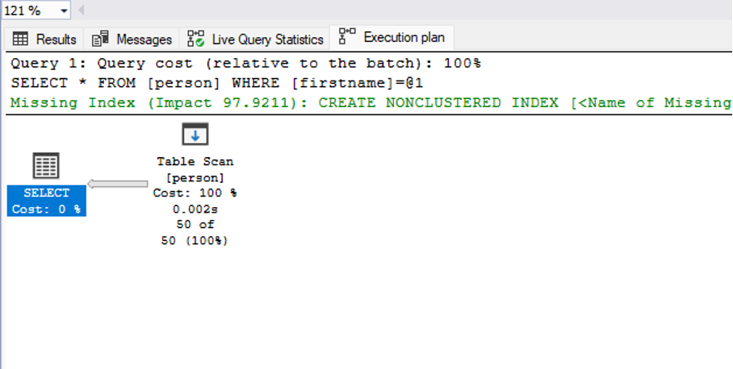


---

Punktacja:

|         |     |
| ------- | --- |
| zadanie | pkt |
| 1       | 2   |
| 2       | 2   |
| 3       | 2   |
| 4       | 2   |
| 5       | 2   |
| razem   | 10  |
|         |     |
