# Indeksy, optymalizator <br>Lab 2

<!-- <style scoped>
 p,li {
    font-size: 12pt;
  }
</style>  -->

<!-- <style scoped>
 pre {
    font-size: 8pt;
  }
</style>  -->

---

**Imię i nazwisko:** Natalia Bratek

---

Celem ćwiczenia jest zapoznanie się z planami wykonania zapytań (execution plans), oraz z budową i możliwością wykorzystaniem indeksów
(kontynuacja poprzedniego ćwiczenia)

Swoje odpowiedzi wpisuj w miejsca oznaczone jako:

---

> Wyniki:

```sql
--  ...
```

---

Ważne/wymagane są komentarze.

Zamieść kod rozwiązania oraz zrzuty ekranu pokazujące wyniki, (dołącz kod rozwiązania w formie tekstowej/źródłowej)

Zwróć uwagę na formatowanie kodu

## Oprogramowanie - co jest potrzebne?

Do wykonania ćwiczenia potrzebne jest następujące oprogramowanie

- MS SQL Server
- SSMS - SQL Server Management Studio
  - ewentualnie inne narzędzie umożliwiające komunikację z MS SQL Server i analizę planów zapytań

Oprogramowanie dostępne jest na przygotowanej maszynie wirtualnej

## Przygotowanie

Uruchom Microsoft SQL Managment Studio.

Stwórz swoją bazę danych o nazwie lab2.

```sql
create database lab2
go

use lab2
go
```

Warto przełączyć bazę w tryb simple

```sql
alter database lab2
set recovery simple;
```

<div style="page-break-after: always;"></div>

# Zadanie 1 - indeksy

Wykonaj poniższy skrypt, aby przygotować dane:

```sql
select * into product_history
from northwind3.dbo.product_history


select * into categories  
from northwind3.dbo.categories


create clustered index categ_clust_idx  
on categories(categoryid)
```

sprawdź liczbę wierszy w tabeli


```sql
select count(*) from product_history
```

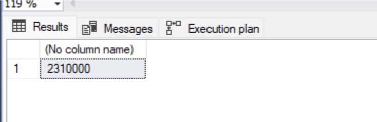

Sprawdź jakie indeksy istnieją dla tej tabeli

```sql
exec sp_helpindex 'dbo.product_history'
```

```sql
Select
    i.name as index_name,
    i.type_desc,
    i.is_unique,
    c.name as column_name,
    ic.key_ordinal,
    ic.is_included_column
from sys.indexes i
join sys.index_columns ic
    on i.object_id = ic.object_id
   and i.index_id = ic.index_id
join sys.columns c
    on ic.object_id = c.object_id
   and ic.column_id = c.column_id
where i.object_id = object_id('dbo.product_history')
order by i.name, ic.key_ordinal;
```

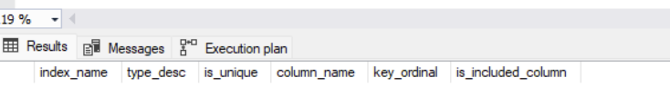

włącz statystyki IO i TIME

```sql
SET STATISTICS IO ON

SET STATISTICS TIME ON;
```

podczas analiz sprawdzaj jak zachowują się zapytania, zwróć uwagę na

- plan
- koszt
- czas (ewentualnie, jeśli coś da się zaobserwować)
- liczbę odczytywanych stron !!!!

porównaj zapytania

### a)

```sql
select count(*) from product_history
where id = 1000000
```
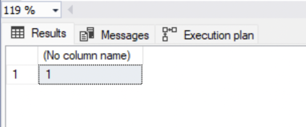
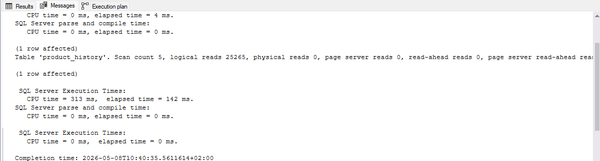

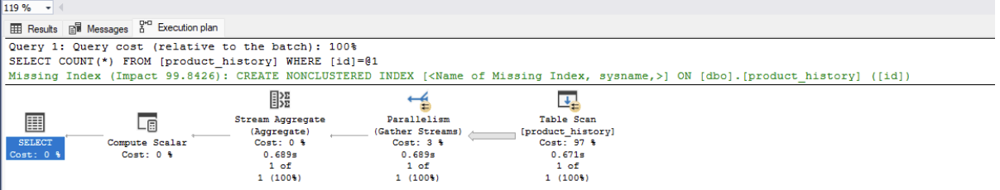

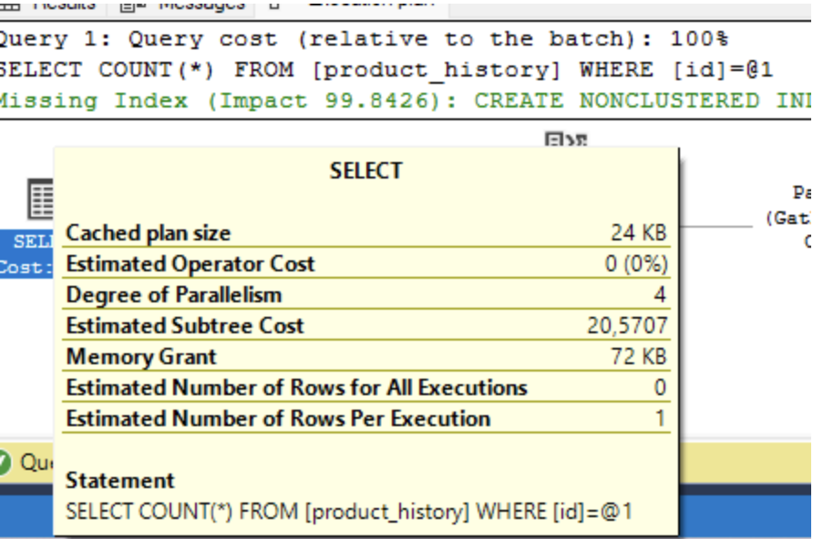

```sql
select count(*) from product_history
where id between 999000 and 10000000
```

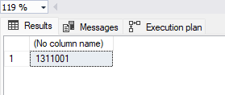
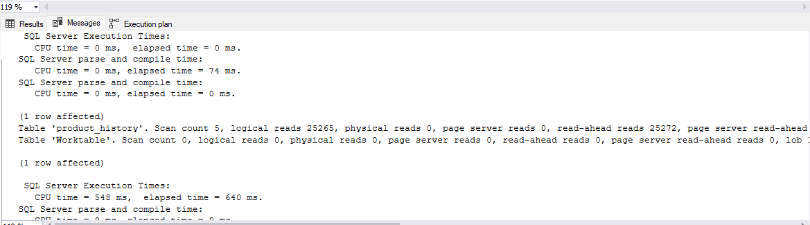


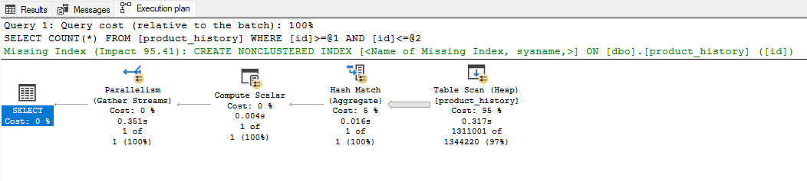

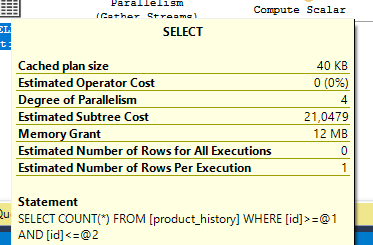


| Zapytanie | Plan / Operator | Logical reads | Estimated Cost | CPU / Elapsed |
|---|---|---:|---:|---:|
| `count(*) where id = 1000000` | Table Scan + Stream Aggregate | 25 265 | 20,57 | 313 / 142 ms |
| `count(*) where id between 999000 and 10000000` | Table Scan + Hash Match | 25 265 | 21,05 | 548 / 640 ms |

Oba zapytania wykonują pełen Table Scan i odczytują tę samą liczbę stron. Przeglądana jest cała tabela, poniewaz SQL Server nie wie gdzie znajdują się szukane wiersze. Pokazuje się Missing Index Hint (Impact 99,84%), SQL sugeruje utworzenie indeksu na kolumnie id.

### b)

```sql
select  * from product_history
where id = 1000000
```
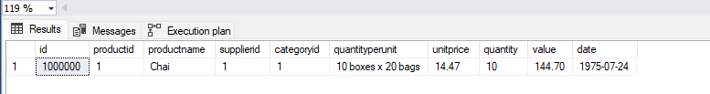
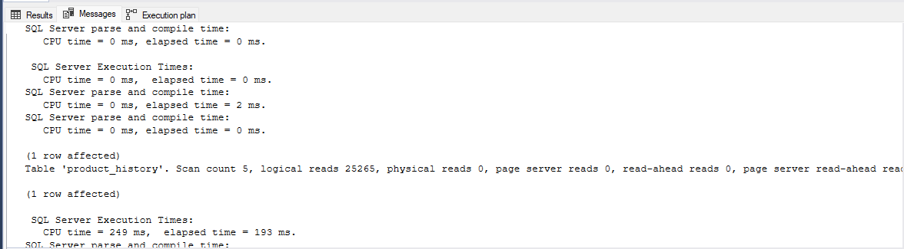


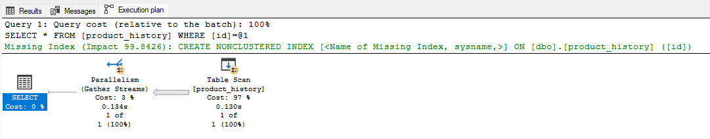

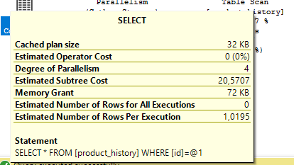

```sql
select * from product_history
where id between 999000 and 10000000
```
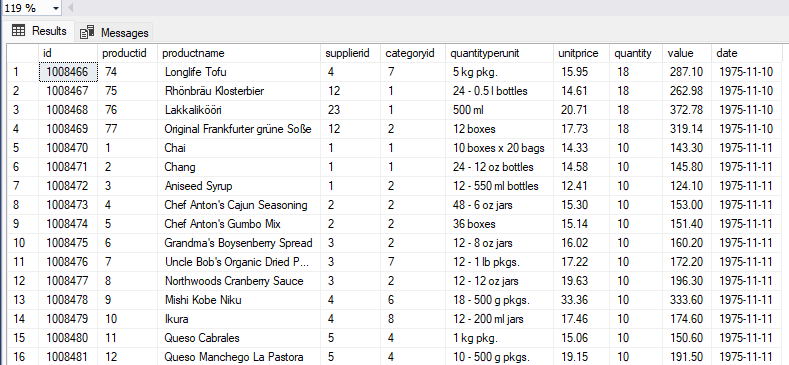
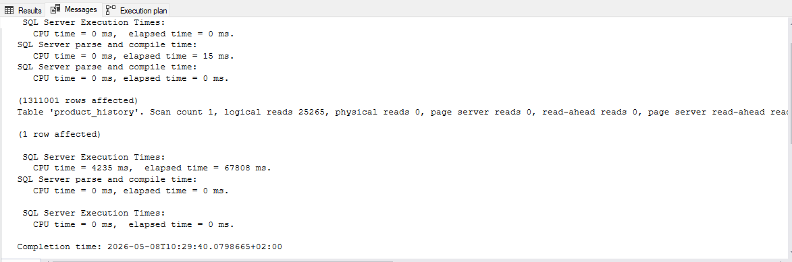


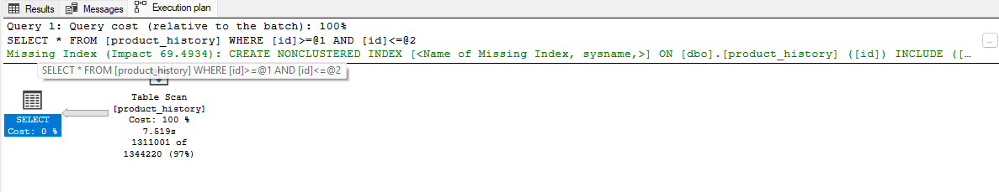

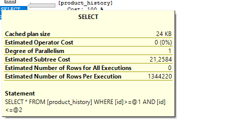


| Zapytanie | Plan | Logical reads | Estimated Cost | CPU / Elapsed |
|:---|:---|---:|---:|---:|
| `select * where id = 1000000` | Table Scan + Parallelism | 25 265 | 20,57 | 249 / 193 ms |
| `select * where id between 999000 and 10000000` | Table Scan | 25 265 | 21,26 | 4235 / 67 808 ms |


Logical reads pozostają identyczne, bo bez indeksu zawsze trzeba przeczytać całą tabelę. 
Missing Index Hint w pierwszym zapytaniu sugeruje zwykły indeks na id (Impact 99,84%), a w drugim indeks z INCLUDE wszystkich kolumn (Impact 69,49%), bo zapytanie potrzebuje wszystkich pól.
W obu zapytaniach występuje Table Scan. 
Czas wykonania znacząco się różni. Pierwsze zapytanie 193 ms, drugie 67,8 s. 

### c)

sprawdź jak zachowają się zapytania z pkt a) i b) jeśli dla kolumny `id` stworzysz indeks

- klastrowy
- nieklastrowy

```sql
create clustered index product_history_clust_idx
on product_history(id)

drop index product_history_clust_idx on product_history

create index product_history_idx
on product_history(id)

drop index product_history_idx on product_history
```
#### indeks klastrowy

pkt a)
- pierwsze zapytanie

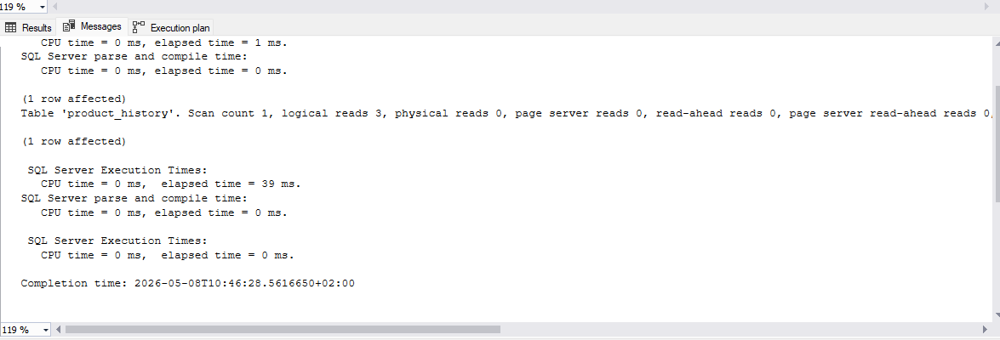


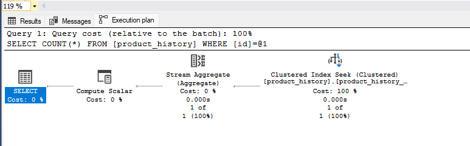

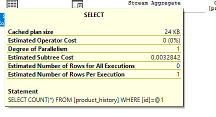


- drugie zapytanie

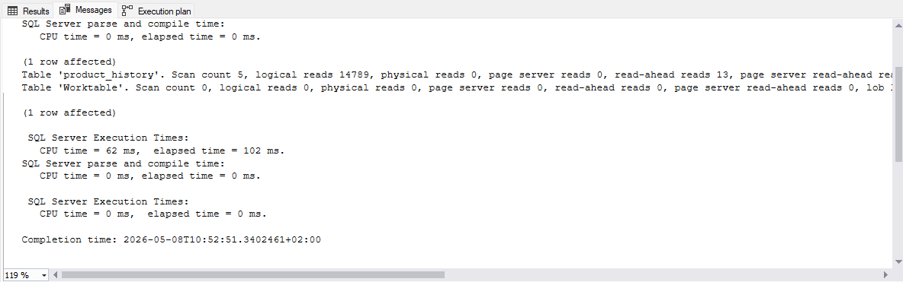


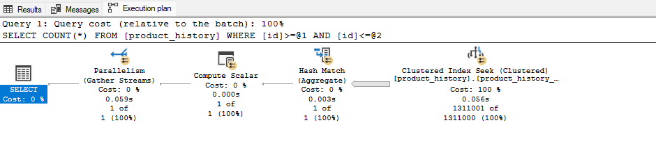

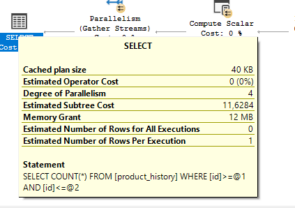

pkt b) 

- pierwsze zapytanie 

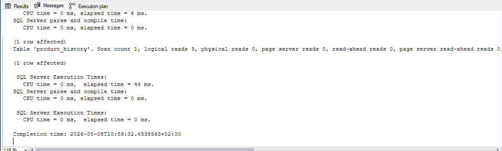


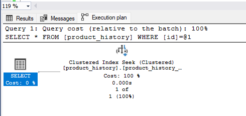
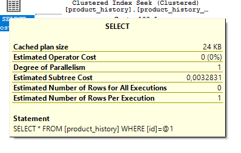


- drugie zapytanie 

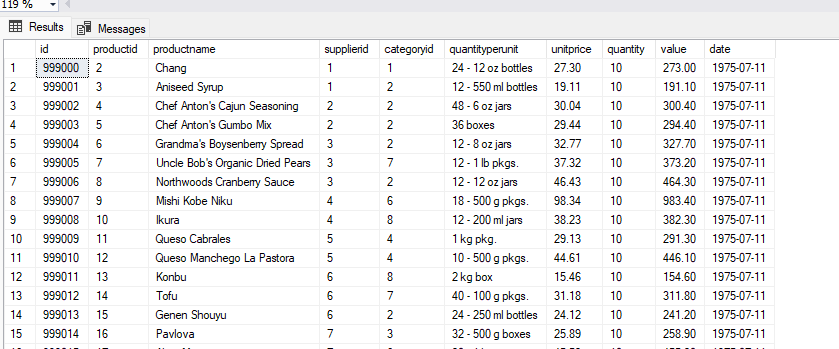

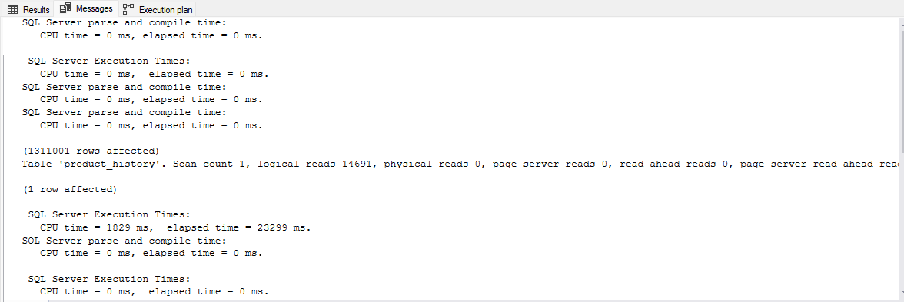

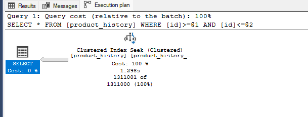
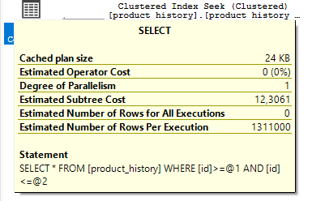


| Zapytanie | Plan | Logical reads | Estimated Cost | CPU / Elapsed |
|:---|:---|---:|---:|---:|
| a1) `count(*) where id = 1000000` | Clustered Index Seek | 3 | 0,003 | 0 / 39 ms |
| a2) `count(*) where id between 999000 and 10000000` | Clustered Index Seek + Hash Match (parallel) | 14 789 | 11,63 | 62 / 102 ms |
| b1) `select * where id = 1000000` | Clustered Index Seek | 3 | 0,003 | 0 / 0 ms |
| b2) `select * where id between 999000 and 10000000` | Clustered Index Seek (Range Scan) | 14 691 | 12,31 | 1829 / 23 299 ms |

Indeks klastrowy dla zapytań where id = 1000000 zredukował logical reads z 25 265 do 3, dla zapytań  where id between 999000 and 10000000 zredukował do 14 789 (i  14 691). 
Czas wykonania zapytań where id = 1000000 spadł niemal do zera (39 ms / 0 ms). Dla zapytań where id between 999000 and 10000000 z select * elapsed time spadł do 23,3 s, a z count(*) do 102 ms. 


#### indeks nieklastrowy 

pkt a) 

- pierwsze zapytanie 

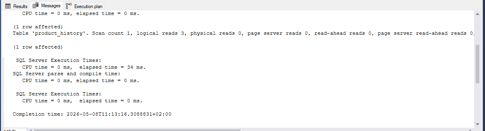

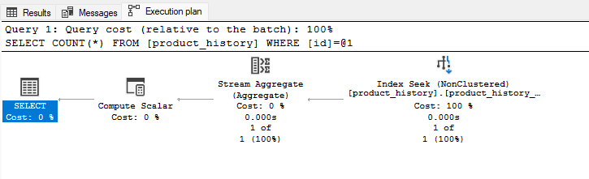
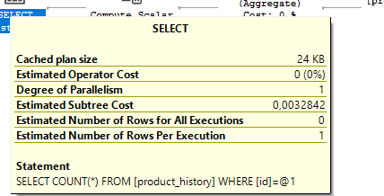

- drugie zapytanie 

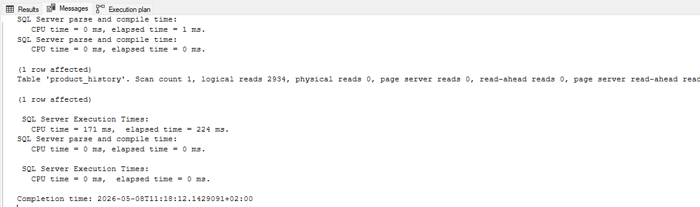


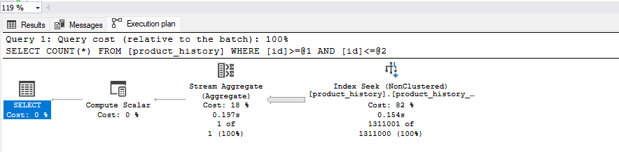
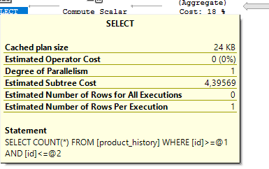


pkt b) 

- pierwsze zapytanie 

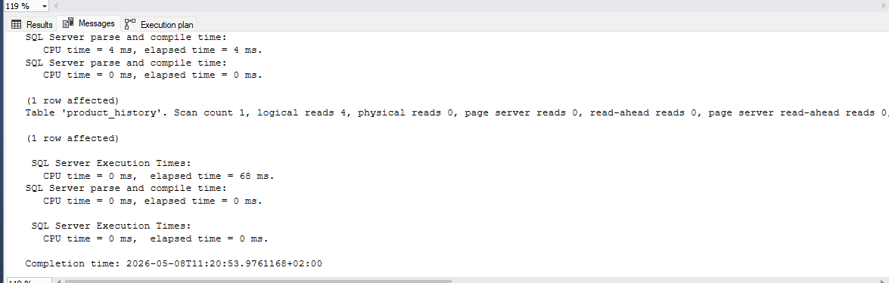


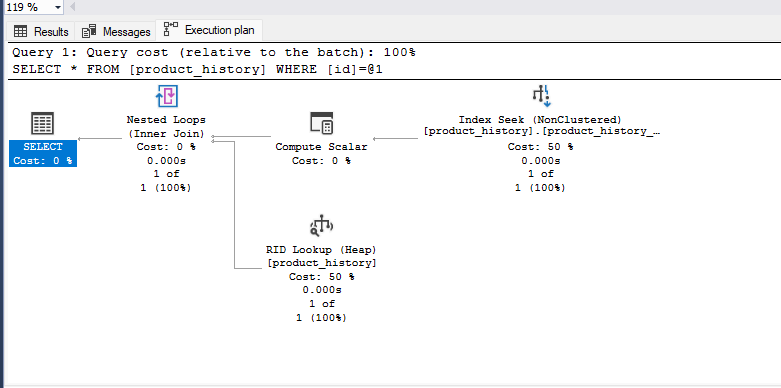
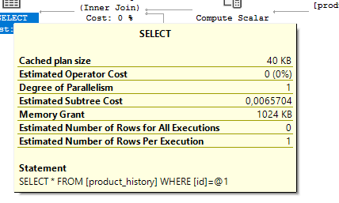

- drugie zapytanie 


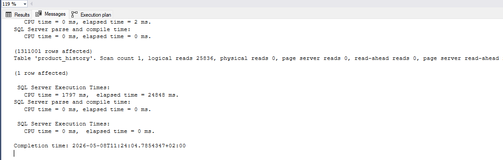


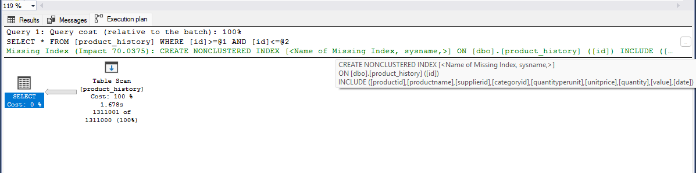
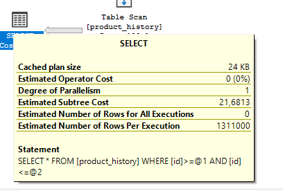


| Zapytanie | Plan | Logical reads | Estimated Cost | CPU / Elapsed |
|:---|:---|---:|---:|---:|
| a1) `count(*) where id = 1000000` | Index Seek (NonClustered) | 3 | 0,003 | 0 / 34 ms |
| a2) `count(*) where id between 999000 and 10000000` | Index Seek (NonClustered) | 2934 | 4,40 | 171 / 224 ms |
| b1) `select * where id = 1000000` | Index Seek + RID Lookup (Heap) + Nested Loops | 4 | 0,007 | 0 / 68 ms |
| b2) `select * where id between 999000 and 10000000` | Table Scan | 25 836 | - | 1797 / 24 848 ms |


Indeks nieklastrowy dla zapytań where id = 1000000 z count(*) zredukował logical reads do 3, a z select * do 4. Dla zapytań where id between 999000 and 10000000 z count(*) logical reads spadły do 2 934, ale z select * SQL Server zignorował indeks i wykonał Table Scan (25 836 logical reads).
Czas wykonania zapytań where id = 1000000 spadł niemal do zera (34 ms / 68 ms). Dla zapytań where id between 999000 and 10000000 z count(*) elapsed time wynosi 224 ms, a z select * 24,8 s.


Indeks klastrowy jest lepszy do select *, nieklastrowy do count(*). 

po zakończeniu pozostaw indeks klastrowy


### d)

indeks dla kolumny `date`

```sql
create index product_history_date_idx
on product_history(date)

drop index product_history_date_idx on product_history
```

porównaj polecenia

```sql
select id, productid, productname, date
from product_history
where date >= '2001-01-01' and date <= '2001-01-31'

select id, productid, productname, date
from product_history
where year(date) = 2001 and month(date) = 1

select id, productid, productname, date
from product_history
where date >= '2001-01-01' and date <= '2001-12-31'

select id, productid, productname, date
from product_history
where year(date) = 2001
```

podczas analiz sprawdzaj jak zachowują się zapytania, zwróć uwagę na

- plan
- indeksy i sposób ich użycia
- koszt
- czas (ewentualnie, jeśli coś da się zaobserwować)
- liczbę odczytywanych stron !!!!

spróbuj skomentować wyniki tych analiz, dlaczego tak się dzieje


#### bez indeksu dla kolumny `date`

- pierwsze zapytanie 

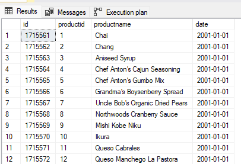
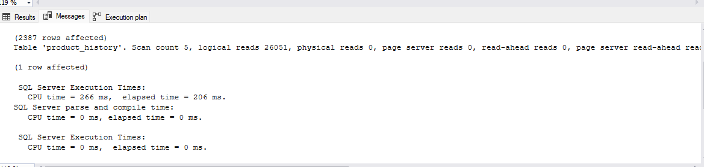

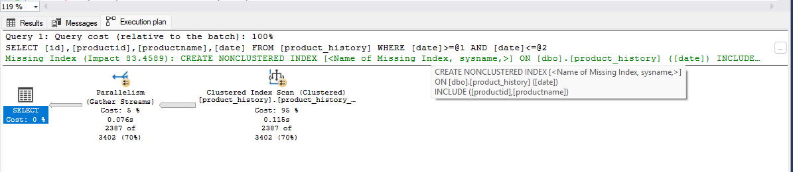
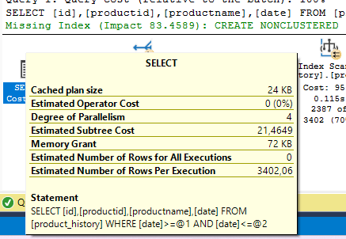


- drugie zapytanie


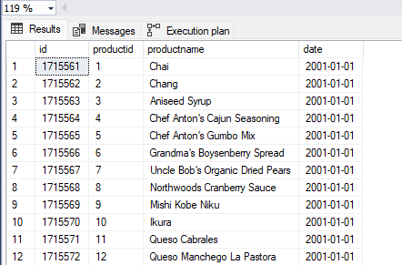
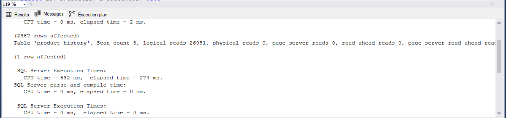
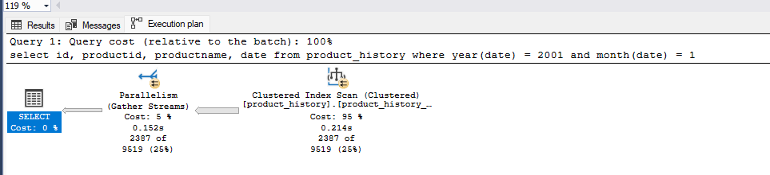


- trzecie zapytanie 


- czwarte zapytanie


| Zapytanie | Plan | Logical reads | Estimated Cost | CPU / Elapsed |
|:---|:---|---:|---:|---:|
| 1. `where date >= '2001-01-01' and date <= '2001-01-31'` | Clustered Index Scan + Parallelism | 26 051 | 21,46 | 266 / 206 ms |
| 2. `where year(date) = 2001 and month(date) = 1` | Clustered Index Scan + Parallelism | 26 051 | 21,60 | 532 / 274 ms |
| 3. `where date >= '2001-01-01' and date <= '2001-12-31'` | Clustered Index Scan + Parallelism | 26 051 | 21,46 | 298 / 445 ms |
| 4. `where year(date) = 2001` | Clustered Index Scan + Parallelism | 26 051 | 21,59 | 548 / 520 ms |


#### z indeksem dla kolumny `date`

- pierwsze zapytanie 


- drugie zapytanie 


- trzecie zapytanie  


- czwarte zapytanie


| Zapytanie | Plan  | Logical reads | Estimated Cost | CPU / Elapsed |
|:---|:---|---:|---:|---:|
| 1. `where date >= '2001-01-01' and date <= '2001-01-31'` | Index Seek + Key Lookup (Nested Loops) | 7 327 | 7,52 | 0 / 109 ms |
| 2. `where year(date) = 2001 and month(date) = 1` | Clustered Index Scan + Parallelism | 26 051 | 21,59 | 625 / 260 ms |
| 3. `where date >= '2001-01-01' and date <= '2001-12-31'` | Clustered Index Scan + Parallelism | 26 051 | 21,53 | 251 / 452 ms |
| 4. `where year(date) = 2001` | Clustered Index Scan + Parallelism | 26 051 | 21,19 | 546 / 590 ms |


Indeks na date pomógł tylko zapytaniu nr 1, SQL Server wykonał Index Seek + Key Lookup i zredukował logical reads z 26 051 do 7 327. Pozostałe trzy zapytania zignorowały indeks, czas wykonania jest porównywalny do wersji bez indeksu. Pokazuje się Missing Index, który sugeruje indeks z INCLUDE (productid, productname) w zapytaniu 3 z indeksem date. 


### e)

powtórz eksperymenty z pkt d) , ale tym razem użyj indeksu zawierającego dodatkowe kolumny

```sql
create index product_history_date_incl_idx
on product_history(date) include(productid, productname)

drop index product_history_date_incl_idx on product_history

```

co się zmieniło?


- pierwsze zapytanie


- drugie zapytanie


- trzecie zapytanie


- czwwarte zapytanie 


| Zapytanie | Plan | Logical reads | Estimated Cost | CPU / Elapsed |
|:---|:---|---:|---:|---:|
| 1. `where date >= '2001-01-01' and date <= '2001-01-31'` | Index Seek (NonClustered) | 16 | 0,014 | 32 / 103 ms |
| 2. `where year(date) = 2001 and month(date) = 1` | Index Scan (NonClustered) + Parallelism | 11 391 | 10,79 | 531 / 245 ms |
| 3. `where date >= '2001-01-01' and date <= '2001-12-31'` | Index Seek (NonClustered) | 142 | 0,014 | 31 / 352 ms |
| 4. `where year(date) = 2001` | Index Scan (NonClustered) + Parallelism | 11 391 | 10,38 | 484 / 531 ms |


Indeks z INCLUDE (productid, productname) pomógł zapytaniom nr 1 i 3, jest Index Seek i logical reads zredukował się do 16 i 142. Zapytania nr 2 i 4 wykonują Index Scan, logical reads spadły do 11 391 z 26 051.
Czas wykonania jest porównywalny do wersji z indeksem 'date'. 


### f)

indeks dla kolumny `categoryid`

```sql
create index product_history_cat_idx
on product_history(categoryid)

drop index product_history_cat_idx on product_history
```

przeanalizuj polecenia

```sql
select id, productid, productname, date 
from product_history p
where categoryid = 8


select id, productid, productname, date, categoryname
from product_history p join categories c on p.categoryid = c.categoryid
where p.categoryid = 8
```

- pierwsze zapytanie


- drugie zapytanie


| Zapytanie | Plan | Logical reads | Estimated Cost | CPU / Elapsed |
|:---|:---|---:|---:|---:|
| 1. `where categoryid = 8` | Clustered Index Scan + Parallelism | 25 987 | 21,98 | 954 / 7 771 ms |
| 2. `JOIN where p.categoryid = 8` | Nested Loops + Clustered Index Scan + Clustered Index Seek (categories) | 25 881 + 2 (categories) | 24,30 | 812 / 9 509 ms |

W obu zapytaniach jest Clustered Index Scan. 
Logical reads są bardzo podobne (25 987 i 25 881), bo oba zapytania skanują tabelę product_history.
Czas wykonania jest długi w obu (7 771 ms i 9 509 ms). 
Pokazuje się Missing Index, który sugeruje indeks z INCLUDE (id, productid, productname, date) na kolumnie categoryid. 


### dodatkowo

możesz sprawdzić strukturę indeksu

np.

```sql
exec sp_helpindex 'dbo.product_history';

select
    i.name as index_name,
    ips.index_depth,
    ips.index_level,
    ips.page_count
from sys.indexes i
cross apply sys.dm_db_index_physical_stats(
    db_id(),
    i.object_id,
    i.index_id,
    null,    'detailed'
) ips
where i.object_id = object_id('dbo.product_history')
  and i.name = 'product_history_date_idx';
```


Indeks product_history_date_idx ma strukturę B-drzewa o głębokości 3 poziomów:
- poziom 0 (liście): 3716 stron 
- poziom 1: 12 stron 
- poziom 2 (root): 1 strona


jeśli chcesz zaobserwować odczyty logiczne/fizyczne możesz zwolnić pulę buforów przed wykonaniem polecenia

```sql
CHECKPOINT;
DBCC DROPCLEANBUFFERS;
```

i teraz porównaj liczby czytanych stron np. wykonując dwukrotnie polecenie

```sql
select * from product_history
```


| Wykonanie | logical reads | physical reads | read-ahead reads | CPU / Elapsed |
|:---|---:|---:|---:|---:|
| 1.  | 25 881 | 1 | 25 892 | 2 593 / 36 717 ms |
| 2.  | 25 881 | 0 | 0 | 3 891 / 45 285 ms |


Pierwsze wykonanie pokazuje physical reads = 1 i read-ahead reads = 25 892. Drugie wykonanie ma physical reads = 0 i read-ahead reads = 0. Logical reads są identyczne (25 881) niezależnie od tego, czy strony są w pamięci. 


# Zadanie 2

Celem zadania jest poznanie indeksów typu column store

Utwórz tabelę testową:

```sql
create table saleshistory(
 id int identity(1,1) not null primary key,
 salesorderid int not null,
 salesorderdetailid int not null,
 carriertrackingnumber nvarchar(25) null,
 orderqty smallint not null,
 productid int not null,
 specialofferid int not null,
 unitprice money not null,
 unitpricediscount money not null,
 linetotal numeric(38, 6) not null,
 rowguid uniqueidentifier not null,
 modifieddate datetime not null
 )
```

Sprawdź jakie indeksy istnieją dla tej tabeli

```sql
exec sp_helpindex 'dbo.saleshistory'
```


```sql
Select
    i.name as index_name,
    i.type_desc,
    i.is_unique,
    c.name as column_name,
    ic.key_ordinal,
    ic.is_included_column
from sys.indexes i
join sys.index_columns ic
    on i.object_id = ic.object_id
   and i.index_id = ic.index_id
join sys.columns c
    on ic.object_id = c.object_id
   and ic.column_id = c.column_id
where i.object_id = object_id('dbo.saleshistory')
order by i.name, ic.key_ordinal;
```


Wypełnij tablicę danymi:

```sql
-- w ssms

insert into saleshistory
 select sh.*
 from adventureworks2017.sales.salesorderdetail sh
go 100
```

(UWAGA `GO 100` oznacza 100 krotne wykonanie polecenia. Jeżeli podejrzewasz, że twój serwer może to zbyt przeciążyć, zacznij od GO 10, GO 20, GO 50

albo

```sql
declare @i int = 1;

while @i <= 100
begin
    insert into saleshistory
    select *
    from adventureworks2017.sales.salesorderdetail;

    set @i += 1;
end;
```

sprawdź liczbę wierszy w tabeli

```sql
select count(*) from saleshistory
```


włącz statystyki IO i TIME

```sql
SET STATISTICS IO ON

SET STATISTICS TIME ON;
```

Sprawdź jak zachowa się zapytanie

- sprawdź plan
- koszt
- czas
- liczbę odczytywanych stron

```sql
select productid, sum(unitprice), avg(unitprice), sum(orderqty), avg(orderqty)
from saleshistory
group by productid
order by productid
```


Załóż indeks typu column store:

```sql
create nonclustered columnstore index saleshistory_columnstore
 on saleshistory(unitprice, orderqty, productid)
```


Sprawdź różnicę pomiędzy przetwarzaniem w zależności od indeksów. Porównaj plany i opisz różnicę.
Co to są indeksy colums store? Jak działają? (poszukaj materiałów w internecie/literaturze)


| Wykonanie | Plan | Logical reads | LOB logical reads | Estimated Cost | CPU / Elapsed |
|:---|:---|---:|---:|---:|---:|
| Bez columnstore | Clustered Index Scan + Hash Match (Aggregate) + Sort + Parallelism | 158 276 | 0 | 124,71 | 2 437 / 827 ms |
| Z columnstore | Columnstore Index Scan + Hash Match + Sort + Parallelism | 0 | 11 457 | 3,63 | 78 / 199 ms |

Logical reads dla zapytania z columnstore spadły z 158 276 do 0, ale pojawiło się 11 457 LOB logical reads.
Estimated Cost spadł z 124,71 do 3,63, a elapsed time z 827 ms do 199 ms.
W zapytaniu bez columnstore jest Clustered Index Scan, a z columnstore występuje Columnstore Index Scan.
W zapytaniu bez columnstore jest  Clustered Index Scan, a z  columnstore występuje Columnstore Index Scan. 

https://learn.microsoft.com/en-us/sql/relational-databases/indexes/columnstore-indexes-overview?view=sql-server-ver17


Indeks columnstore to technologia służąca do przechowywania, pobierania i zarządzania danymi przy użyciu kolumnowego formatu danych, zwanego columnstore.


Jak działają:

1. Rowgroup - grupa wierszy kompresowanych razem do formatu columnstore, zwykle zawierająca maksymalną liczbę 1 048 576 wierszy. Indeks columnstore dzieli tabelę na rowgroups, a następnie kompresuje każdą z nich kolumnowo. 

2. Column segment - kolumna danych w obrębie rowgroup. Każda rowgroup zawiera jeden segment kolumny dla każdej kolumny w tabeli, a każdy segment jest kompresowany razem i przechowywany na nośniku fizycznym. Każdy segment ma metadane pozwalające na szybką eliminację segmentów bez ich odczytywania. 

3. Deltastore - aby zmniejszyć fragmentację segmentów kolumn i poprawić wydajność, indeks columnstore może tymczasowo przechowywać niektóre dane w klastrowanym indeksie zwanym deltastore oraz w liście B-tree identyfikatorów usuniętych wierszy. 

4. Tuple-mover - proces w tle, który sprawdza zamknięte rowgroups - jeśli znajdzie taką grupę, kompresuje ją i zapisuje w columnstore jako rowgroup w stanie COMPRESSED. 

5. Batch mode execution - metoda przetwarzania zapytań przetwarzająca wiele wierszy razem. Jest ściśle zintegrowana z formatem columnstore i zoptymalizowana wokół niego. Zapytania na indeksach columnstore używają trybu batch, co zwykle poprawia wydajność 2-4 razy. 


Kiedy używać:
- Klastrowane indeksy columnstore do przechowywania tabel faktów i dużych tabel wymiarów w hurtowniach danych. Poprawia wydajność zapytań i kompresję danych do 10 razy. 
- Nieklastrowane indeksy columnstore do analizy w czasie rzeczywistym na obciążeniu OLTP. 

Powody, dla których indeksy columnstore są tak szybkie:

- Kolumny przechowują wartości z tej samej dziedziny i często mają podobne wartości, więc jest wysoki współczynnik kompresji. Wąskie gardła I/O w systemie są minimalizowane lub eliminowane, a zużycie pamięci jest znacząco zmniejszone.
- Wysokie współczynniki kompresji poprawiają wydajność zapytań poprzez mniejszy ślad pamięciowy. W rezultacie wydajność zapytań może się poprawić, ponieważ SQL Server może wykonywać więcej operacji na zapytaniach i danych w pamięci.
- Wykonywanie wsadowe (batch execution) poprawia wydajność zapytań zazwyczaj 2-4 krotnie, przetwarza wiele wierszy jednocześnie.
- Zapytania często wybierają tylko kilka kolumn z tabeli, co redukuje całkowite I/O z nośnika fizycznego.

UWAGA: ciekawsze efekty możesz zaobserwować dla jeszcze większych tabel (jeśli twój komp na to pozwala możesz zwiększyć wolumen generowanych danych)

# Zadanie 3 – własne eksperymenty

Należy zaprojektować/zaimplementować tabelę w bazie danych, lub wybrać dowolny schemat/bazę/tabelę (poza używanymi na zajęciach), a następnie wypełnić ją danymi w taki sposób, przetestować/przeanalizować działanie indeksów różnego typu. Warto wygenerować sobie tabele o większym rozmiarze.

Możesz też powtórzyć np. eksperymenty wykonywane w zadaniu 1, ale tym razem dla innego serwera,

Wedle uznania i zainteresowań, ważne żeby poeksplorować tematykę i spróbować

Do analizy, proszę uwzględnić następujące rodzaje indeksów:

- Klastrowane (np.  dla atrybutu nie będącego kluczem głównym)
- Nieklastrowane
- Indeksy wykorzystujące kilka atrybutów, indeksy include
- Filtered Index (Indeks warunkowy)
- Kolumnowe

## Analiza

Proszę przygotować zestaw zapytań do danych, które:

- wykorzystują poszczególne indeksy
- które przy wymuszeniu indeksu działają gorzej, niż bez niego (lub pomimo założonego indeksu, tabela jest w pełni skanowana)
  Odpowiedź powinna zawierać:
- Schemat tabeli
- Opis danych (ich rozmiar, zawartość, statystyki)
- Opis indeksu
- Przygotowane zapytania, wraz z wynikami z planów (zrzuty ekranow)
- Inf o kosztach, czytanych stornach
- Komentarze do zapytań, ich wyników
- ew. sprawdzenie, co proponuje Database Engine Tuning Advisor (porównanie czy udało się Państwu znaleźć odpowiednie indeksy do zapytania)

> Wyniki:

```sql
--  ...
```

|         |                                                                          |     |
| ------- | ------------------------------------------------------------------------ | --- |
| zadanie | pkt                                                                      |     |
| 1       | 6                                                                        |     |
| 2       | 2                                                                        |     |
| 3       | 5 (3 pkt. za eksperymenty + 2 dodatkowe za ciekawe/oryginalne przyklady) |     |
| razem   | 13                                                                       |     |
