# Indeksy, optymalizator <br>Lab 2

<!-- <style scoped>
 p,li {
    font-size: 12pt;
  }
</style>  -->

<!-- <style scoped>
 pre {
    font-size: 8pt;
  }
</style>  -->

---

**Imiona i nazwiska:** Natalia Bratek i Jakub Karczewski

---

Celem ćwiczenia jest zapoznanie się z planami wykonania zapytań (execution plans), oraz z budową i możliwością wykorzystaniem indeksów
(kontynuacja poprzedniego ćwiczenia)

Swoje odpowiedzi wpisuj w miejsca oznaczone jako:

---

> Wyniki:

```sql
--  ...
```

---

Ważne/wymagane są komentarze.

Zamieść kod rozwiązania oraz zrzuty ekranu pokazujące wyniki, (dołącz kod rozwiązania w formie tekstowej/źródłowej)

Zwróć uwagę na formatowanie kodu

## Oprogramowanie - co jest potrzebne?

Do wykonania ćwiczenia potrzebne jest następujące oprogramowanie

- MS SQL Server
- SSMS - SQL Server Management Studio
  - ewentualnie inne narzędzie umożliwiające komunikację z MS SQL Server i analizę planów zapytań

Oprogramowanie dostępne jest na przygotowanej maszynie wirtualnej

## Przygotowanie

Uruchom Microsoft SQL Managment Studio.

Stwórz swoją bazę danych o nazwie lab2.

```sql
create database lab2
go

use lab2
go
```

Warto przełączyć bazę w tryb simple

```sql
alter database lab2
set recovery simple;
```

<div style="page-break-after: always;"></div>

# Zadanie 1 - indeksy

Wykonaj poniższy skrypt, aby przygotować dane:

```sql
select * into product_history
from northwind3.dbo.product_history


select * into categories  
from northwind3.dbo.categories


create clustered index categ_clust_idx  
on categories(categoryid)
```

sprawdź liczbę wierszy w tabeli


```sql
select count(*) from product_history
```


Sprawdź jakie indeksy istnieją dla tej tabeli

```sql
exec sp_helpindex 'dbo.product_history'
```

```sql
Select
    i.name as index_name,
    i.type_desc,
    i.is_unique,
    c.name as column_name,
    ic.key_ordinal,
    ic.is_included_column
from sys.indexes i
join sys.index_columns ic
    on i.object_id = ic.object_id
   and i.index_id = ic.index_id
join sys.columns c
    on ic.object_id = c.object_id
   and ic.column_id = c.column_id
where i.object_id = object_id('dbo.product_history')
order by i.name, ic.key_ordinal;
```


włącz statystyki IO i TIME

```sql
SET STATISTICS IO ON

SET STATISTICS TIME ON;
```

podczas analiz sprawdzaj jak zachowują się zapytania, zwróć uwagę na

- plan
- koszt
- czas (ewentualnie, jeśli coś da się zaobserwować)
- liczbę odczytywanych stron !!!!

porównaj zapytania

### a)

```sql
select count(*) from product_history
where id = 1000000
```


```sql
select count(*) from product_history
where id between 999000 and 10000000
```


| Zapytanie | Plan / Operator | Logical reads | Estimated Cost | CPU / Elapsed |
|---|---|---:|---:|---:|
| `count(*) where id = 1000000` | Table Scan + Stream Aggregate | 25 265 | 20,57 | 313 / 142 ms |
| `count(*) where id between 999000 and 10000000` | Table Scan + Hash Match | 25 265 | 21,05 | 548 / 640 ms |

Oba zapytania wykonują pełen Table Scan i odczytują tę samą liczbę stron. Przeglądana jest cała tabela, poniewaz SQL Server nie wie gdzie znajdują się szukane wiersze. Pokazuje się Missing Index Hint (Impact 99,84%), SQL sugeruje utworzenie indeksu na kolumnie id.

### b)

```sql
select  * from product_history
where id = 1000000
```


```sql
select * from product_history
where id between 999000 and 10000000
```


| Zapytanie | Plan | Logical reads | Estimated Cost | CPU / Elapsed |
|:---|:---|---:|---:|---:|
| `select * where id = 1000000` | Table Scan + Parallelism | 25 265 | 20,57 | 249 / 193 ms |
| `select * where id between 999000 and 10000000` | Table Scan | 25 265 | 21,26 | 4235 / 67 808 ms |


Logical reads pozostają identyczne, bo bez indeksu zawsze trzeba przeczytać całą tabelę. 
Missing Index Hint w pierwszym zapytaniu sugeruje zwykły indeks na id (Impact 99,84%), a w drugim indeks z INCLUDE wszystkich kolumn (Impact 69,49%), bo zapytanie potrzebuje wszystkich pól.
W obu zapytaniach występuje Table Scan. 
Czas wykonania znacząco się różni. Pierwsze zapytanie 193 ms, drugie 67,8 s. 

### c)

sprawdź jak zachowają się zapytania z pkt a) i b) jeśli dla kolumny `id` stworzysz indeks

- klastrowy
- nieklastrowy

```sql
create clustered index product_history_clust_idx
on product_history(id)

drop index product_history_clust_idx on product_history

create index product_history_idx
on product_history(id)

drop index product_history_idx on product_history
```
#### indeks klastrowy

pkt a)
- pierwsze zapytanie


- drugie zapytanie


pkt b) 

- pierwsze zapytanie 


- drugie zapytanie 


| Zapytanie | Plan | Logical reads | Estimated Cost | CPU / Elapsed |
|:---|:---|---:|---:|---:|
| a1) `count(*) where id = 1000000` | Clustered Index Seek | 3 | 0,003 | 0 / 39 ms |
| a2) `count(*) where id between 999000 and 10000000` | Clustered Index Seek + Hash Match (parallel) | 14 789 | 11,63 | 62 / 102 ms |
| b1) `select * where id = 1000000` | Clustered Index Seek | 3 | 0,003 | 0 / 0 ms |
| b2) `select * where id between 999000 and 10000000` | Clustered Index Seek (Range Scan) | 14 691 | 12,31 | 1829 / 23 299 ms |

Indeks klastrowy dla zapytań where id = 1000000 zredukował logical reads z 25 265 do 3, dla zapytań  where id between 999000 and 10000000 zredukował do 14 789 (i  14 691). 
Czas wykonania zapytań where id = 1000000 spadł niemal do zera (39 ms / 0 ms). Dla zapytań where id between 999000 and 10000000 z select * elapsed time spadł do 23,3 s, a z count(*) do 102 ms. 


#### indeks nieklastrowy 

pkt a) 

- pierwsze zapytanie 


- drugie zapytanie 


pkt b) 

- pierwsze zapytanie 


- drugie zapytanie 


| Zapytanie | Plan | Logical reads | Estimated Cost | CPU / Elapsed |
|:---|:---|---:|---:|---:|
| a1) `count(*) where id = 1000000` | Index Seek (NonClustered) | 3 | 0,003 | 0 / 34 ms |
| a2) `count(*) where id between 999000 and 10000000` | Index Seek (NonClustered) | 2934 | 4,40 | 171 / 224 ms |
| b1) `select * where id = 1000000` | Index Seek + RID Lookup (Heap) + Nested Loops | 4 | 0,007 | 0 / 68 ms |
| b2) `select * where id between 999000 and 10000000` | Table Scan | 25 836 | - | 1797 / 24 848 ms |


Indeks nieklastrowy dla zapytań where id = 1000000 z count(*) zredukował logical reads do 3, a z select * do 4. Dla zapytań where id between 999000 and 10000000 z count(*) logical reads spadły do 2 934, ale z select * SQL Server zignorował indeks i wykonał Table Scan (25 836 logical reads).
Czas wykonania zapytań where id = 1000000 spadł niemal do zera (34 ms / 68 ms). Dla zapytań where id between 999000 and 10000000 z count(*) elapsed time wynosi 224 ms, a z select * 24,8 s.


Indeks klastrowy jest lepszy do select *, nieklastrowy do count(*). 

po zakończeniu pozostaw indeks klastrowy


### d)

indeks dla kolumny `date`

```sql
create index product_history_date_idx
on product_history(date)

drop index product_history_date_idx on product_history
```

porównaj polecenia

```sql
select id, productid, productname, date
from product_history
where date >= '2001-01-01' and date <= '2001-01-31'

select id, productid, productname, date
from product_history
where year(date) = 2001 and month(date) = 1

select id, productid, productname, date
from product_history
where date >= '2001-01-01' and date <= '2001-12-31'

select id, productid, productname, date
from product_history
where year(date) = 2001
```

podczas analiz sprawdzaj jak zachowują się zapytania, zwróć uwagę na

- plan
- indeksy i sposób ich użycia
- koszt
- czas (ewentualnie, jeśli coś da się zaobserwować)
- liczbę odczytywanych stron !!!!

spróbuj skomentować wyniki tych analiz, dlaczego tak się dzieje


#### bez indeksu dla kolumny `date`

- pierwsze zapytanie 


- drugie zapytanie


- trzecie zapytanie 


- czwarte zapytanie


| Zapytanie | Plan | Logical reads | Estimated Cost | CPU / Elapsed |
|:---|:---|---:|---:|---:|
| 1. `where date >= '2001-01-01' and date <= '2001-01-31'` | Clustered Index Scan + Parallelism | 26 051 | 21,46 | 266 / 206 ms |
| 2. `where year(date) = 2001 and month(date) = 1` | Clustered Index Scan + Parallelism | 26 051 | 21,60 | 532 / 274 ms |
| 3. `where date >= '2001-01-01' and date <= '2001-12-31'` | Clustered Index Scan + Parallelism | 26 051 | 21,46 | 298 / 445 ms |
| 4. `where year(date) = 2001` | Clustered Index Scan + Parallelism | 26 051 | 21,59 | 548 / 520 ms |


#### z indeksem dla kolumny `date`

- pierwsze zapytanie 


- drugie zapytanie 


- trzecie zapytanie  


- czwarte zapytanie


| Zapytanie | Plan  | Logical reads | Estimated Cost | CPU / Elapsed |
|:---|:---|---:|---:|---:|
| 1. `where date >= '2001-01-01' and date <= '2001-01-31'` | Index Seek + Key Lookup (Nested Loops) | 7 327 | 7,52 | 0 / 109 ms |
| 2. `where year(date) = 2001 and month(date) = 1` | Clustered Index Scan + Parallelism | 26 051 | 21,59 | 625 / 260 ms |
| 3. `where date >= '2001-01-01' and date <= '2001-12-31'` | Clustered Index Scan + Parallelism | 26 051 | 21,53 | 251 / 452 ms |
| 4. `where year(date) = 2001` | Clustered Index Scan + Parallelism | 26 051 | 21,19 | 546 / 590 ms |


Indeks na date pomógł tylko zapytaniu nr 1, SQL Server wykonał Index Seek + Key Lookup i zredukował logical reads z 26 051 do 7 327. Pozostałe trzy zapytania zignorowały indeks, czas wykonania jest porównywalny do wersji bez indeksu. Pokazuje się Missing Index, który sugeruje indeks z INCLUDE (productid, productname) w zapytaniu 3 z indeksem date. 


### e)

powtórz eksperymenty z pkt d) , ale tym razem użyj indeksu zawierającego dodatkowe kolumny

```sql
create index product_history_date_incl_idx
on product_history(date) include(productid, productname)

drop index product_history_date_incl_idx on product_history

```

co się zmieniło?


- pierwsze zapytanie


- drugie zapytanie


- trzecie zapytanie


- czwwarte zapytanie 


| Zapytanie | Plan | Logical reads | Estimated Cost | CPU / Elapsed |
|:---|:---|---:|---:|---:|
| 1. `where date >= '2001-01-01' and date <= '2001-01-31'` | Index Seek (NonClustered) | 16 | 0,014 | 32 / 103 ms |
| 2. `where year(date) = 2001 and month(date) = 1` | Index Scan (NonClustered) + Parallelism | 11 391 | 10,79 | 531 / 245 ms |
| 3. `where date >= '2001-01-01' and date <= '2001-12-31'` | Index Seek (NonClustered) | 142 | 0,014 | 31 / 352 ms |
| 4. `where year(date) = 2001` | Index Scan (NonClustered) + Parallelism | 11 391 | 10,38 | 484 / 531 ms |


Indeks z INCLUDE (productid, productname) pomógł zapytaniom nr 1 i 3, jest Index Seek i logical reads zredukował się do 16 i 142. Zapytania nr 2 i 4 wykonują Index Scan, logical reads spadły do 11 391 z 26 051.
Czas wykonania jest porównywalny do wersji z indeksem 'date'. 


### f)

indeks dla kolumny `categoryid`

```sql
create index product_history_cat_idx
on product_history(categoryid)

drop index product_history_cat_idx on product_history
```

przeanalizuj polecenia

```sql
select id, productid, productname, date 
from product_history p
where categoryid = 8


select id, productid, productname, date, categoryname
from product_history p join categories c on p.categoryid = c.categoryid
where p.categoryid = 8
```

- pierwsze zapytanie


- drugie zapytanie


| Zapytanie | Plan | Logical reads | Estimated Cost | CPU / Elapsed |
|:---|:---|---:|---:|---:|
| 1. `where categoryid = 8` | Clustered Index Scan + Parallelism | 25 987 | 21,98 | 954 / 7 771 ms |
| 2. `JOIN where p.categoryid = 8` | Nested Loops + Clustered Index Scan + Clustered Index Seek (categories) | 25 881 + 2 (categories) | 24,30 | 812 / 9 509 ms |

W obu zapytaniach jest Clustered Index Scan. 
Logical reads są bardzo podobne (25 987 i 25 881), bo oba zapytania skanują tabelę product_history.
Czas wykonania jest długi w obu (7 771 ms i 9 509 ms). 
Pokazuje się Missing Index, który sugeruje indeks z INCLUDE (id, productid, productname, date) na kolumnie categoryid. 


### dodatkowo

możesz sprawdzić strukturę indeksu

np.

```sql
exec sp_helpindex 'dbo.product_history';

select
    i.name as index_name,
    ips.index_depth,
    ips.index_level,
    ips.page_count
from sys.indexes i
cross apply sys.dm_db_index_physical_stats(
    db_id(),
    i.object_id,
    i.index_id,
    null,    'detailed'
) ips
where i.object_id = object_id('dbo.product_history')
  and i.name = 'product_history_date_idx';
```


Indeks product_history_date_idx ma strukturę B-drzewa o głębokości 3 poziomów:
- poziom 0 (liście): 3716 stron 
- poziom 1: 12 stron 
- poziom 2 (root): 1 strona


jeśli chcesz zaobserwować odczyty logiczne/fizyczne możesz zwolnić pulę buforów przed wykonaniem polecenia

```sql
CHECKPOINT;
DBCC DROPCLEANBUFFERS;
```

i teraz porównaj liczby czytanych stron np. wykonując dwukrotnie polecenie

```sql
select * from product_history
```


| Wykonanie | logical reads | physical reads | read-ahead reads | CPU / Elapsed |
|:---|---:|---:|---:|---:|
| 1.  | 25 881 | 1 | 25 892 | 2 593 / 36 717 ms |
| 2.  | 25 881 | 0 | 0 | 3 891 / 45 285 ms |


Pierwsze wykonanie pokazuje physical reads = 1 i read-ahead reads = 25 892. Drugie wykonanie ma physical reads = 0 i read-ahead reads = 0. Logical reads są identyczne (25 881) niezależnie od tego, czy strony są w pamięci. 


# Zadanie 2

Celem zadania jest poznanie indeksów typu column store

Utwórz tabelę testową:

```sql
create table saleshistory(
 id int identity(1,1) not null primary key,
 salesorderid int not null,
 salesorderdetailid int not null,
 carriertrackingnumber nvarchar(25) null,
 orderqty smallint not null,
 productid int not null,
 specialofferid int not null,
 unitprice money not null,
 unitpricediscount money not null,
 linetotal numeric(38, 6) not null,
 rowguid uniqueidentifier not null,
 modifieddate datetime not null
 )
```

Sprawdź jakie indeksy istnieją dla tej tabeli

```sql
exec sp_helpindex 'dbo.saleshistory'
```


```sql
Select
    i.name as index_name,
    i.type_desc,
    i.is_unique,
    c.name as column_name,
    ic.key_ordinal,
    ic.is_included_column
from sys.indexes i
join sys.index_columns ic
    on i.object_id = ic.object_id
   and i.index_id = ic.index_id
join sys.columns c
    on ic.object_id = c.object_id
   and ic.column_id = c.column_id
where i.object_id = object_id('dbo.saleshistory')
order by i.name, ic.key_ordinal;
```


Wypełnij tablicę danymi:

```sql
-- w ssms

insert into saleshistory
 select sh.*
 from adventureworks2017.sales.salesorderdetail sh
go 100
```

(UWAGA `GO 100` oznacza 100 krotne wykonanie polecenia. Jeżeli podejrzewasz, że twój serwer może to zbyt przeciążyć, zacznij od GO 10, GO 20, GO 50

albo

```sql
declare @i int = 1;

while @i <= 100
begin
    insert into saleshistory
    select *
    from adventureworks2017.sales.salesorderdetail;

    set @i += 1;
end;
```

sprawdź liczbę wierszy w tabeli

```sql
select count(*) from saleshistory
```


włącz statystyki IO i TIME

```sql
SET STATISTICS IO ON

SET STATISTICS TIME ON;
```

Sprawdź jak zachowa się zapytanie

- sprawdź plan
- koszt
- czas
- liczbę odczytywanych stron

```sql
select productid, sum(unitprice), avg(unitprice), sum(orderqty), avg(orderqty)
from saleshistory
group by productid
order by productid
```


Załóż indeks typu column store:

```sql
create nonclustered columnstore index saleshistory_columnstore
 on saleshistory(unitprice, orderqty, productid)
```


Sprawdź różnicę pomiędzy przetwarzaniem w zależności od indeksów. Porównaj plany i opisz różnicę.
Co to są indeksy colums store? Jak działają? (poszukaj materiałów w internecie/literaturze)


| Wykonanie | Plan | Logical reads | LOB logical reads | Estimated Cost | CPU / Elapsed |
|:---|:---|---:|---:|---:|---:|
| Bez columnstore | Clustered Index Scan + Hash Match (Aggregate) + Sort + Parallelism | 158 276 | 0 | 124,71 | 2 437 / 827 ms |
| Z columnstore | Columnstore Index Scan + Hash Match + Sort + Parallelism | 0 | 11 457 | 3,63 | 78 / 199 ms |

Logical reads dla zapytania z columnstore spadły z 158 276 do 0, ale pojawiło się 11 457 LOB logical reads.
Estimated Cost spadł z 124,71 do 3,63, a elapsed time z 827 ms do 199 ms.
W zapytaniu bez columnstore jest Clustered Index Scan, a z columnstore występuje Columnstore Index Scan.
W zapytaniu bez columnstore jest  Clustered Index Scan, a z  columnstore występuje Columnstore Index Scan. 

https://learn.microsoft.com/en-us/sql/relational-databases/indexes/columnstore-indexes-overview?view=sql-server-ver17


Indeks columnstore to technologia służąca do przechowywania, pobierania i zarządzania danymi przy użyciu kolumnowego formatu danych, zwanego columnstore.


Jak działają:

1. Rowgroup - grupa wierszy kompresowanych razem do formatu columnstore, zwykle zawierająca maksymalną liczbę 1 048 576 wierszy. Indeks columnstore dzieli tabelę na rowgroups, a następnie kompresuje każdą z nich kolumnowo. 

2. Column segment - kolumna danych w obrębie rowgroup. Każda rowgroup zawiera jeden segment kolumny dla każdej kolumny w tabeli, a każdy segment jest kompresowany razem i przechowywany na nośniku fizycznym. Każdy segment ma metadane pozwalające na szybką eliminację segmentów bez ich odczytywania. 

3. Deltastore - aby zmniejszyć fragmentację segmentów kolumn i poprawić wydajność, indeks columnstore może tymczasowo przechowywać niektóre dane w klastrowanym indeksie zwanym deltastore oraz w liście B-tree identyfikatorów usuniętych wierszy. 

4. Tuple-mover - proces w tle, który sprawdza zamknięte rowgroups - jeśli znajdzie taką grupę, kompresuje ją i zapisuje w columnstore jako rowgroup w stanie COMPRESSED. 

5. Batch mode execution - metoda przetwarzania zapytań przetwarzająca wiele wierszy razem. Jest ściśle zintegrowana z formatem columnstore i zoptymalizowana wokół niego. Zapytania na indeksach columnstore używają trybu batch, co zwykle poprawia wydajność 2-4 razy. 


Kiedy używać:
- Klastrowane indeksy columnstore do przechowywania tabel faktów i dużych tabel wymiarów w hurtowniach danych. Poprawia wydajność zapytań i kompresję danych do 10 razy. 
- Nieklastrowane indeksy columnstore do analizy w czasie rzeczywistym na obciążeniu OLTP. 

Powody, dla których indeksy columnstore są tak szybkie:

- Kolumny przechowują wartości z tej samej dziedziny i często mają podobne wartości, więc jest wysoki współczynnik kompresji. Wąskie gardła I/O w systemie są minimalizowane lub eliminowane, a zużycie pamięci jest znacząco zmniejszone.
- Wysokie współczynniki kompresji poprawiają wydajność zapytań poprzez mniejszy ślad pamięciowy. W rezultacie wydajność zapytań może się poprawić, ponieważ SQL Server może wykonywać więcej operacji na zapytaniach i danych w pamięci.
- Wykonywanie wsadowe (batch execution) poprawia wydajność zapytań zazwyczaj 2-4 krotnie, przetwarza wiele wierszy jednocześnie.
- Zapytania często wybierają tylko kilka kolumn z tabeli, co redukuje całkowite I/O z nośnika fizycznego.

UWAGA: ciekawsze efekty możesz zaobserwować dla jeszcze większych tabel (jeśli twój komp na to pozwala możesz zwiększyć wolumen generowanych danych)

# Zadanie 3 – własne eksperymenty

Należy zaprojektować/zaimplementować tabelę w bazie danych, lub wybrać dowolny schemat/bazę/tabelę (poza używanymi na zajęciach), a następnie wypełnić ją danymi w taki sposób, przetestować/przeanalizować działanie indeksów różnego typu. Warto wygenerować sobie tabele o większym rozmiarze.

Możesz też powtórzyć np. eksperymenty wykonywane w zadaniu 1, ale tym razem dla innego serwera,

Wedle uznania i zainteresowań, ważne żeby poeksplorować tematykę i spróbować

Do analizy, proszę uwzględnić następujące rodzaje indeksów:

- Klastrowane (np.  dla atrybutu nie będącego kluczem głównym)
- Nieklastrowane
- Indeksy wykorzystujące kilka atrybutów, indeksy include
- Filtered Index (Indeks warunkowy)
- Kolumnowe

## Analiza

Proszę przygotować zestaw zapytań do danych, które:

- wykorzystują poszczególne indeksy
- które przy wymuszeniu indeksu działają gorzej, niż bez niego (lub pomimo założonego indeksu, tabela jest w pełni skanowana)
  Odpowiedź powinna zawierać:
- Schemat tabeli
- Opis danych (ich rozmiar, zawartość, statystyki)
- Opis indeksu
- Przygotowane zapytania, wraz z wynikami z planów (zrzuty ekranow)
- Inf o kosztach, czytanych stornach
- Komentarze do zapytań, ich wyników
- ew. sprawdzenie, co proponuje Database Engine Tuning Advisor (porównanie czy udało się Państwu znaleźć odpowiednie indeksy do zapytania)

> Wyniki:

### Schemat tabeli
Tabela `OrdersTest` przechowuje przykładowe dane zamówień sklepu internetowego. 
Zawiera informacje o klientach, produktach, datach zamówień, statusach oraz cenach produktów. 
Tabela została wykorzystana do analizy wydajności różnych typów indeksów w SQL Server.

```sql
create table OrdersTest
(
    OrderID INT IDENTITY(1,1) NOT NULL CONSTRAINT PK_Order PRIMARY KEY NONCLUSTERED
    CustomerID int,
    ProductID int,
    OrderDate datetime,
    Status varchar(20),
    Quantity int,
    Price money,
    City varchar(50)
)

set nocount on

declare @i int = 1

while @i <= 500000
begin

    insert into OrdersTest
    (
        CustomerID,
        ProductID,
        OrderDate,
        Status,
        Quantity,
        Price,
        City
    )
    values
    (
        abs(checksum(newid())) % 10000,
        abs(checksum(newid())) % 5000,
        dateadd(day, -abs(checksum(newid())) % 1000, getdate()),

        case
            when @i % 10 = 0 then 'Cancelled'
            when @i % 5 = 0 then 'Pending'
            else 'Completed'
        end,

        abs(checksum(newid())) % 20 + 1,
        abs(checksum(newid())) % 5000 + 100,

        case
            when @i % 3 = 0 then 'Warsaw'
            when @i % 3 = 1 then 'Krakow'
            else 'Gdansk'
        end
    )
    set @i += 1
end
```

Jak widać poprawnie wygenerowaliśmy 0,5 mln rekordów.

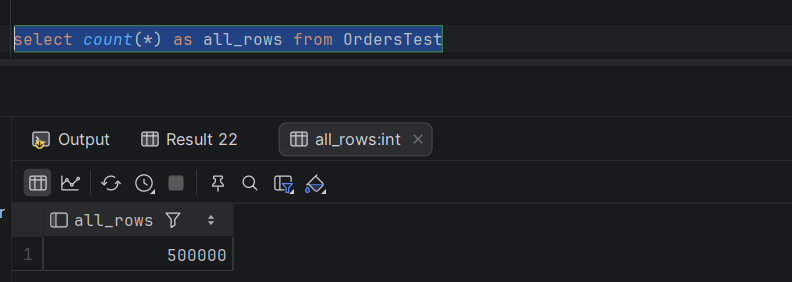

### Opis danych

- **OrderID** - unikalny numer zamówienia i klucz główny tabeli
- **CustomerID** - numer identyfikacyjny klienta
- **ProductID** - numer identyfikacyjny produktu
- **OrderDate** - data oraz godzina zamówienia
- **Status** - status zamówienia: completed, pending, cancelled lub error
- **Quantity** - ilość produktów w zamówieniu
- **Price** - cena jednostkowa produktu
- **City** - miasto dostawy

### Statystyki

| Kategoria         | Wartość   |
| ----------------  | --------- |
| Liczba rekordów   | 500_000   |
| Unikalni klienci  | 10_000    |
| Unikalne produkty | 5_000     |
| Zakres dat [dni]  | 1_000     |
| Regiony           | 3         |
| Statusy           | 3         |

Kwerenda do wyznaczenia większości statystyk:
```sql
select count(distinct CustomerID) as unique_clients, min(OrderDate) as min_date,
       max(OrderDate) as max_date, datediff(day, min(OrderDate), max(OrderDate)) as max_days_diff from OrdersTest
```

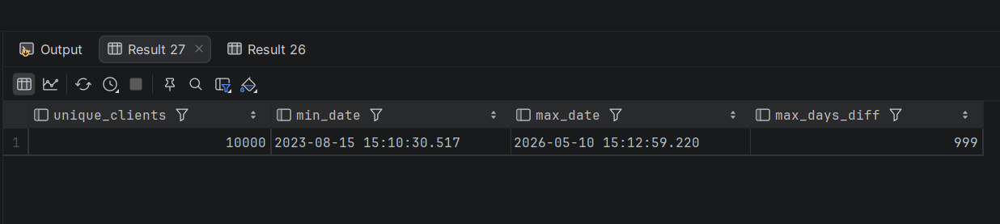


### Rozmiar danych

Aby sprawdzić rozmiar miejsca na dysku zajmowanego przez tabelę użyto poniższego polecenia:

```sql
exec sp_spaceused 'OrdersTest'
```

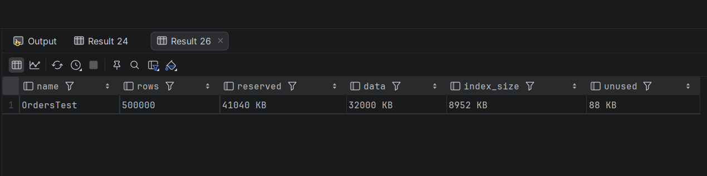

Tabela zajmuje łącznie około 41MB, z czego dane stanowią około 32MB. Póki co w tabeli mamy jeden indeks nieklastrowany na kluczu głównym i zajmuje on niemal 9MB. Wartość unused jest równa zaledwie 88KB, z czego można wnioskowac, że strony danych są prawie całkowicie wypełnione.

### Indeks klastrowany

Sprawdzimy, jak baza danych radzi sobie z wyszukiwaniem transakcji z konkretnego przedziału czasowego. Chcemy sprawdzić, czy fizyczne posortowanie miliona wierszy według daty skróci czas dostępu do danych.

#### Zapytanie bez indeksu

```sql
select * from OrdersTest
where OrderDate between '2026-01-01' and '2026-01-31'
```

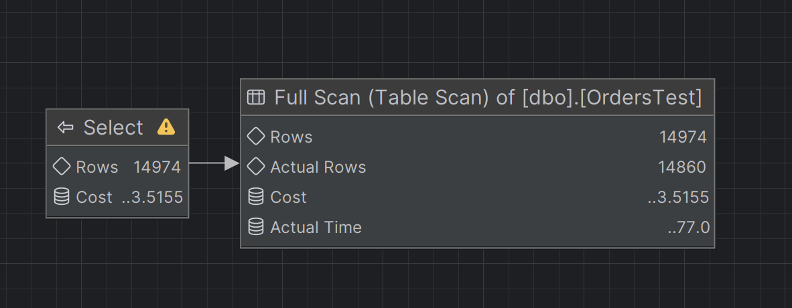

Server wykonuje Table Scan czyli musi przejść przez każdy z pół miliona wierszy, aby sprawdzić, czy data pasuje do zakresu. Czas wykonania zapytania wyniósł 157 ms.

#### Tworzenie indeksu klastrowanego

Teraz poukładamy tabelę fizycznie według daty. Wybieramy indeks klastrowany, ponieważ w tabeli może być tylko jeden, a data jest najczęstszym kryterium filtrowania + jest nam potrzebna w tym konkretnym przypadku.

```sql
create clustered index ix_OrderDate_clustered on OrdersTest(OrderDate)
```

Indeks klastrowany przebudowuje tabelę. Od teraz transakcje nie leżą w bazie chaotycznie, ale są poukładane chronologicznie. Dzieki temu baza szukając stycznia wie dokładnie, w którym miejscu na dysku ten styczeń się zaczyna i kończy.

#### Zapytanie z indeksem

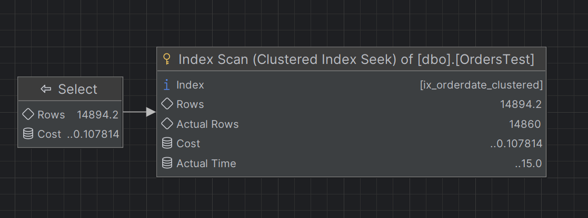

Dzięki zastosowaniu indeksu klastrowanego serwer zamiast Table Scana użył Clustered Index Seeka. Dzięki temu baza nie traci czasu na przeglądanie miliona wierszy, zamiast tego wchodzi bezpośrednio w odpowiednie miejsce na dysku, gdzie zaczynają się dane z wybranego zakresu dat. Czas wykonania zapytania spadł do 35 ms, co jest znaczną poprawą w porównaniu do 95 ms bez indeksu.
Różnica jest natomiast wyraźnie widoczna w liczbie odczytywanych stron. Bez indeksu baza danych musiała odczytać 4000 stron(czyli praktycznie wszystkie), aby znaleźć pasujące wiersze, natomiast z indeksem klastrowanym odczytano tylko 9 stron, co świadczy o znacznej poprawie efektywności dostępu do danych.


| Zapytanie   | Koszt    | Czas (ms) | Odczytane strony |
| ----------- | -------- | --------- | ---------------- |
| Bez indeksu | 3.5155   | 95        | 4000             |
| Z indeksem  | 0.1078   | 35        | 9                |


### Indeks nieklastrowany

Sprawdzimy, jak baza danych radzi sobie z wyszukiwaniem transakcji dla konkretnego klienta. Chcemy sprawdzić czy utworzenie indeksu nieklastrowanego na id klienta przyspieszy dostęp do jego danych w tabeli, która jest już fizycznie posortowana wg daty.

#### Zapytanie bez indeksu

```sql
select * from OrdersTest
where CustomerID = 1000
```

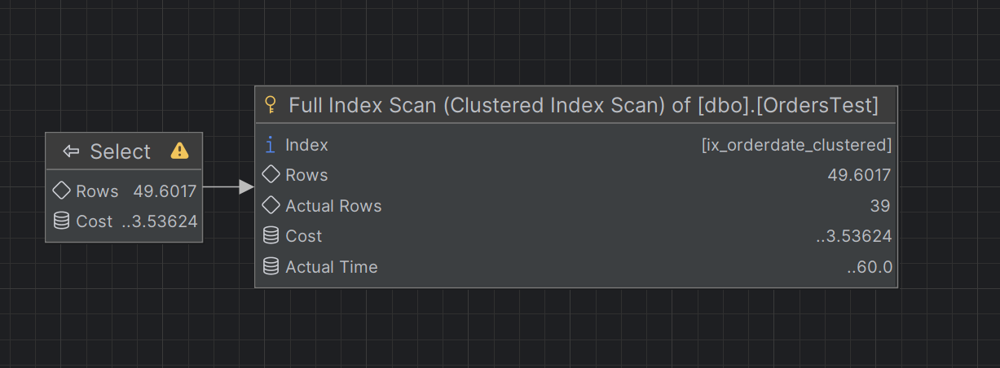

Server wykonuje Clustered Index Scan czyli musi przejść przez każdy z miliona wierszy ułożonych chronologicznie względem OrderDate, aby znaleźć wszystkie transakcje dla wybranego klienta.

#### Tworzenie indeksu nieklastrowanego

Tworzymy osobną strukturę dla kolumny z id klienta. Wybieramy indeks nieklastrowany, ponieważ nasza tabela ma już swój fizyczny porządek wg daty, a my potrzebujemy szybkiego sposobu na wyszukiwanie po id klienta.

```sql
create nonclustered index ix_customerid_nonclustered on OrdersTest(CustomerID)
```

#### Zapytanie z indeksem

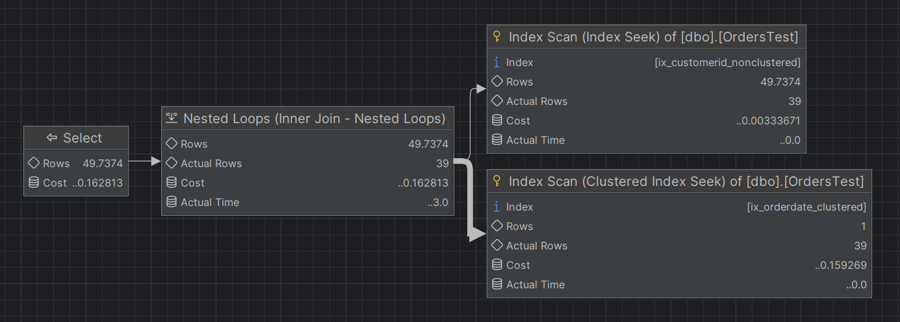

Utworzenie indeksu nieklastrowanego całkowicie zmieniło plan wykonania. Baza zrezygnowała z pełnego skanowania za pomocą Clustered Index Scan. Zamiast tego używa operacji Index Seek, aby szybko odnaleźć identyfikator klienta w nowym indeksie, a następnie przez pętlę pobiera brakujące kolumny z tabeli głównej.

| Zapytanie   | Koszt    | Czas (ms) | Odczytane strony |
| ----------- | -------- | --------- | ---------------- |
| Bez indeksu | 3.536    | 492       | 4041             |
| Z indeksem  | 0.163    | 294       | 131              |

Zastosowanie indeksu nieklastrowanego znacząco poprawiło wydajność zapytania. Liczba odczytów logicznych spadła z 4041 do 131. Koszt zapytania spadł o ponad 90%, czas wykonania również się zmniejszył, lecz mniej znacząco. Optymalizacja zapytań wyszukujących pojedyncze wartości przy użyciu indeksu nieklastrowanego jest w tym przypadku skuteczna i chroni bazę przed niepotrzebnym skanowaniem dużej ilości rekordów.


### Covering Index
W tym przykładzie będziemy korzystać z utworzonych wyżej indeksów: klastrowanego na OrderDate oraz nieklastrowanego na CustomerID. Sprawdzimy, jak baza danych radzi sobie z zapytaniem, które może być obsłużone wyłącznie przez indeksy, bez konieczności odwoływania się do tabeli głównej.

#### Zapytanie z indeksem pokrywającym

```sql
select OrderDate from OrdersTest
where CustomerID = 1000
```
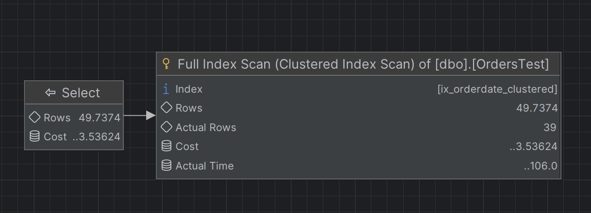

#### Zapytanie bez indeksu (wymuszone użycie klastrowanego po dacie)

```sql
SELECT OrderDate
FROM OrdersTest WITH (INDEX(ix_OrderDate_clustered))
WHERE CustomerID = 1000;
```

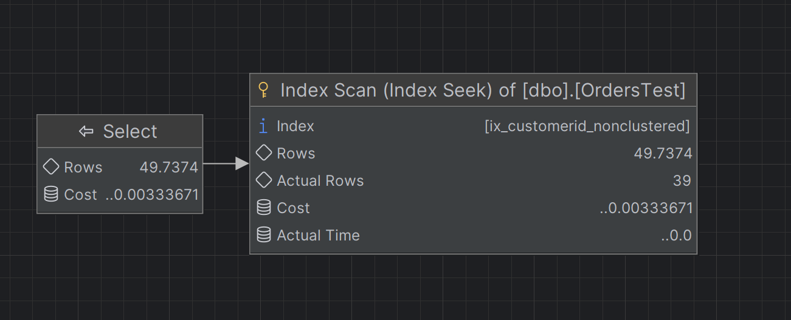

| Zapytanie   | Koszt    | Czas (ms) | Odczytane strony |
| ----------- | -------- | --------- | ---------------- |
| Bez indeksu | 3.536    | 475       | 4041             |
| Z indeksem  | 0.163    | 412       | 3                |

Można zauważyć, że zapytanie z indeksem pokrywającym jest znacznie bardziej efektywne. Baza danych może zaspokoić zapytanie wyłącznie z indeksu nieklastrowanego, ponieważ wszystkie potrzebne kolumny (CustomerID i OrderDate) są zawarte w tym indeksie (ponieważ indeks klastrowany zawiera indeks nieklastrowany). Dzięki temu liczba odczytanych stron spadła do zaledwie 3, a koszt zapytania został drastycznie zredukowany. W przypadku wymuszenia użycia indeksu klastrowanego, baza danych musi nadal skanować dużą liczbę rekordów, co skutkuje znacznie wyższym kosztem i czasem wykonania.

### Przykład 3 - Indeks z INCLUDE

Będziemy chcieli teraz wyświetlić historię klienta, obejmującą datę, kwotę oraz status transakcji.

Indeksy, które na ten moment posiada baza:


Na początek sprawdzimy, jak zachowuje się zapytanie bez dodatkowego indeksu:

#### Zapytanie bez indeksu
```sql
select OrderDate, Status, City from OrdersTest
where customerid = 1234
```

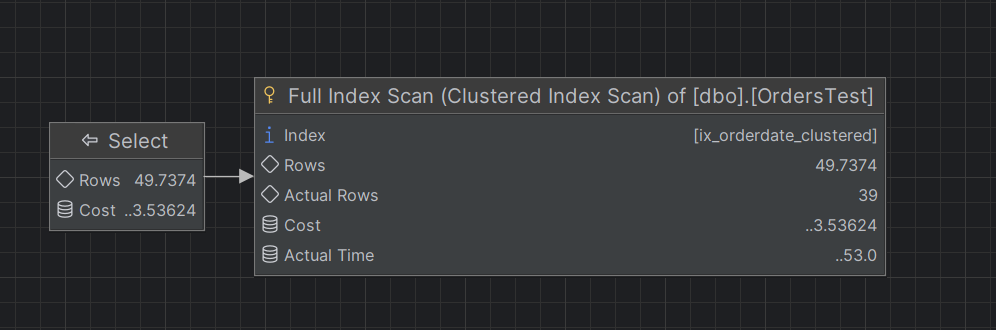

#### Zapytanie z indeksem nieklastrowanym na customerid

```sql
select OrderDate, Status, City from OrdersTest
where customerid = 1000
```
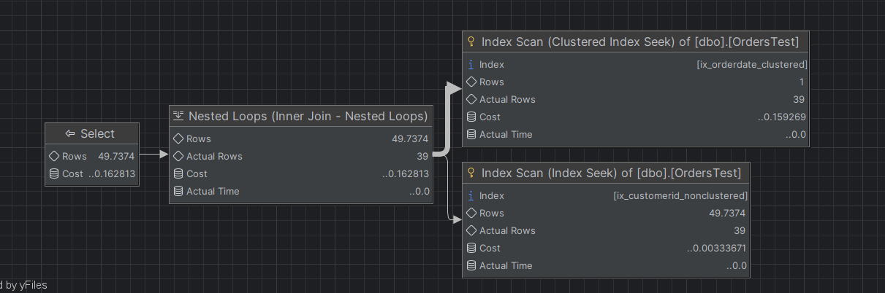

#### Zapytanie z indeksem nieklastrowanym na customerid, który zawiera dodatkowe kolumny (INCLUDE)

##### Tworzenie indeksu z INCLUDE

```sql
create nonclustered index ix_customerid_include
    on OrdersTest(CustomerID) include (Status, City)
```

###### Resultat zapytania z indeksem z INCLUDE
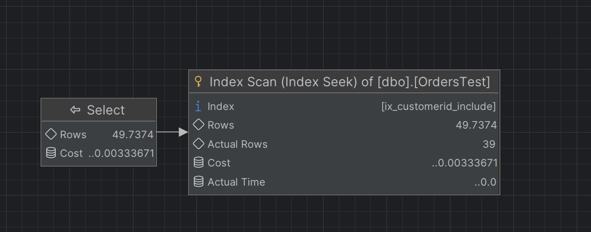


| Zapytanie   | Koszt    | Czas (ms) | Odczytane strony |
| ----------- | -------- | --------- | ---------------- |
| Bez indeksu | 3.536    | 460       | 4041             |
| Z indeksem  | 0.162    | 392       | 131              |
| Include     | 0.003    | 365       | 3                |

Zastosowanie indeksu z INCLUDE pozwoliło na jeszcze większą optymalizację zapytania. Baza danych była w stanie zaspokoić zapytanie wyłącznie z indeksu, ponieważ wszystkie potrzebne kolumny (CustomerID, Status, City i OrderDate będące kluczem indeksu klastrowanego) były zawarte w tym indeksie. Dzięki temu liczba odczytanych stron spadła do zaledwie 3, a koszt zapytania został drastycznie zredukowany w porównaniu do zapytania bez indeksu oraz z indeksem nieklastrowanym bez INCLUDE. Czasowo też różnica jest widoczna, jednak nie aż tak, ze względu na to, że we wszystkich przypadkach do czasu był wliczany czas komunikacji z bazą danych.


### Filtered Index (Indeks warunkowy)

W tym przykładzie sprawdzimy, jak zoptymalizować zapytania o rzadkie zdarzenia. Zamiast indeksować całą tabelę, zostanie stworzony indeks zawierający tylko rekordy ze statusem zamówienia jako anulowane. Dzięki temu zapytania szukające błędów będą znacznie szybsze, ponieważ będą operować na znacznie mniejszym zbiorze danych.

#### Sprawdzenie liczby anulowanych zamówień
```sql
select count(*) from OrdersTest
where status = 'Cancelled'
```

#### Zmniejszenie liczby anulowanych zamówień do 5 procent

```sql
DECLARE @TotalRows INT;
DECLARE @TargetCancelled INT;
DECLARE @CurrentCancelled INT;
DECLARE @RowsToUpdate INT;

SELECT @TotalRows = COUNT(*)
FROM OrdersTest;

SET @TargetCancelled = @TotalRows * 0.05;

SELECT @CurrentCancelled = COUNT(*)
FROM OrdersTest
WHERE Status = 'Cancelled';

SET @RowsToUpdate = @CurrentCancelled - @TargetCancelled;

UPDATE TOP (@RowsToUpdate) OrdersTest
SET Status = 'Pending'
WHERE Status = 'Cancelled';
```

#### Ilość zamówień per status
```sql
select Status, count(*) as num from OrdersTest
group by Status
```

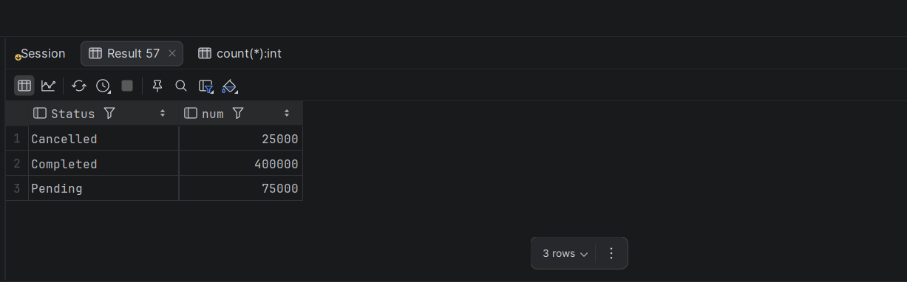


#### Zapytanie

Szukanie anulowanych zamówień, wraz z informacją o kliencie i mieście dostawy.

```sql
select OrderID, CustomerID, City
from OrdersTest
where status = 'Cancelled'
```

#### Bez dedykowanego indeksu

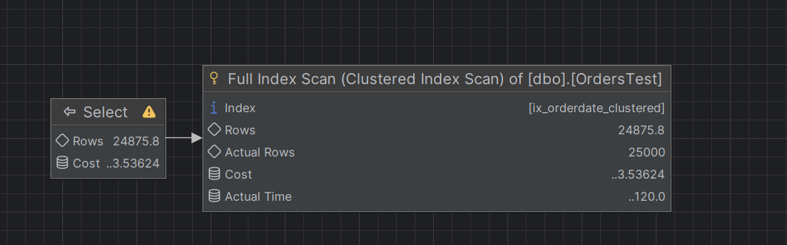

Silnik bazy danych wykonuje pełne skanowanie głównej tabeli za pomocą Clustered Index Scan.

#### Tworzenie indeksu filtrowanego

```sql
create nonclustered index ix_cancelled
on OrdersTest (OrderID)
include (CustomerID, City)
where Status = 'Cancelled'
```

#### Z Indeksem filtrowany

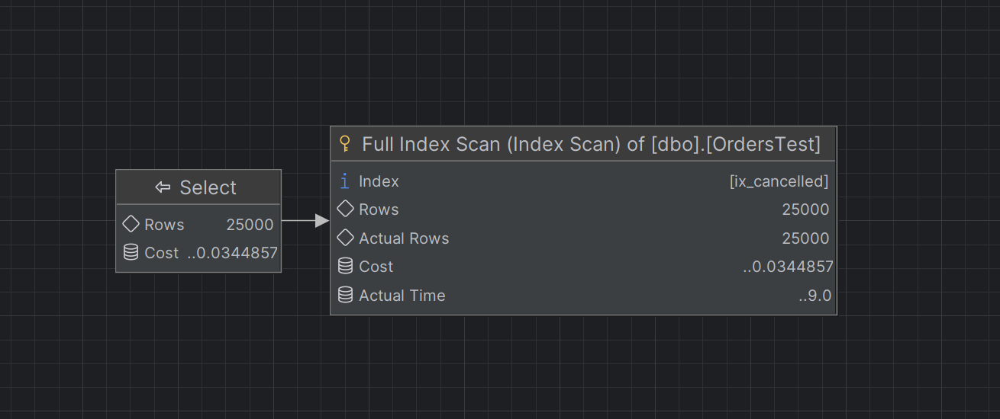

Plan zapytania uprościł się. Baza wykonała operację Index Scan na indeksie filtrowanym. Wydaje się to być w tym przypadku optymalne, ponieważ indeks zawiera wyłącznie szukane błędy, więc silnik odczytuje po kolei całą jego zawartość bez konieczności nawigowania po drzewie indeksu jak byloby w przypadku Index Seeka.

| Zapytanie    | Koszt     | Czas (ms) | Odczytane strony |
| ------------ | --------- | --------- | ---------------- |
| Brak indeksu | 3.536     | 15        | 80               |
| Z indeksem   | 0.034     | 6         | 5                |

Jak widać indeksy warunkowe dla danych o wysokiej selektywności bardzo dobrze sobie radzą. Liczba odczytanych stron spadła z ponad 80 do 5, a koszt zapytania zmniejszył o około 98 %.


### Indeks kolumnowy

W tym przykładzie zostanie zanalizowanie zapytanie wymagające pogrupowania i zagregowania dużej liczby rekordów dla poszczególnych klientów.

#### Zapytanie

```sql
select
    customerID,
    count(*) as orders_count,
    sum(Quantity * Price) as total_bought
from OrdersTest
group by customerID
```

#### Bez indeksu

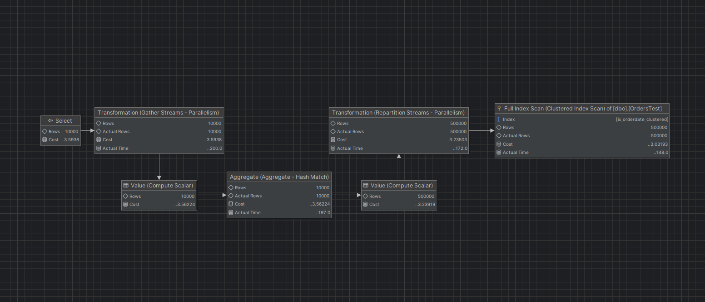

Silnik bazy danych użył indeksu klastrowanego, aby odczytać dane, ale musiał przetworzyć wszystkie rekordy, aby pogrupować je według klienta i obliczyć sumę. Plan zapytania zawiera operacje zrównoleglenia i przesyłania strumieni, co wskazuje na to, że baza danych próbuje zoptymalizować przetwarzanie dużej ilości danych, ale nadal musi odczytać wszystkie rekordy, co jest kosztowne.

#### Tworzenie indeksu kolumnowego

```sql
CREATE NONCLUSTERED COLUMNSTORE INDEX IX_OrdersTest_CS
ON OrdersTest(CustomerID, Quantity, Price);
```

#### Z indeksem

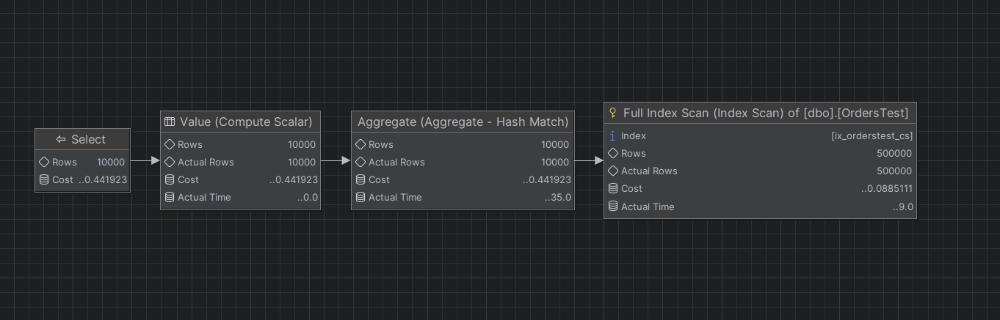

Plan zapytania uległ znacznemu uproszczeniu. Silnik wykonuje operację Index Scan na nowym indeksie kolumnowym. Operatory zrównoleglenia i przesyłania strumieni zostały wyeliminowane z planu, a proces agregacji jest realizowany jednoetapowo.

| Zapytanie   | Koszt    | Czas (ms) | Odczytane strony         |
| ----------- | -------- | --------- | ------------------------ |
| Bez indeksu | 3.592    | 209       | 4239                     |
| Z indeksem  | 0.442    | 91        | 1305 (lob logical reads) |

Indeks kolumnowy znacząco poprawił wydajność zapytania agregującego dużą ilość danych. Liczba odczytanych stron spadła z 4239 do 1305, a koszt zapytania został zredukowany o ponad 87%. Czas wykonania również uległ znacznemu skróceniu, co świadczy o efektywności indeksów kolumnowych w przypadku zapytań analitycznych i agregujących.

|         |                                                                          |     |
| ------- | ------------------------------------------------------------------------ | --- |
| zadanie | pkt                                                                      |     |
| 1       | 6                                                                        |     |
| 2       | 2                                                                        |     |
| 3       | 5 (3 pkt. za eksperymenty + 2 dodatkowe za ciekawe/oryginalne przyklady) |     |
| razem   | 13                                                                       |     |
