# Raport

# Przetwarzanie i analiza danych przestrzennych 
# Oracle spatial


---

**Imiona i nazwiska:** Natalia Bratek i Jakub Karczewski

--- 

Celem ćwiczenia jest zapoznanie się ze sposobem przechowywania, przetwarzania i analizy danych przestrzennych w bazach danych
(na przykładzie systemu Oracle spatial)

Swoje odpowiedzi wpisuj w miejsca oznaczone jako:

---
> Wyniki, zrzut ekranu, komentarz

```sql
--  ...
```

---

Do wykonania ćwiczenia (zadania 1 – 6) i wizualizacji danych wykorzystaj Oracle SQL Develper. Alternatywnie możesz wykonać analizy w środowisku Python/Jupyter Notebook

Do wykonania zadania 7 wykorzystaj środowisko Python/Jupyter Notebook

Raport należy przesłać w formacie pdf.

Należy też dołączyć raport zawierający kod w formacie źródłowym.

Np.
- plik tekstowy .sql z kodem poleceń
- plik .md zawierający kod wersji tekstowej
- notebook programu jupyter – plik .ipynb

Zamieść kod rozwiązania oraz zrzuty ekranu pokazujące wyniki, (dołącz kod rozwiązania w formie tekstowej/źródłowej)

Zwróć uwagę na formatowanie kodu

<div style="page-break-after: always;"></div>

# Zadanie 1

Zwizualizuj przykładowe dane

US_STATES


> Wyniki, zrzut ekranu, komentarz

```sql
SELECT *
FROM us_states
```

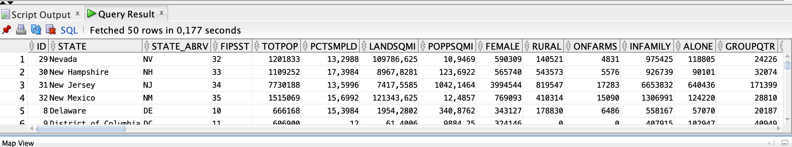
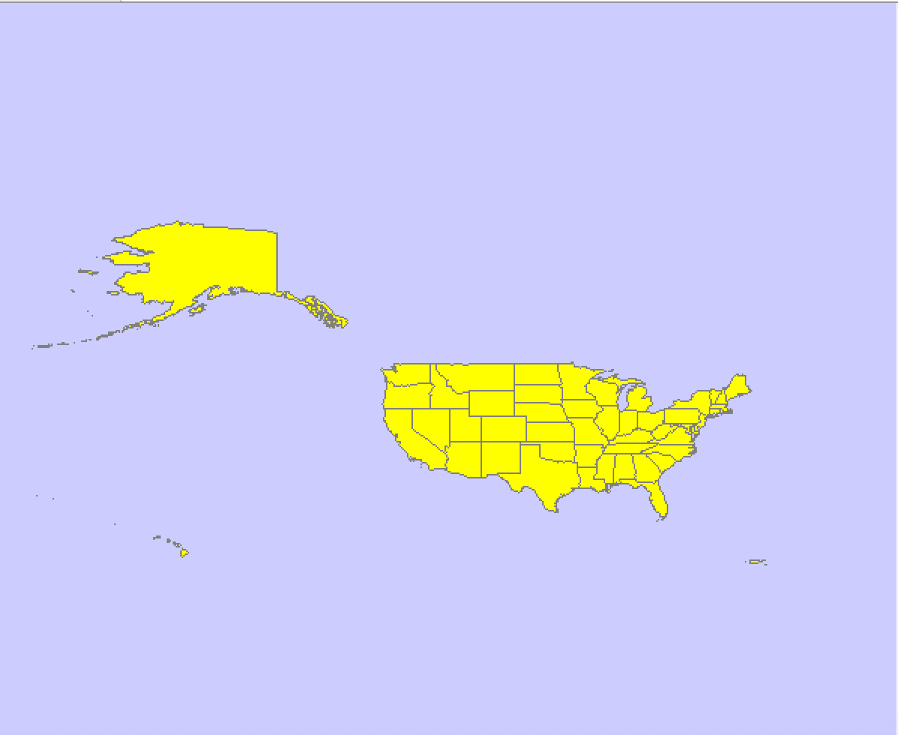


US_INTERSTATES


> Wyniki, zrzut ekranu, komentarz

```sql
SELECT * 
FROM US_INTERSTATES
```


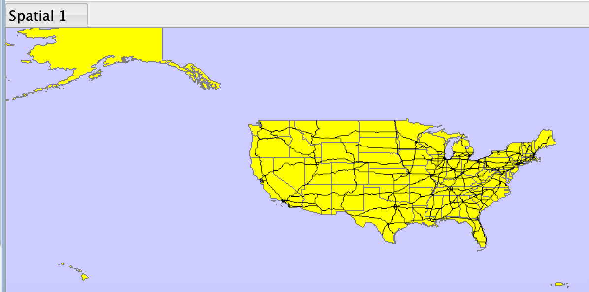


US_CITIES


> Wyniki, zrzut ekranu, komentarz

```sql
SELECT * 
FROM US_CITIES
```


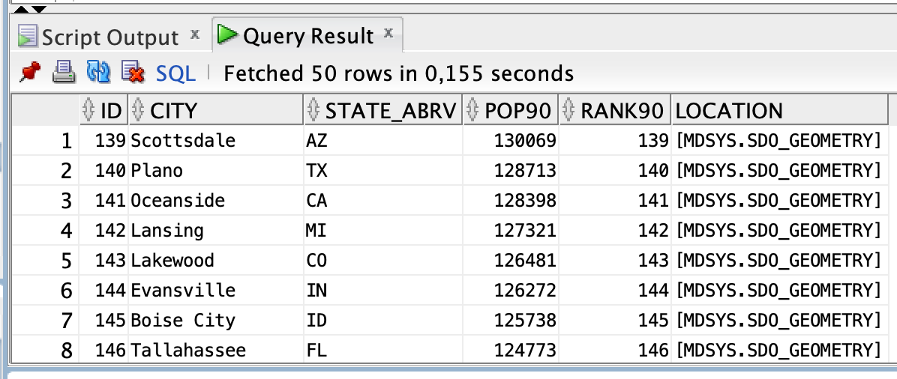


US_RIVERS


> Wyniki, zrzut ekranu, komentarz

```sql
SELECT * 
FROM US_RIVERS
```

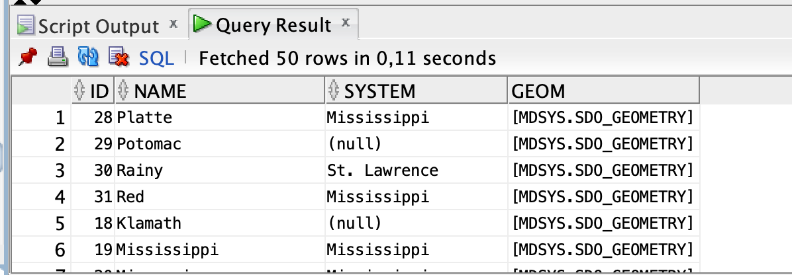
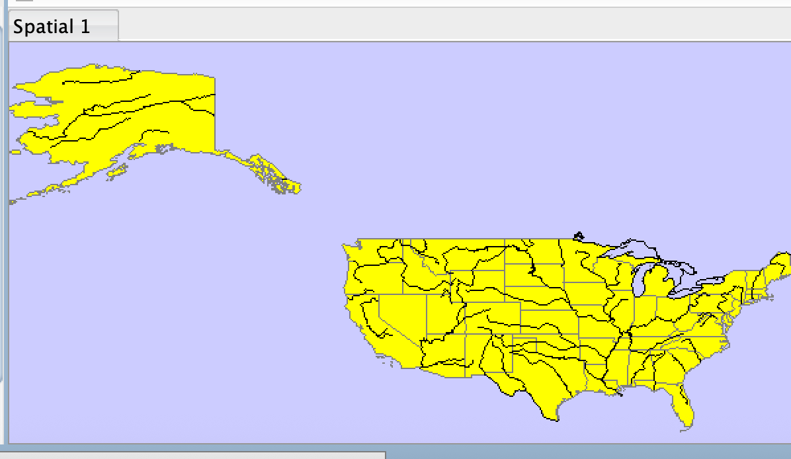


US_COUNTIES


> Wyniki, zrzut ekranu, komentarz

```sql
SELECT * 
FROM US_COUNTIES
```
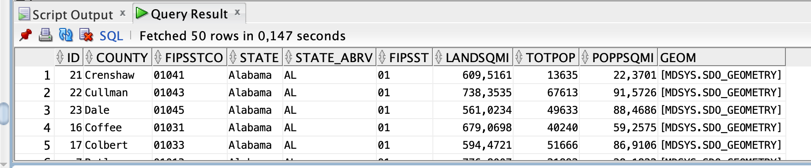


US_PARKS


> Wyniki, zrzut ekranu, komentarz

```sql
SELECT * 
FROM US_PARKS
```


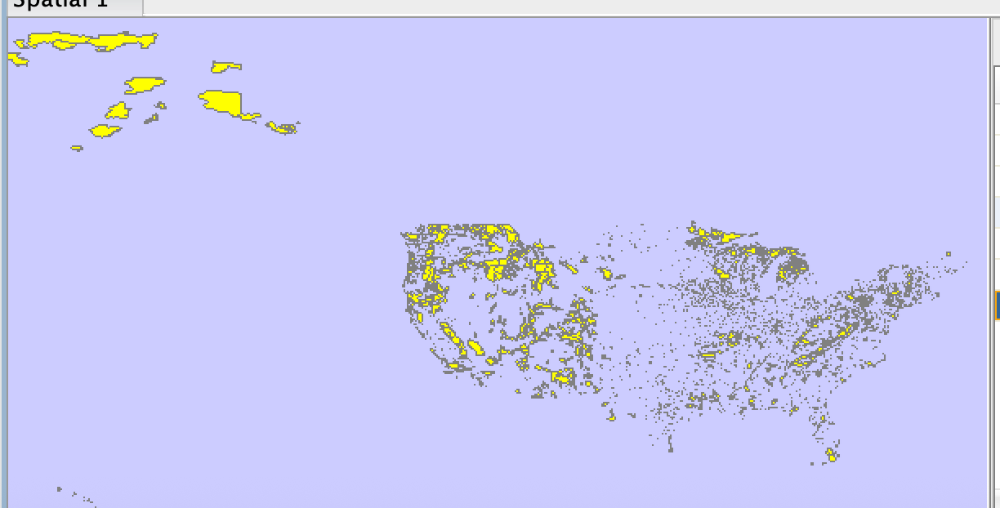

# Zadanie 2

Znajdź wszystkie stany (us_states) których obszary mają część wspólną ze wskazaną geometrią (prostokątem)

Pokaż wynik na mapie.

prostokąt


```sql
SELECT sdo_geometry (2003, 8307, null,
sdo_elem_info_array (1,1003,3),
sdo_ordinate_array ( -117.0, 40.0, -90., 44.0)) g
FROM dual 
```


Użyj funkcji SDO_FILTER

```sql
SELECT state, geom FROM us_states
WHERE sdo_filter (geom,
sdo_geometry (2003, 8307, null,
sdo_elem_info_array (1,1003,3),
sdo_ordinate_array ( -117.0, 40.0, -90., 44.0))
) = 'TRUE';
```

Zwróć uwagę na liczbę zwróconych wierszy (16)

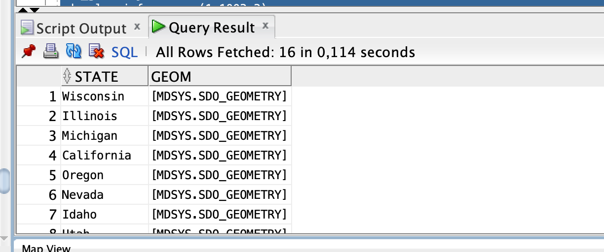
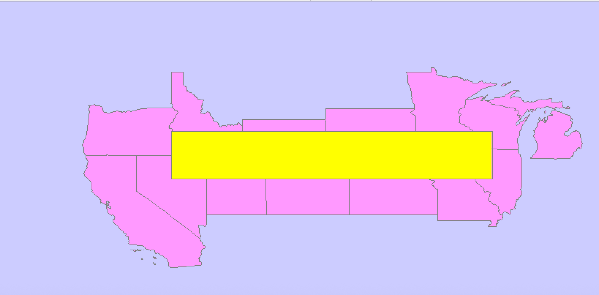


Użyj funkcji  SDO_ANYINTERACT

```sql
SELECT state, geom FROM us_states
WHERE sdo_anyinteract (geom,
sdo_geometry (2003, 8307, null,
sdo_elem_info_array (1,1003,3),
sdo_ordinate_array ( -117.0, 40.0, -90., 44.0))
) = 'TRUE';
```


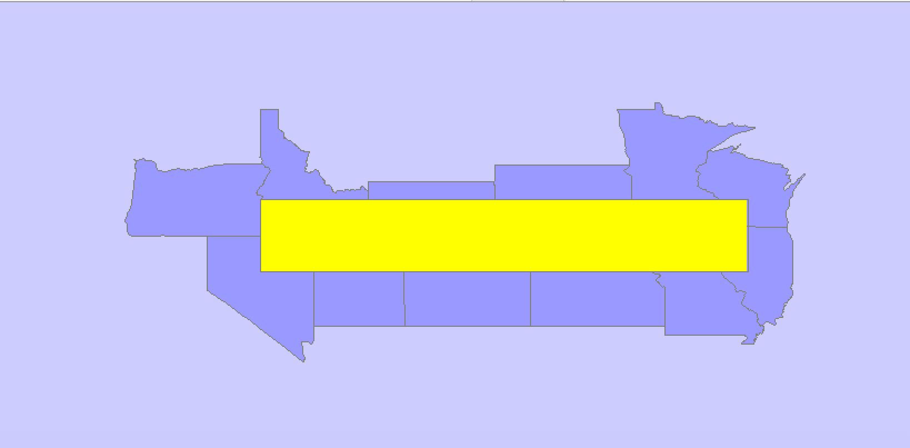


Porównaj wyniki sdo_filter i sdo_anyinteract

Pokaż wynik na mapie


SDO_FILTER zwraca geometrie, które mogą się przecinać.
Operuje na przybliżeniach geometrii, więc może zwracać dodatkowe obiekty, bo porównuje prostokąty otaczające, a nie dokładne kształty geometrii. W wyniku jest 16 wierszy.

SDO_ANYINTERACT sprawdza rzeczywiste geometrie i zwraca tylko te, które mają część wspólną. Jest 14 wierszy.

Na mapie 2 dodatkowe stany, które są zaznaczone na różowo, są wynikiem SDO_FILTER.


# Zadanie 3

Znajdź wszystkie parki (us_parks) których obszary znajdują się wewnątrz stanu Wyoming

Użyj funkcji SDO_INSIDE

```sql
SELECT p.name, p.geom
FROM us_parks p, us_states s
WHERE s.state = 'Wyoming'
      AND SDO_INSIDE (p.geom, s.geom ) = 'TRUE';
```


W przypadku wykorzystywania narzędzia SQL Developer, w celu wizualizacji na mapie użyj podzapytania

```sql
SELECT pp.name, pp.geom FROM us_parks pp  
WHERE id IN  
(  
      SELECT p.id  
      FROM us_parks p, us_states s  
      WHERE s.state = 'Wyoming'  
            AND SDO_INSIDE (p.geom, s.geom ) = 'TRUE'  
)
```


```sql
SELECT state, geom FROM us_states
WHERE state = 'Wyoming'
```

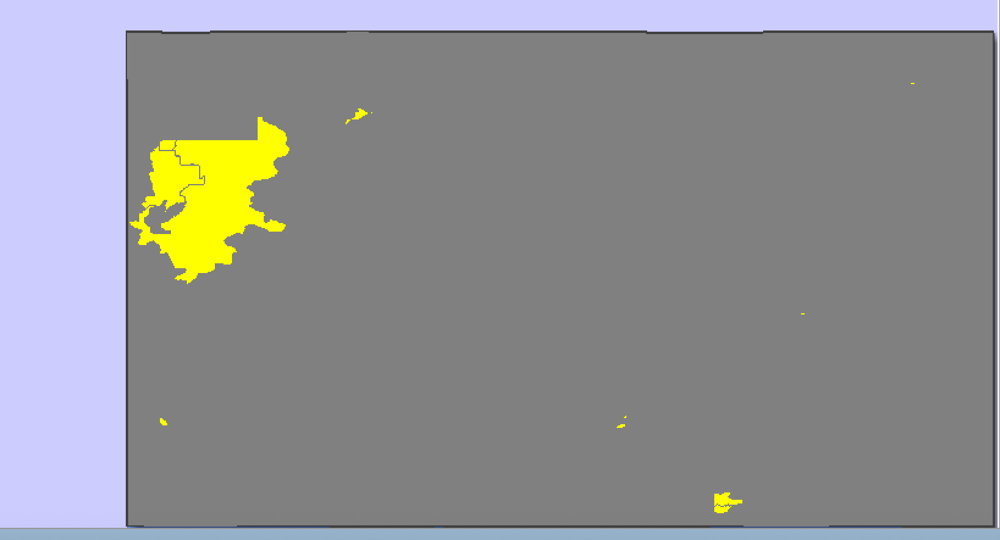


Porównaj wynik z:

```sql
SELECT p.name, p.geom
FROM us_parks p, us_states s
WHERE s.state = 'Wyoming'
AND SDO_ANYINTERACT (p.geom, s.geom ) = 'TRUE';
```
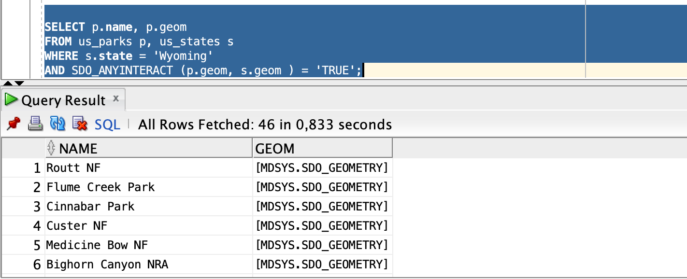


W celu wizualizacji użyj podzapytania


```sql
SELECT pp.name, pp.geom FROM us_parks pp
WHERE id IN
(
 SELECT p.id
 FROM us_parks p, us_states s
 WHERE s.state = 'Wyoming'
 and SDO_ANYINTERACT (p.geom, s.geom ) = 'TRUE'
)
```


SDO_INSIDE zwraca tylko te parki, które w całości leżą wewnątrz stanu Wyoming i nie dotykają granicy. Na mapie to żółte parki. Jest ich 32.

SDO_ANYINTERACT zwraca wszystkie parki w Wyoming, też te które są na granicy dwóch stanów lub wychodzą poza stan. W tym przypadku to 46 parków: 32 żółte z SDO_INSIDE  
i 14 na granicy lub wychodzących poza Wyoming.


# Zadanie 4

Znajdź wszystkie jednostki administracyjne (us_counties) wewnątrz stanu New Hampshire

```sql
SELECT c.county, c.state_abrv, c.geom
FROM us_counties c, us_states s
WHERE s.state = 'New Hampshire'
AND SDO_RELATE ( c.geom,s.geom, 'mask=INSIDE+COVEREDBY') = 'TRUE';

SELECT c.county, c.state_abrv, c.geom
FROM us_counties c, us_states s
WHERE s.state = 'New Hampshire'
AND SDO_RELATE ( c.geom,s.geom, 'mask=INSIDE') = 'TRUE';

SELECT c.county, c.state_abrv, c.geom
FROM us_counties c, us_states s
WHERE s.state = 'New Hampshire'
AND SDO_RELATE ( c.geom,s.geom, 'mask=COVEREDBY') = 'TRUE';
```

W przypadku wykorzystywania narzędzia SQL Developer, w celu wizualizacji danych na mapie należy użyć podzapytania (podobnie jak w poprzednim zadaniu)

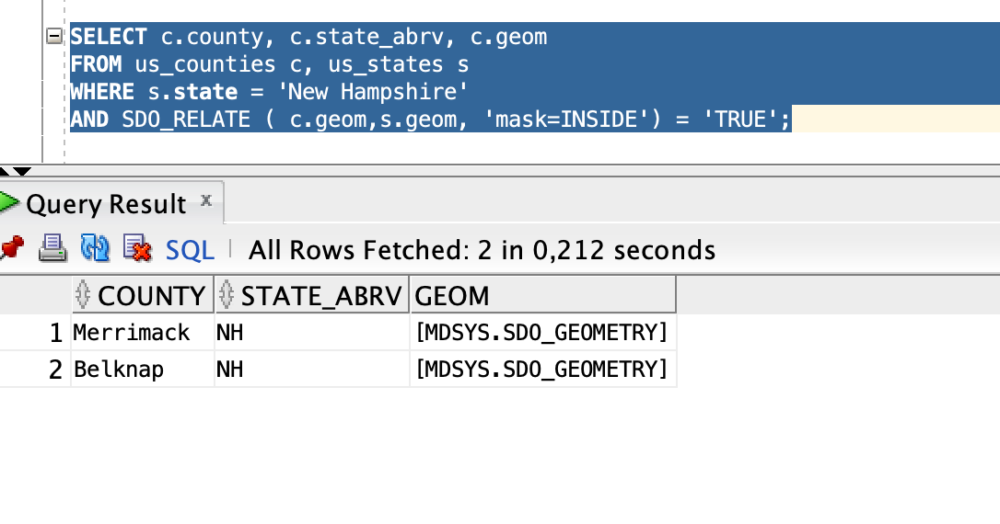

```sql
SELECT cc.county, cc.state_abrv, cc.geom
FROM us_counties cc
WHERE cc.county IN (
    SELECT c.county
    FROM us_counties c, us_states s
    WHERE s.state = 'New Hampshire'
    AND SDO_RELATE(c.geom,s.geom,'mask=INSIDE') = 'TRUE'
)
```


```sql
SELECT cc.county, cc.state_abrv, cc.geom
FROM us_counties cc
WHERE cc.county IN (
    SELECT c.county
    FROM us_counties c, us_states s
    WHERE s.state = 'New Hampshire'
    AND SDO_RELATE(c.geom,s.geom,'mask=COVEREDBY') = 'TRUE'
)
```


```sql
SELECT cc.county, cc.state_abrv, cc.geom
FROM us_counties cc
WHERE cc.county IN (
    SELECT c.county
    FROM us_counties c, us_states s
    WHERE s.state = 'New Hampshire'
    AND SDO_RELATE(c.geom,s.geom,'mask=INSIDE+COVEREDBY'= 'TRUE'
)
```


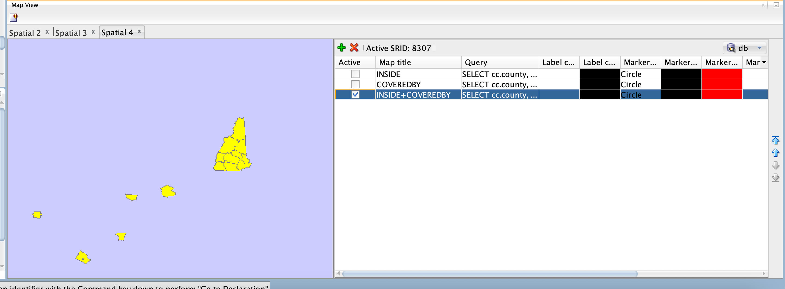


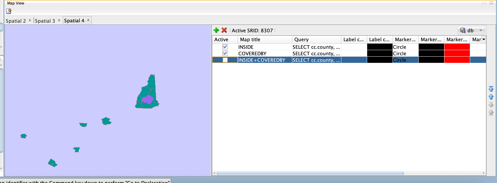

INSIDE (kolor fioletowy) zwraca 2 jednostki administracyjne. Zwraca tylko te jednostki, które leżą 
w całości wewnątrz stanu i nie dotykają granicy.

COVEREDBY(kolor turkusowy) zwraca 8 jednostek administracyjnych, ale tylko te które dotykają granicy.

INSIDE+COVEREDBY (żółty) zwraca 10 jednostek administracyjnych (dotykających i niedotykających granicy), wszystkie znajdujące się w New Hampshire

# Zadanie 5

Znajdź wszystkie miasta w odległości 50 mil od drogi I4 i pokaż wyniki na mapie.

```sql
SELECT c.city, c.state_abrv, c.location
FROM us_cities c
WHERE c.ROWID IN (
    SELECT c.ROWID
    FROM us_interstates i, us_cities c
    WHERE i.interstate = 'I4'
    AND SDO_WITHIN_DISTANCE(
        c.location,
        i.geom,
        'distance=50 unit=mile'
    ) = 'TRUE'
);
```

Zapytanie wykorzystuje `SDO_WITHIN_DISTANCE` do wybrania miast oddalonych od geometrii drogi I4 o nie więcej niż 50 mil. Na mapie umieszczono trzy warstwy: granicę Florydy, przebieg drogi I4 oraz znalezione miasta.

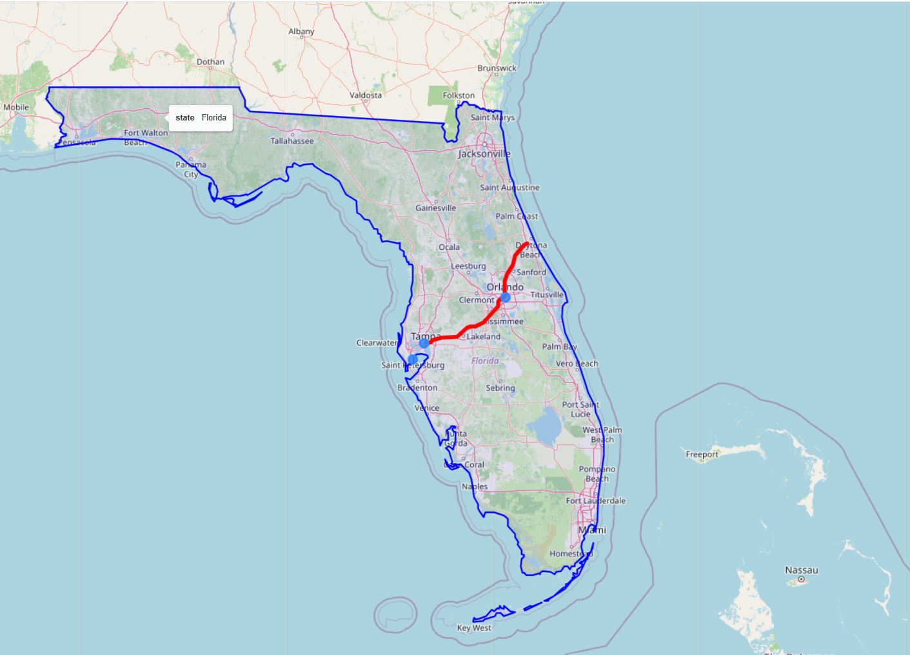

[Mapa interaktywna](html_maps/i4_florida_miasta.html)

## Zadanie 5a

Znajdź wszystkie drogi, które przecinają rzekę Mississippi.

```sql
SELECT i.interstate, i.geom
FROM us_interstates i, us_rivers r
WHERE LOWER(r.name) LIKE '%mississippi%'
AND SDO_ANYINTERACT(i.geom, r.geom) = 'TRUE';
```

Funkcja `SDO_ANYINTERACT` zwraca drogi, których geometria ma jakąkolwiek część wspólną z geometrią rzeki Mississippi. Na mapie rzekę oznaczono kolorem niebieskim, a przecinające ją drogi kolorem czerwonym.

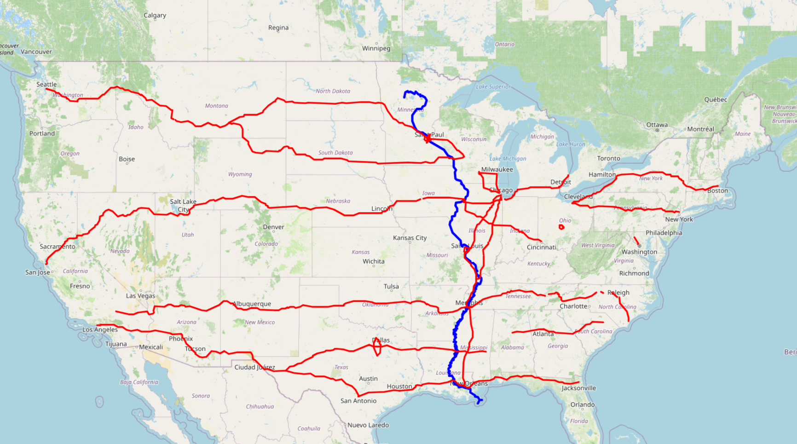

[Mapa interaktywna](html_maps/zad5a_drogi_mississippi.html)

## Zadanie 5b

Znajdź wszystkie miasta w odległości od 15 do 30 mil od drogi I275.

```sql
SELECT c.city, c.state_abrv, c.location
FROM us_cities c
WHERE c.ROWID IN (
    SELECT c.ROWID
    FROM us_interstates i, us_cities c
    WHERE i.interstate = 'I275'
    AND SDO_WITHIN_DISTANCE(
        c.location,
        i.geom,
        'distance=30 unit=mile'
    ) = 'TRUE'
)
AND c.ROWID NOT IN (
    SELECT c.ROWID
    FROM us_interstates i, us_cities c
    WHERE i.interstate = 'I275'
    AND SDO_WITHIN_DISTANCE(
        c.location,
        i.geom,
        'distance=15 unit=mile'
    ) = 'TRUE'
);
```

Najpierw wybrano miasta położone maksymalnie 30 mil od drogi, a następnie odrzucono miasta znajdujące się nie dalej niż 15 mil. Wynik tworzy pierścień odległościowy 15–30 mil wokół drogi I275.

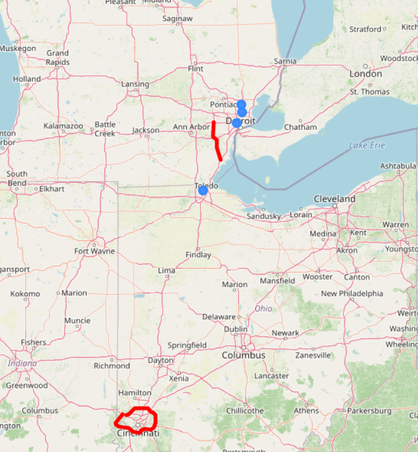

[Mapa interaktywna](html_maps/zad5b_miasta_15_30_mil_i275.html)

## Zadanie 5c

Własny przykład: miasta w odległości nie większej niż 50 mil od rzeki Colorado.

```sql
SELECT
    c.city,
    c.state_abrv,
    c.location
FROM us_cities c, us_rivers r
WHERE LOWER(r.name) LIKE '%colorado%'
AND SDO_GEOM.SDO_DISTANCE(
    c.location,
    r.geom,
    0.005,
    'unit=mile'
) <= 50;
```

Zapytanie zwróciło dwa miasta: **Lakewood (CO)** i **Las Vegas (NV)**.

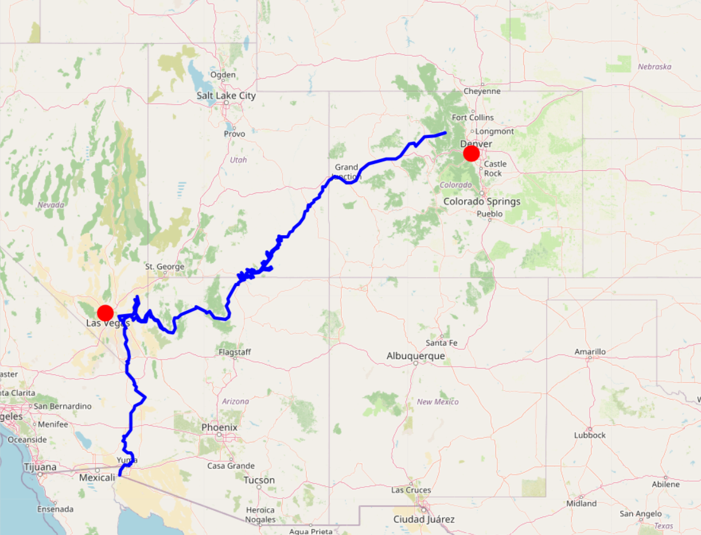

[Mapa interaktywna](html_maps/zad5c_colorado_river_cities.html)

# Zadanie 6

Znajdź pięć miast położonych najbliżej drogi I4.

```sql
SELECT
    c.city,
    c.state_abrv,
    SDO_NN_DISTANCE(1) AS distance_mile,
    c.location
FROM us_interstates i, us_cities c
WHERE i.interstate = 'I4'
AND SDO_NN(
    c.location,
    i.geom,
    'sdo_num_res=5 unit=mile',
    1
) = 'TRUE'
ORDER BY distance_mile;
```

Funkcja `SDO_NN` wyszukuje najbliższe geometrie, a `SDO_NN_DISTANCE` oblicza ich odległość od drogi. Otrzymano:

| Miasto | Stan | Odległość od I4 [mile] |
| --- | --- | ---: |
| Orlando | FL | 1,15 |
| Tampa | FL | 1,93 |
| St Petersburg | FL | 18,43 |
| Jacksonville | FL | 88,41 |
| Fort Lauderdale | FL | 171,39 |

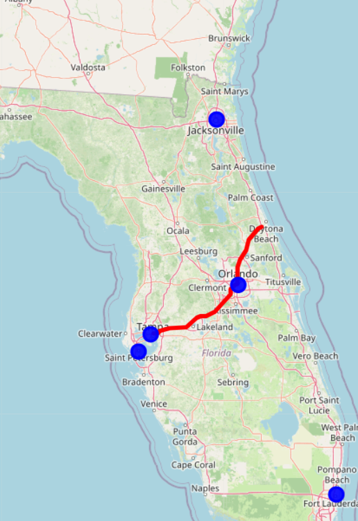

[Mapa interaktywna](html_maps/zad6_5_miast_najblizszych_i4.html)

## Zadanie 6a

Podaj trzy parki z tabeli `us_parks`, do których jest najbliżej z Nowego Jorku, i oblicz odległości do tych parków.

```sql
SELECT
    p.name,
    SDO_GEOM.SDO_DISTANCE(
        c.location,
        p.geom,
        0.005,
        'unit=mile'
    ) AS distance_mile,
    p.geom
FROM us_cities c, us_parks p
WHERE c.city = 'New York'
AND c.state_abrv = 'NY'
AND SDO_NN(
    p.geom,
    c.location,
    'sdo_num_res=3',
    1
) = 'TRUE'
ORDER BY distance_mile;
```

| Park | Odległość od Nowego Jorku [mile] |
| --- | ---: |
| Institute Park | 0,96 |
| Prospect Park | 1,07 |
| Thompkins Park | 1,33 |

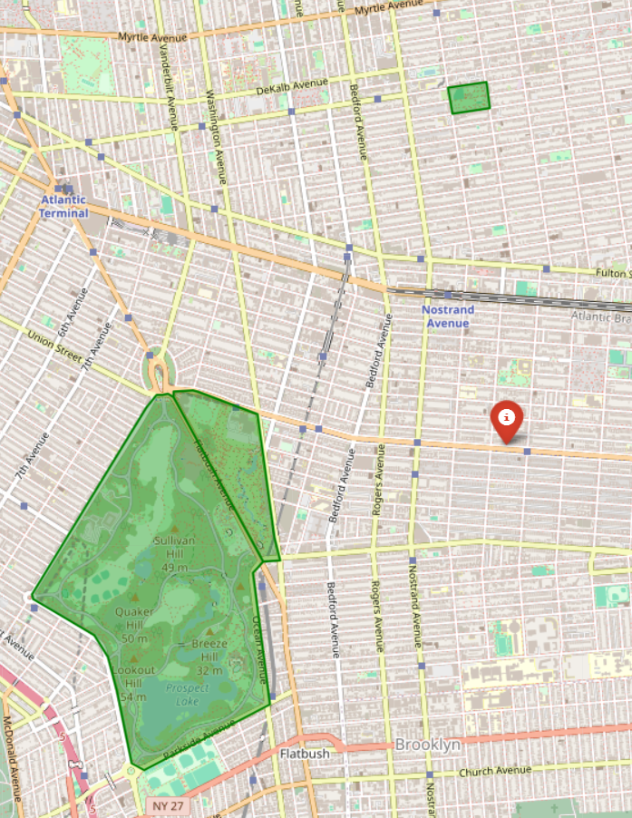

[Mapa interaktywna](html_maps/zad6a_parki_najblizsze_new_york.html)

## Zadanie 6b

Znajdź pięć najbliższych dużych miast o populacji powyżej 300 tys. mieszkańców od drogi I170.

```sql
SELECT
    c.city,
    c.state_abrv,
    c.pop90,
    SDO_NN_DISTANCE(1) AS distance_mile,
    c.location
FROM us_interstates i, us_cities c
WHERE i.interstate = 'I170'
AND c.pop90 > 300000
AND SDO_NN(
    c.location,
    i.geom,
    'sdo_num_res=5 unit=mile',
    1
) = 'TRUE'
ORDER BY distance_mile;
```

Po zastosowaniu warunku `pop90 > 300000` zbiór danych zawiera tylko jedno pasujące miasto: **St Louis (MO)**, populacja 396 685, w odległości około **5,36 mili** od I170. Z tego powodu zapytanie nie mogło zwrócić pięciu rekordów.

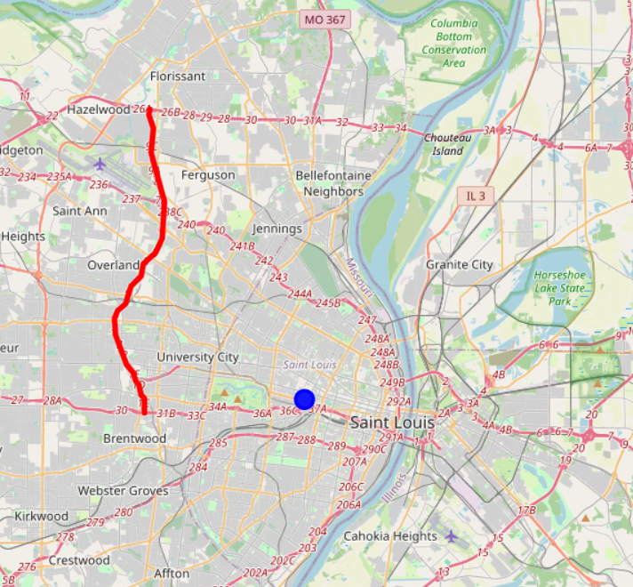

[Mapa interaktywna](html_maps/zad6b_duze_miasta_i170.html)

## Zadanie 6c

Własny przykład: wyznaczenie minimalnego prostokąta ograniczającego (MBR) dla stanu Texas.

```sql
SELECT SDO_GEOM.SDO_MBR(s.geom) AS mbr
FROM us_states s
WHERE s.state = 'Texas';
```

Funkcja `SDO_MBR` tworzy najmniejszy prostokąt obejmujący całą geometrię stanu. Na mapie granicę Texasu oznaczono kolorem niebieskim, a jego MBR kolorem czerwonym.

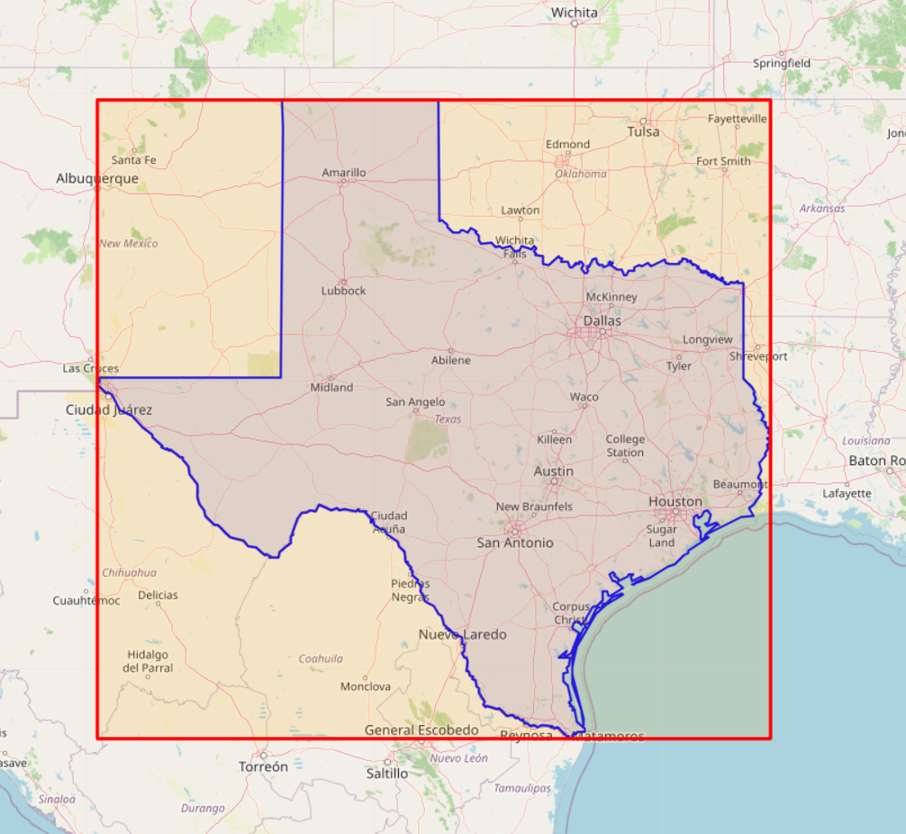

[Mapa interaktywna](html_maps/zad6c_mbr_texas.html)

# Zadanie 7

Wykonaj kilka własnych przykładów i analiz.

## Zadanie 7a

Wyznacz stany, przez które przepływa rzeka Missouri.

```sql
SELECT
    s.state,
    s.state_abrv,
    s.geom
FROM us_states s, us_rivers r
WHERE LOWER(r.name) LIKE '%missouri%'
AND SDO_ANYINTERACT(s.geom, r.geom) = 'TRUE';
```

Zapytanie zwróciło osiem stanów: **Montana, Wyoming, Nebraska, South Dakota, North Dakota, Kansas, Iowa i Missouri**. Funkcja `SDO_ANYINTERACT` sprawdza, które geometrie stanów mają część wspólną z geometrią rzeki.

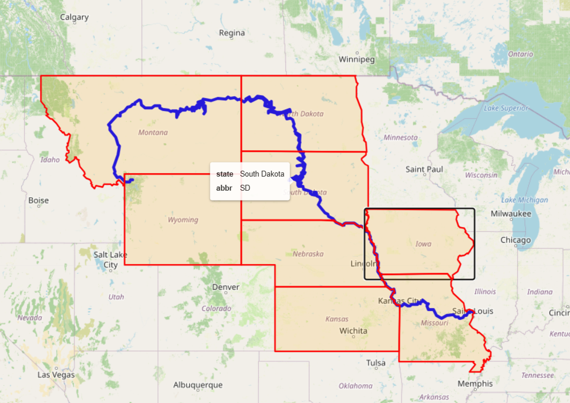

[Mapa interaktywna](html_maps/zad7a_stany_missouri.html)

## Zadanie 7b

Wyznacz centroidy stanów Florida, Texas i California.

```sql
SELECT
    s.state,
    SDO_GEOM.SDO_CENTROID(s.geom, 0.005) AS centroid
FROM us_states s
WHERE s.state IN ('Florida', 'Texas', 'California');
```

Funkcja `SDO_CENTROID` wyznacza geometryczny środek obszaru. Na mapie pokazano granice trzech stanów oraz położenie ich centroidów.

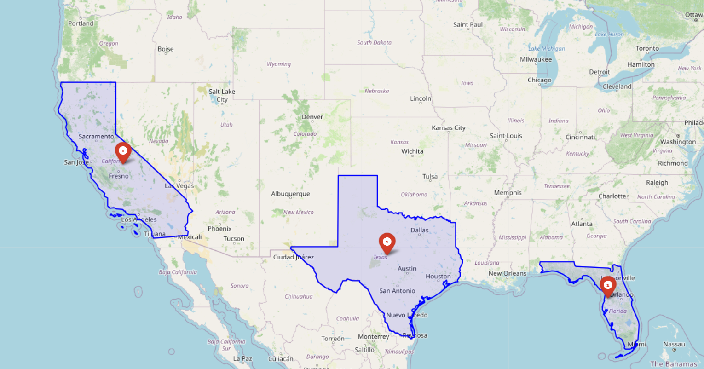

[Mapa interaktywna](html_maps/zad7b_centroidy_stanow.html)

Punktacja

|       |     |
| ----- | --- |
| zad   | pkt |
| 1     | 0,5 |
| 2     | 0,5 |
| 3     | 0,5 |
| 4     | 0,5 |
| 5     | 1   |
| 6     | 2   |
| 7     | 2   |
| razem | 7   |
