# Raport

# Przetwarzanie i analiza danych przestrzennych 
# Oracle spatial


---

**Imiona i nazwiska:** Natalia Bratek i Jakub Karczewski

--- 

Celem ćwiczenia jest zapoznanie się ze sposobem przechowywania, przetwarzania i analizy danych przestrzennych w bazach danych
(na przykładzie systemu Oracle spatial)

Swoje odpowiedzi wpisuj w miejsca oznaczone jako:

---
> Wyniki, zrzut ekranu, komentarz

```sql
--  ...
```

---

Do wykonania ćwiczenia (zadania 1 – 6) i wizualizacji danych wykorzystaj Oracle SQL Develper. Alternatywnie możesz wykonać analizy w środowisku Python/Jupyter Notebook

Do wykonania zadania 7 wykorzystaj środowisko Python/Jupyter Notebook

Raport należy przesłać w formacie pdf.

Należy też dołączyć raport zawierający kod w formacie źródłowym.

Np.
- plik tekstowy .sql z kodem poleceń
- plik .md zawierający kod wersji tekstowej
- notebook programu jupyter – plik .ipynb

Zamieść kod rozwiązania oraz zrzuty ekranu pokazujące wyniki, (dołącz kod rozwiązania w formie tekstowej/źródłowej)

Zwróć uwagę na formatowanie kodu

<div style="page-break-after: always;"></div>

# Zadanie 1

Zwizualizuj przykładowe dane

US_STATES


> Wyniki, zrzut ekranu, komentarz

```sql
SELECT *
FROM us_states
```


US_INTERSTATES


> Wyniki, zrzut ekranu, komentarz

```sql
SELECT * 
FROM US_INTERSTATES
```
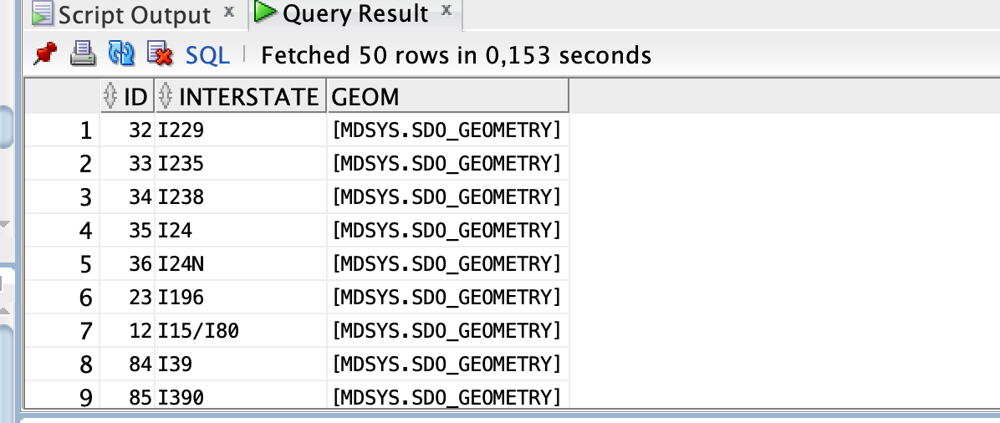
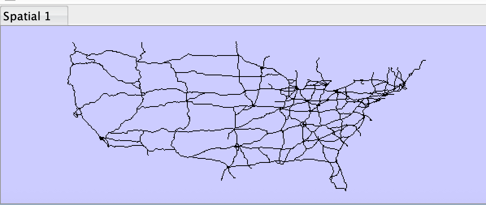


US_CITIES


> Wyniki, zrzut ekranu, komentarz

```sql
SELECT * 
FROM US_CITIES
```


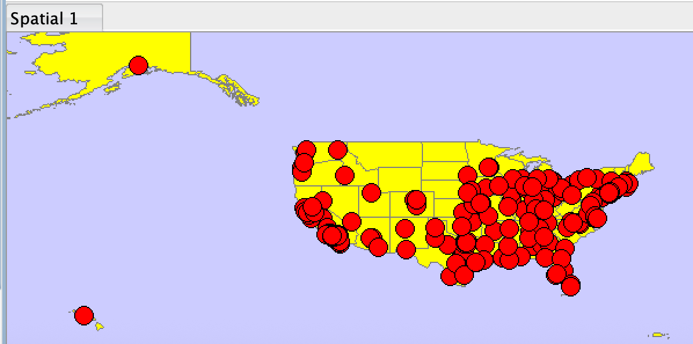

US_RIVERS


> Wyniki, zrzut ekranu, komentarz

```sql
SELECT * 
FROM US_RIVERS
```


US_COUNTIES


> Wyniki, zrzut ekranu, komentarz

```sql
SELECT * 
FROM US_COUNTIES
```

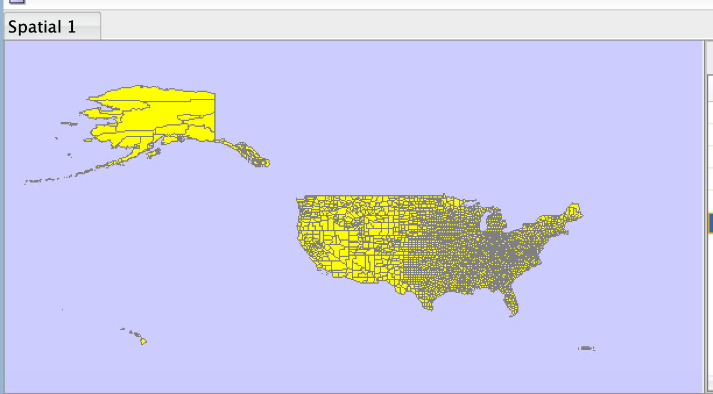

US_PARKS


> Wyniki, zrzut ekranu, komentarz

```sql
SELECT * 
FROM US_PARKS
```

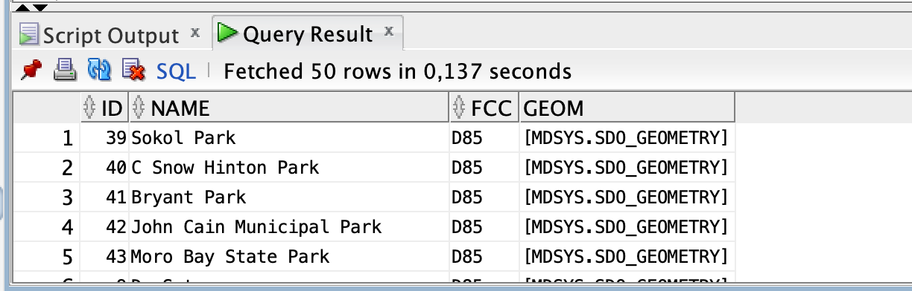


# Zadanie 2

Znajdź wszystkie stany (us_states) których obszary mają część wspólną ze wskazaną geometrią (prostokątem)

Pokaż wynik na mapie.

prostokąt


```sql
SELECT sdo_geometry (2003, 8307, null,
sdo_elem_info_array (1,1003,3),
sdo_ordinate_array ( -117.0, 40.0, -90., 44.0)) g
FROM dual 
```


Użyj funkcji SDO_FILTER

```sql
SELECT state, geom FROM us_states
WHERE sdo_filter (geom,
sdo_geometry (2003, 8307, null,
sdo_elem_info_array (1,1003,3),
sdo_ordinate_array ( -117.0, 40.0, -90., 44.0))
) = 'TRUE';
```

Zwróć uwagę na liczbę zwróconych wierszy (16)


Użyj funkcji  SDO_ANYINTERACT

```sql
SELECT state, geom FROM us_states
WHERE sdo_anyinteract (geom,
sdo_geometry (2003, 8307, null,
sdo_elem_info_array (1,1003,3),
sdo_ordinate_array ( -117.0, 40.0, -90., 44.0))
) = 'TRUE';
```

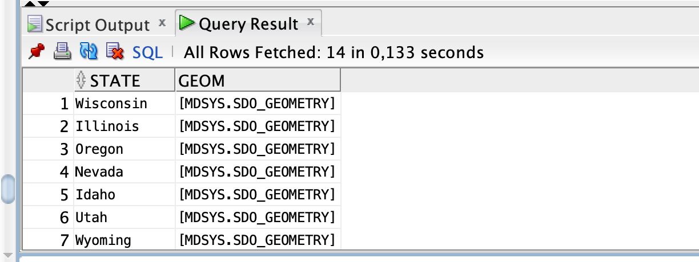


Porównaj wyniki sdo_filter i sdo_anyinteract

Pokaż wynik na mapie


SDO_FILTER zwraca geometrie, które mogą się przecinać.
Operuje na przybliżeniach geometrii, więc może zwracać dodatkowe obiekty, bo porównuje prostokąty otaczające, a nie dokładne kształty geometrii. W wyniku jest 16 wierszy.

SDO_ANYINTERACT sprawdza rzeczywiste geometrie i zwraca tylko te, które mają część wspólną. Jest 14 wierszy.

Na mapie 2 dodatkowe stany, które są zaznaczone na różowo, są wynikiem SDO_FILTER.

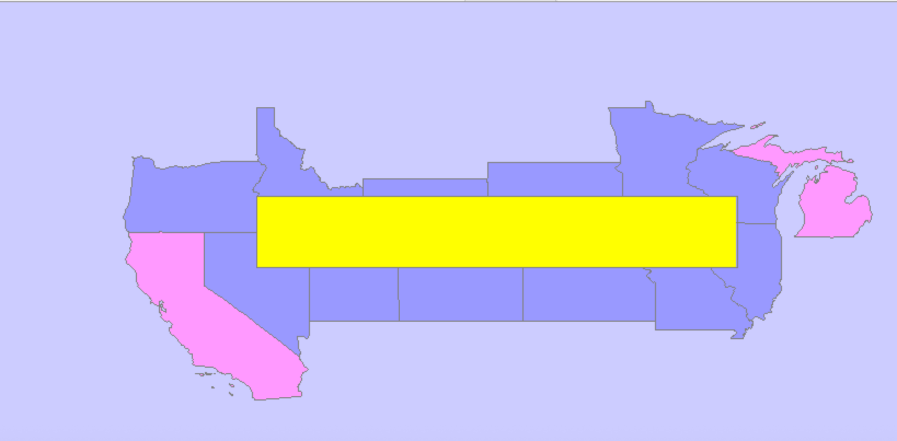

# Zadanie 3

Znajdź wszystkie parki (us_parks) których obszary znajdują się wewnątrz stanu Wyoming

Użyj funkcji SDO_INSIDE

```sql
SELECT p.name, p.geom
FROM us_parks p, us_states s
WHERE s.state = 'Wyoming'
      AND SDO_INSIDE (p.geom, s.geom ) = 'TRUE';
```

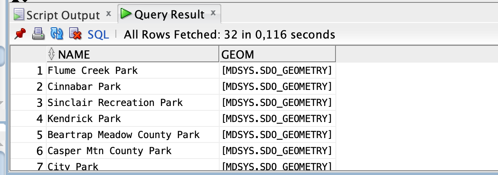

W przypadku wykorzystywania narzędzia SQL Developer, w celu wizualizacji na mapie użyj podzapytania

```sql
SELECT pp.name, pp.geom FROM us_parks pp  
WHERE id IN  
(  
      SELECT p.id  
      FROM us_parks p, us_states s  
      WHERE s.state = 'Wyoming'  
            AND SDO_INSIDE (p.geom, s.geom ) = 'TRUE'  
)
```
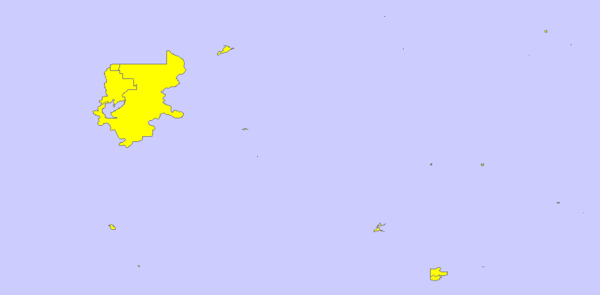


```sql
SELECT state, geom FROM us_states
WHERE state = 'Wyoming'
```


Porównaj wynik z:

```sql
SELECT p.name, p.geom
FROM us_parks p, us_states s
WHERE s.state = 'Wyoming'
AND SDO_ANYINTERACT (p.geom, s.geom ) = 'TRUE';
```


W celu wizualizacji użyj podzapytania


```sql
SELECT pp.name, pp.geom FROM us_parks pp
WHERE id IN
(
 SELECT p.id
 FROM us_parks p, us_states s
 WHERE s.state = 'Wyoming'
 and SDO_ANYINTERACT (p.geom, s.geom ) = 'TRUE'
)
```

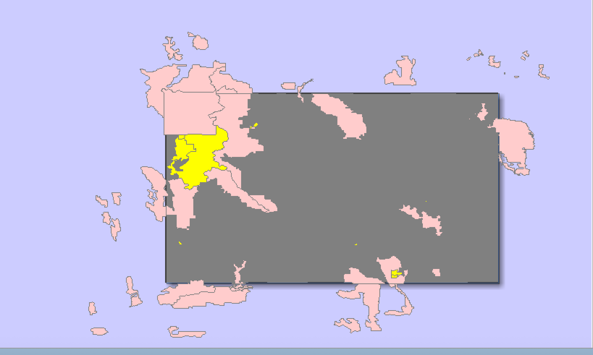


SDO_INSIDE zwraca tylko te parki, które w całości leżą wewnątrz stanu Wyoming i nie dotykają granicy. Na mapie to żółte parki. Jest ich 32.

SDO_ANYINTERACT zwraca wszystkie parki w Wyoming, też te które są na granicy dwóch stanów lub wychodzą poza stan. W tym przypadku to 46 parków: 32 żółte z SDO_INSIDE  
i 14 na granicy lub wychodzących poza Wyoming.


# Zadanie 4

Znajdź wszystkie jednostki administracyjne (us_counties) wewnątrz stanu New Hampshire

```sql
SELECT c.county, c.state_abrv, c.geom
FROM us_counties c, us_states s
WHERE s.state = 'New Hampshire'
AND SDO_RELATE ( c.geom,s.geom, 'mask=INSIDE+COVEREDBY') = 'TRUE';

SELECT c.county, c.state_abrv, c.geom
FROM us_counties c, us_states s
WHERE s.state = 'New Hampshire'
AND SDO_RELATE ( c.geom,s.geom, 'mask=INSIDE') = 'TRUE';

SELECT c.county, c.state_abrv, c.geom
FROM us_counties c, us_states s
WHERE s.state = 'New Hampshire'
AND SDO_RELATE ( c.geom,s.geom, 'mask=COVEREDBY') = 'TRUE';
```

W przypadku wykorzystywania narzędzia SQL Developer, w celu wizualizacji danych na mapie należy użyć podzapytania (podobnie jak w poprzednim zadaniu)


```sql
SELECT cc.county, cc.state_abrv, cc.geom
FROM us_counties cc
WHERE cc.county IN (
    SELECT c.county
    FROM us_counties c, us_states s
    WHERE s.state = 'New Hampshire'
    AND SDO_RELATE(c.geom,s.geom,'mask=INSIDE') = 'TRUE'
)
```


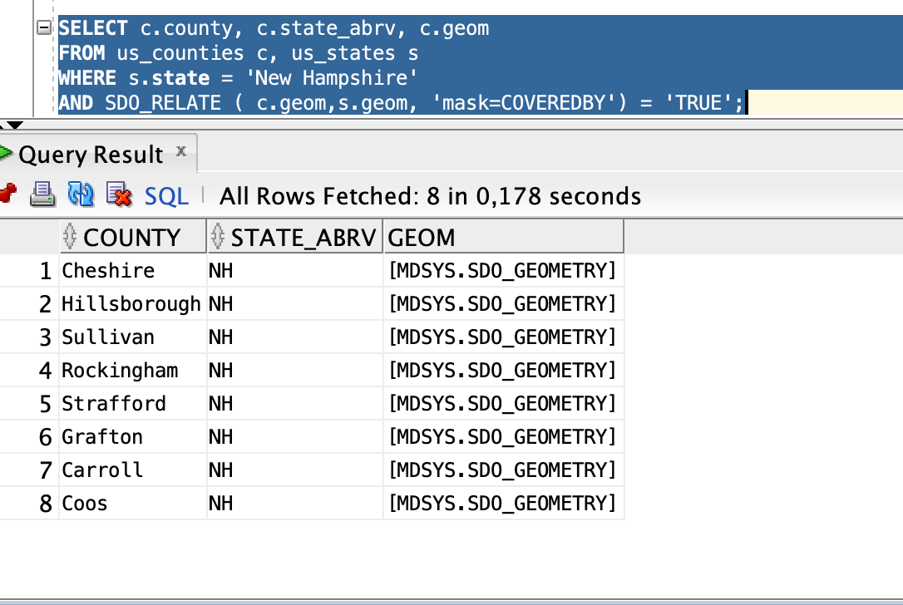

```sql
SELECT cc.county, cc.state_abrv, cc.geom
FROM us_counties cc
WHERE cc.county IN (
    SELECT c.county
    FROM us_counties c, us_states s
    WHERE s.state = 'New Hampshire'
    AND SDO_RELATE(c.geom,s.geom,'mask=COVEREDBY') = 'TRUE'
)
```
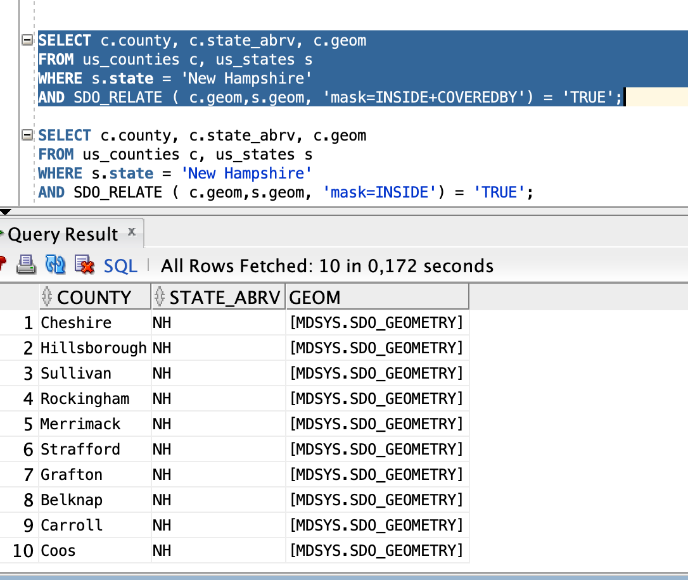


```sql
SELECT cc.county, cc.state_abrv, cc.geom
FROM us_counties cc
WHERE cc.county IN (
    SELECT c.county
    FROM us_counties c, us_states s
    WHERE s.state = 'New Hampshire'
    AND SDO_RELATE(c.geom,s.geom,'mask=INSIDE+COVEREDBY'= 'TRUE'
)
```


INSIDE (kolor fioletowy) zwraca 2 jednostki administracyjne. Zwraca tylko te jednostki, które leżą 
w całości wewnątrz stanu i nie dotykają granicy.

COVEREDBY(kolor turkusowy) zwraca 8 jednostek administracyjnych, ale tylko te które dotykają granicy.

INSIDE+COVEREDBY (żółty) zwraca 10 jednostek administracyjnych (dotykających i niedotykających granicy), wszystkie znajdujące się w New Hampshire

# Zadanie 5

Znajdź wszystkie miasta w odległości 50 mili od drogi (us_interstates) I4

Pokaż wyniki na mapie

```sql
SELECT * FROM us_interstates
WHERE interstate = 'I4'

SELECT * FROM us_states
WHERE state_abrv = 'FL'

SELECT c.city, c.state_abrv, c.location 
FROM us_cities c
WHERE ROWID IN 
( 
SELECT c.rowid
FROM us_interstates i, us_cities c 
WHERE i.interstate = 'I4'
AND sdo_within_distance (c.location, i.geom,'distance=50 unit=mile') = 'TRUE'
)
```


> Wyniki, zrzut ekranu, komentarz

```sql
--  ...
```


Dodatkowo:


a)    Znajdz wszystkie drogi które przecinają rzekę Mississippi

b)    Znajdz wszystkie miasta w odlegości od 15 do 30 mil od drogi 'I275'

c)      Itp. (własne przykłady)


> Wyniki, zrzut ekranu, komentarz
> (dla każdego z podpunktów)

```sql
--  ...
```

# Zadanie 6

Znajdz 5 miast najbliższych drogi I4

```sql
SELECT c.city, c.state_abrv, c.location
FROM us_interstates i, us_cities c 
WHERE i.interstate = 'I4'
AND sdo_nn(c.location, i.geom, 'sdo_num_res=5') = 'TRUE';
```

>Wyniki, zrzut ekranu, komentarz

```sql
--  ...
```


Dodatkowo:


a) Podaj 3 parki narodowe do których jest najbliżej z Nowego Jorku, oblicz odległości do tych parków

b) Znajdz 5 najbliższych dużych miast (o populacji powyżej 300 tys) od drogi  'I170'

c)  Itp. (własne przykłady). 
- np. przetestuj działanie funkcji 
	- sdo_intersection, sdo_union, sdo_difference
	- sdo_buffer
	- sdo_centroid, sdo_mbr, sdo_convexhull, sdo_simplify


> Wyniki, zrzut ekranu, komentarz
> (dla każdego z podpunktów)

```sql
--  ...
```


# Zadanie 7

Wykonaj kilka własnych przykładów/analiz


>Wyniki, zrzut ekranu, komentarz

```sql
--  ...
```

Punktacja

|       |     |
| ----- | --- |
| zad   | pkt |
| 1     | 0,5 |
| 2     | 0,5 |
| 3     | 0,5 |
| 4     | 0,5 |
| 5     | 1   |
| 6     | 2   |
| 7     | 2   |
| razem | 7   |
